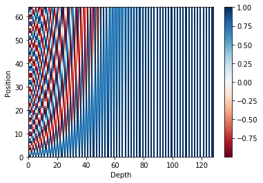
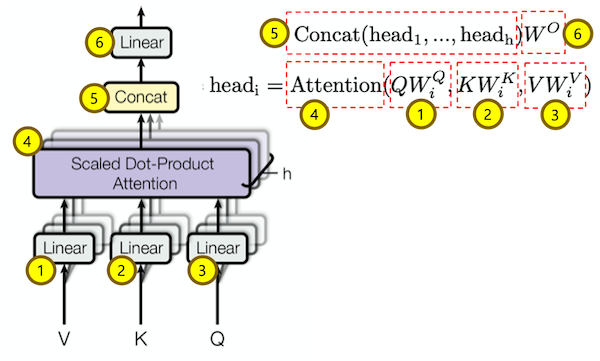
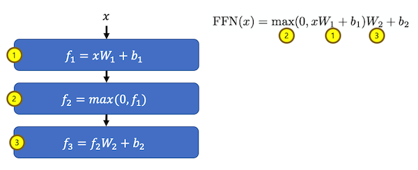
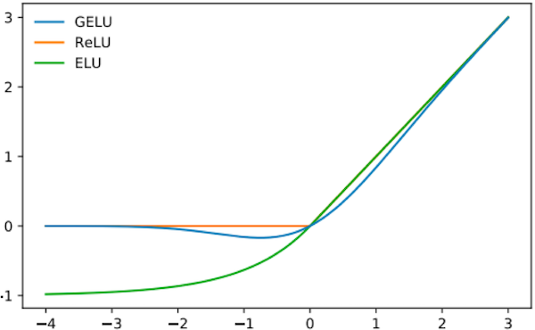

Transformer는 자연어처리에서 가장 중요한 논문이라고 생각이 됩니다. 이유는 2019년 12월 현재 각종 Benchmark 에서 가장 좋은 성능을 내고 있는 모델들이 Transformer 기반의 Pretrained 모델이기 때문 입니다.

이 포스트는 Transformer를 모델 구현에 대한 내용 입니다. 논문에 대한 내용은 [Attention Is All You Need](https://arxiv.org/abs/1706.03762){:target="_blank"} 논문을 참고 하거나 블로그를 참고 하세요.

###### 미리 확인해야할 포스트

- [Sentencepiece를 활용해 Vocab 만들기](../vocab-with-sentencepiece/)
- [Naver 영화리뷰 감정분석 데이터 전처리 하기](../preprocess-nsmc/)

#### 1. Vocab

[Sentencepiece를 활용해 Vocab 만들기](../vocab-with-sentencepiece/)를 통해 만들어 놓은 vocab을 이용해 텍스트를 입력 tensor로 변경 합니다.

```python
# vocab loading
vocab_file = f"{data_dir}/kowiki.model"
vocab = spm.SentencePieceProcessor()
vocab.load(vocab_file)

# 입력 texts
lines = [
  "겨울은 추워요.",
  "감기 조심하세요."
]

# text를 tensor로 변환
inputs = []
for line in lines:
  pieces = vocab.encode_as_pieces(line)
  ids = vocab.encode_as_ids(line)
  inputs.append(torch.tensor(ids))
  print(pieces)

# 입력 길이가 다르므로 입력 최대 길이에 맟춰 padding(0)을 추가 해 줌
inputs = torch.nn.utils.rnn.pad_sequence(inputs, batch_first=True, padding_value=0)
# shape
print(inputs.size())
# 값
print(inputs)
```

위 실행결과는 아래와 같습니다.

```text
['▁겨울', '은', '▁추', '워', '요', '.']
['▁감', '기', '▁조', '심', '하', '세', '요', '.']
torch.Size([2, 8])
tensor([[3091, 3604,  206, 3958, 3760, 3590,    0,    0],
        [ 212, 3605,   53, 3832, 3596, 3682, 3760, 3590]])
```

#### 2. Embedding

Transformer의 Embedding은 'Input Embedding'과 'Postion Embedding' 두 가지를 합해서 사용 합니다.

###### - Input Embedding

embedding은 입력 토큰을 vector 형태로 변환 합니다.
1. inputs에 대한 embedding 값 input_embs를 구합니다.

```python
n_vocab = len(vocab) # vocab count
d_hidn = 128 # hidden size
nn_emb = nn.Embedding(n_vocab, d_hidn) # embedding 객체

input_embs = nn_emb(inputs) # input embedding
print(input_embs.size())
```

위와 같이 inputs(2, 7)에 대한 embedding값 input_embs(2, 7, 128) shape을 갖습니다.

```text
torch.Size([2, 8, 128])
```

###### - Position Embedding

Position encoding값을 구하기 위한 함수는 아래와 같습니다.
1. 각 position별도 angle 값을 구합니다.
2. 구해진 angle 중 짝수 index의 값에 대한 sin 값을 구합니다.
3. 구해진 angle 중 홀수 index의 값에 대한 cos 값을 구합니다.

```python
""" sinusoid position embedding """
def get_sinusoid_encoding_table(n_seq, d_hidn):
    def cal_angle(position, i_hidn):
        return position / np.power(10000, 2 * (i_hidn // 2) / d_hidn)
    def get_posi_angle_vec(position):
        return [cal_angle(position, i_hidn) for i_hidn in range(d_hidn)]

    sinusoid_table = np.array([get_posi_angle_vec(i_seq) for i_seq in range(n_seq)])
    sinusoid_table[:, 0::2] = np.sin(sinusoid_table[:, 0::2])  # even index sin 
    sinusoid_table[:, 1::2] = np.cos(sinusoid_table[:, 1::2])  # odd index cos

    return sinusoid_table
```

아래와 같이 position encoding값을 구하면 됩니다.

```python
n_seq = 64
pos_encoding = get_sinusoid_encoding_table(n_seq, d_hidn)

print (pos_encoding.shape) # 크기 출력
plt.pcolormesh(pos_encoding, cmap='RdBu')
plt.xlabel('Depth')
plt.xlim((0, d_hidn))
plt.ylabel('Position')
plt.colorbar()
plt.show()
```

위에서 구한 결과를 그래프로 출력하면 아래와 같이 각 position 별로 다른 값을 갖는 것을 확인 할 수 있습니다.



아래 절차로 position embedding 값을 구합니다.
1. 위해서 구해진 position encodong 값을 이용해 position emgedding을 생성합니다. 학습되는 값이 아니므로 freeze옵션을 True로 설정 합니다.
2. 입력 inputs과 동일한 크기를 갖는 positions값을 구합니다.
3. input값 중 pad(0)값을 찾습니다.
4. positions값중 pad부분은 0으로 변경 합니다.
5. positions값에 해당하는 embedding값을 구합니다.

```python
pos_encoding = torch.FloatTensor(pos_encoding)
nn_pos = nn.Embedding.from_pretrained(pos_encoding, freeze=True)

positions = torch.arange(inputs.size(1), device=inputs.device, dtype=inputs.dtype).expand(inputs.size(0), inputs.size(1)).contiguous() + 1
pos_mask = inputs.eq(0)

positions.masked_fill_(pos_mask, 0)
pos_embs = nn_emb(positions) # position embedding

print(inputs)
print(positions)
print(pos_embs.size())
```

위의 출력한 결과는 아래와 같습니다. inputs의 pad(0) 위치에 positions의 값도 pad(0)으로 변경 되어 있음을 알 수 있습니다.

pos_embs(3, 13, 128)은 input_embs(3, 13, 128)과 shape이 동일합니다.

```Text
tensor([[3091, 3604,  206, 3958, 3760, 3590,    0,    0],
        [ 212, 3605,   53, 3832, 3596, 3682, 3760, 3590]])
tensor([[1, 2, 3, 4, 5, 6, 0, 0],
        [1, 2, 3, 4, 5, 6, 7, 8]])
torch.Size([2, 8, 128])
```

위에서 구한 input_embs과 pos_embs를 더하면 transformer에 입력할 input이 됩니다.

```python
input_sums = input_embs + pos_embs
```


#### 3. Scaled Dot Product Attention


###### 입력값

입력값은 Q(query), K(key), V(value) 그리고 attention mask로 구성 되어 있습니다.  
입력값 중 K, V는 같은 값 이어야 합니다.  
Q, K, V가 모두 동일한 경우는 self attention이라 합니다.

```python
Q = input_sums
K = input_sums
V = input_sums
attn_mask = inputs.eq(0).unsqueeze(1).expand(Q.size(0), Q.size(1), K.size(1))
print(attn_mask.size())
print(attn_mask[0])
```

attn_mask의 값은 pad(0) 부분만 True 입니다.

```Text
torch.Size([2, 8, 8])
tensor([[False, False, False, False, False, False,  True,  True],
        [False, False, False, False, False, False,  True,  True],
        [False, False, False, False, False, False,  True,  True],
        [False, False, False, False, False, False,  True,  True],
        [False, False, False, False, False, False,  True,  True],
        [False, False, False, False, False, False,  True,  True],
        [False, False, False, False, False, False,  True,  True],
        [False, False, False, False, False, False,  True,  True]])
```

###### MatMul Q, K-transpose

위 그림의 수식 중 1번 Q * K-transpose를 하는 코드 입니다.

```python
scores = torch.matmul(Q, K.transpose(-1, -2))
print(scores.size())
print(scores[0])
```

각 단어상호간에 가중치를 표현하는 테이블이 생성 되었습니다.

```Text
torch.Size([2, 8, 8])
tensor([[250.7811,  -1.1604, -11.8655, -23.0747, -10.0332,   6.6510, -45.7395, -45.7395],
        [ -1.1604, 222.7683,  39.4433,   7.0246,  12.0378,  13.0978,   4.4677,   4.4677],
        [-11.8655,  39.4433, 214.6503,  31.6948,  17.2696,  28.4694,  24.3573,  24.3573],
        [-23.0747,   7.0246,  31.6948, 223.2298,  13.5132,  32.3621,  37.9429,  37.9429],
        [-10.0332,  12.0378,  17.2696,  13.5132, 256.6101,  32.1088,  -9.0106,  -9.0106],
        [  6.6510,  13.0978,  28.4694,  32.3621,  32.1088, 304.7859, -21.7731, -21.7731],
        [-45.7395,   4.4677,  24.3573,  37.9429,  -9.0106, -21.7731, 455.8302, 455.8302],
        [-45.7395,   4.4677,  24.3573,  37.9429,  -9.0106, -21.7731, 455.8302, 455.8302]],
       grad_fn=<SelectBackward>)
```

###### Scale

위 그림의 수식 중 2번 k-dimension에 루트를 취한 값으로 나누는 코드 입니다.

```python
d_head = 64
scores = scores.mul_(1/d_head**0.5)
print(scores.size())
print(scores[0])
```

위 값에 비해서 가중치 편차가 줄어든 것을 확인 할 수 있습니다.

```Text
torch.Size([2, 8, 8])
tensor([[31.3476, -0.1451, -1.4832, -2.8843, -1.2542,  0.8314, -5.7174, -5.7174],
        [-0.1451, 27.8460,  4.9304,  0.8781,  1.5047,  1.6372,  0.5585,  0.5585],
        [-1.4832,  4.9304, 26.8313,  3.9618,  2.1587,  3.5587,  3.0447,  3.0447],
        [-2.8843,  0.8781,  3.9618, 27.9037,  1.6892,  4.0453,  4.7429,  4.7429],
        [-1.2542,  1.5047,  2.1587,  1.6892, 32.0763,  4.0136, -1.1263, -1.1263],
        [ 0.8314,  1.6372,  3.5587,  4.0453,  4.0136, 38.0982, -2.7216, -2.7216],
        [-5.7174,  0.5585,  3.0447,  4.7429, -1.1263, -2.7216, 56.9788, 56.9788],
        [-5.7174,  0.5585,  3.0447,  4.7429, -1.1263, -2.7216, 56.9788, 56.9788]],
       grad_fn=<SelectBackward>)
```

###### Mask (Opt.)

위 그림 수식 중 3번 mask를 하는 코드 입니다.

```python
scores.masked_fill_(attn_mask, -1e9)
print(scores.size())
print(scores[0])
```

mask를 한 부분이 -1e9로 매우 작은 값으로 변경된 것을 확인 할 수 있습니다.

```Text
torch.Size([2, 8, 8])
tensor([[ 3.1348e+01, -1.4505e-01, -1.4832e+00, -2.8843e+00, -1.2542e+00,  8.3138e-01, -1.0000e+09, -1.0000e+09],
        [-1.4505e-01,  2.7846e+01,  4.9304e+00,  8.7807e-01,  1.5047e+00,  1.6372e+00, -1.0000e+09, -1.0000e+09],
        [-1.4832e+00,  4.9304e+00,  2.6831e+01,  3.9618e+00,  2.1587e+00,  3.5587e+00, -1.0000e+09, -1.0000e+09],
        [-2.8843e+00,  8.7807e-01,  3.9618e+00,  2.7904e+01,  1.6892e+00,  4.0453e+00, -1.0000e+09, -1.0000e+09],
        [-1.2542e+00,  1.5047e+00,  2.1587e+00,  1.6892e+00,  3.2076e+01,  4.0136e+00, -1.0000e+09, -1.0000e+09],
        [ 8.3138e-01,  1.6372e+00,  3.5587e+00,  4.0453e+00,  4.0136e+00,  3.8098e+01, -1.0000e+09, -1.0000e+09],
        [-5.7174e+00,  5.5846e-01,  3.0447e+00,  4.7429e+00, -1.1263e+00, -2.7216e+00, -1.0000e+09, -1.0000e+09],
        [-5.7174e+00,  5.5846e-01,  3.0447e+00,  4.7429e+00, -1.1263e+00, -2.7216e+00, -1.0000e+09, -1.0000e+09]],
       grad_fn=<SelectBackward>)
```

###### Softmax

위 그림 수식 중 4번 softmax를 하는 코드 입니다.

```python
attn_prob = nn.Softmax(dim=-1)(scores)
print(attn_prob.size())
print(attn_prob[0])
```

가중치가 확률로 변환 된 값을 볼 수 있습니다. mask를 한 부분이 모두 0이 되었습니다.

```Text
torch.Size([2, 8, 8])
tensor([[1.0000e+00, 2.1033e-14, 5.5176e-15, 1.3591e-15, 6.9378e-15, 5.5841e-14, 0.0000e+00, 0.0000e+00],
        [6.9763e-13, 1.0000e+00, 1.1165e-10, 1.9407e-12, 3.6318e-12, 4.1463e-12, 0.0000e+00, 0.0000e+00],
        [5.0487e-13, 3.0802e-10, 1.0000e+00, 1.1693e-10, 1.9268e-11, 7.8133e-11, 0.0000e+00, 0.0000e+00],
        [4.2551e-14, 1.8319e-12, 4.0010e-11, 1.0000e+00, 4.1224e-12, 4.3491e-11, 0.0000e+00, 0.0000e+00],
        [3.3480e-15, 5.2839e-14, 1.0162e-13, 6.3540e-14, 1.0000e+00, 6.4945e-13, 0.0000e+00, 0.0000e+00],
        [6.5344e-17, 1.4628e-16, 9.9921e-16, 1.6255e-15, 1.5748e-15, 1.0000e+00, 0.0000e+00, 0.0000e+00],
        [2.3843e-05, 1.2675e-02, 1.5230e-01, 8.3218e-01, 2.3510e-03, 4.7689e-04, 0.0000e+00, 0.0000e+00],
        [2.3843e-05, 1.2675e-02, 1.5230e-01, 8.3218e-01, 2.3510e-03, 4.7689e-04, 0.0000e+00, 0.0000e+00]],
       grad_fn=<SelectBackward>)
```

###### MatMul attn_prov, V

위 그림 수식 중 5번 attn_prov * V를 하는 코드 입니다.

```python
context = torch.matmul(attn_prob, V)
print(context.size())
```

Q와 동일한 shape 값이 구해집니다. 이 값은 V값들이 attn_prov의 가중치를 이용해서 더해진 값 입니다.

```Text
torch.Size([2, 8, 128])
```

###### Class

위 절차를 하나의 클래스 행태로 구성하면 아래와 같습니다.

```python
""" scale dot product attention """
class ScaledDotProductAttention(nn.Module):
    def __init__(self, d_head):
        super().__init__()
        self.scale = 1 / (d_head ** 0.5)
    
    def forward(self, Q, K, V, attn_mask):
        # (bs, n_head, n_q_seq, n_k_seq)
        scores = torch.matmul(Q, K.transpose(-1, -2)).mul_(self.scale)
        scores.masked_fill_(attn_mask, -1e9)
        # (bs, n_head, n_q_seq, n_k_seq)
        attn_prob = nn.Softmax(dim=-1)(scores)
        # (bs, n_head, n_q_seq, d_v)
        context = torch.matmul(attn_prob, V)
        # (bs, n_head, n_q_seq, d_v), (bs, n_head, n_q_seq, n_v_seq)
        return context, attn_prob
```

#### 4. Multi-Head Attention



###### 입력값

Q, K, V, attn_mask는 ScaledDotProductAttention과 동일 합니다.  
head 개수는 2개 head의 dimension은 64 입니다.

```python
Q = input_sums
K = input_sums
V = input_sums
attn_mask = inputs.eq(0).unsqueeze(1).expand(Q.size(0), Q.size(1), K.size(1))

batch_size = Q.size(0)
n_head = 2
```

###### Multi Head Q, K, V

위 그림 수식 중 1번 Q를 여러개의 head로 나누는 과정 입니다.

```python
W_Q = nn.Linear(d_hidn, n_head * d_head)
W_K = nn.Linear(d_hidn, n_head * d_head)
W_V = nn.Linear(d_hidn, n_head * d_head)

# (bs, n_seq, n_head * d_head)
q_s = W_Q(Q)
print(q_s.size())
# (bs, n_seq, n_head, d_head)
q_s = q_s.view(batch_size, -1, n_head, d_head)
print(q_s.size())
# (bs, n_head, n_seq, d_head)
q_s = q_s.transpose(1,2)
print(q_s.size())
```

Q값이 head단위로 나눠졌습니다.

```Text
torch.Size([2, 8, 128])
torch.Size([2, 8, 2, 64])
torch.Size([2, 2, 8, 64])
```

위 과정을 한 줄로 표현하면 다음과 같습니다.

```python
# (bs, n_head, n_seq, d_head)
q_s = W_Q(Q).view(batch_size, -1, n_head, d_head).transpose(1,2)
# (bs, n_head, n_seq, d_head)
k_s = W_K(K).view(batch_size, -1, n_head, d_head).transpose(1,2)
# (bs, n_head, n_seq, d_head)
v_s = W_V(V).view(batch_size, -1, n_head, d_head).transpose(1,2)
print(q_s.size(), k_s.size(), v_s.size())
```

Q, K, V 모두 Multi Head로 나눠졌습니다.

```Text
torch.Size([2, 2, 8, 64]) torch.Size([2, 2, 8, 64]) torch.Size([2, 2, 8, 64])
```

Attention Mask도 Multi Head로 변경 합니다.

```python
print(attn_mask.size())
attn_mask = attn_mask.unsqueeze(1).repeat(1, n_head, 1, 1)
print(attn_mask.size())
```

Attention Mask도 Multi Head로 변경 되었습니다.

```Text
torch.Size([2, 8, 8])
torch.Size([2, 2, 8, 8])
```

######  Attention

위 그림 수식 중 4번 Attention 과정 입니다.  
이전에 설명한 'Scaled Dot Product Attention'을 사용합니다.

```python
scaled_dot_attn = ScaledDotProductAttention(d_head)
context, attn_prob = scaled_dot_attn(q_s, k_s, v_s, attn_mask)
print(context.size())
print(attn_prob.size())
```

Multi Head에 대한 Attention이 구해 졌습니다.

```Text
torch.Size([2, 2, 8, 64])
torch.Size([2, 2, 8, 8])
```

######  Concat

위 그림 수식 중 5번 Concat 과정 입니다.  

```python
# (bs, n_seq, n_head * d_head)
context = context.transpose(1, 2).contiguous().view(batch_size, -1, n_head * d_head)
print(context.size())
```

Multi Head를 한개로 합쳤습니다.

```Text
torch.Size([2, 8, 128])
```

######  Linear

위 그림 수식 중 6번 Linear 과정 입니다.  

```python
# (bs, n_seq, d_hidn)
output = linear(context)
print(output.size())
```

입력 Q와 동일한 shape을 가진 Multi Head Attention이 구해 졌습니다.

```Text
torch.Size([2, 8, 128])
```

###### Class

위 절차를 하나의 클래스 행태로 구성하면 아래와 같습니다.

```python
""" multi head attention """
class MultiHeadAttention(nn.Module):
    def __init__(self, d_hidn, n_head, d_head):
        super().__init__()
        self.d_hidn = d_hidn
        self.n_head = n_head
        self.d_head = d_head

        self.W_Q = nn.Linear(d_hidn, n_head * d_head)
        self.W_K = nn.Linear(d_hidn, n_head * d_head)
        self.W_V = nn.Linear(d_hidn, n_head * d_head)
        self.scaled_dot_attn = ScaledDotProductAttention(d_head)
        self.linear = nn.Linear(n_head * d_head, d_hidn)
    
    def forward(self, Q, K, V, attn_mask):
        batch_size = Q.size(0)
        # (bs, n_head, n_q_seq, d_head)
        q_s = self.W_Q(Q).view(batch_size, -1, self.n_head, self.d_head).transpose(1,2)
        # (bs, n_head, n_k_seq, d_head)
        k_s = self.W_K(K).view(batch_size, -1, self.n_head, self.d_head).transpose(1,2)
        # (bs, n_head, n_v_seq, d_head)
        v_s = self.W_V(V).view(batch_size, -1, self.n_head, self.d_head).transpose(1,2)

        # (bs, n_head, n_q_seq, n_k_seq)
        attn_mask = attn_mask.unsqueeze(1).repeat(1, self.n_head, 1, 1)

        # (bs, n_head, n_q_seq, d_head), (bs, n_head, n_q_seq, n_k_seq)
        context, attn_prob = self.scaled_dot_attn(q_s, k_s, v_s, attn_mask)
        # (bs, n_head, n_q_seq, h_head * d_head)
        context = context.transpose(1, 2).contiguous().view(batch_size, -1, self.n_head * self.d_head)
        # (bs, n_head, n_q_seq, e_embd)
        output = self.linear(context)
        # (bs, n_q_seq, d_hidn), (bs, n_head, n_q_seq, n_k_seq)
        return output, attn_prob
```

#### 5. Masked Multi-Head Attention

Masked Multi-Head Attention은 Multi-Head Attention과 attention mask를 제외한 부분은 모두 동일합니다.

###### 입력값

```python
""" attention decoder mask """
def get_attn_decoder_mask(seq):
    subsequent_mask = torch.ones_like(seq).unsqueeze(-1).expand(seq.size(0), seq.size(1), seq.size(1))
    subsequent_mask = subsequent_mask.triu(diagonal=1) # upper triangular part of a matrix(2-D)
    return subsequent_mask


Q = input_sums
K = input_sums
V = input_sums

attn_pad_mask = inputs.eq(0).unsqueeze(1).expand(Q.size(0), Q.size(1), K.size(1))
print(attn_pad_mask[1])
attn_dec_mask = get_attn_decoder_mask(inputs)
print(attn_dec_mask[1])
attn_mask = torch.gt((attn_pad_mask + attn_dec_mask), 0)
print(attn_mask[1])

batch_size = Q.size(0)
n_head = 2
```

pad mask, decoder mask 그리고 이 둘을 합한 attention mask를 확인 할 수 있습니다.

```Text
tensor([[False, False, False, False, False, False,  True,  True],
        [False, False, False, False, False, False,  True,  True],
        [False, False, False, False, False, False,  True,  True],
        [False, False, False, False, False, False,  True,  True],
        [False, False, False, False, False, False,  True,  True],
        [False, False, False, False, False, False,  True,  True],
        [False, False, False, False, False, False,  True,  True],
        [False, False, False, False, False, False,  True,  True]])
tensor([[0, 1, 1, 1, 1, 1, 1, 1],
        [0, 0, 1, 1, 1, 1, 1, 1],
        [0, 0, 0, 1, 1, 1, 1, 1],
        [0, 0, 0, 0, 1, 1, 1, 1],
        [0, 0, 0, 0, 0, 1, 1, 1],
        [0, 0, 0, 0, 0, 0, 1, 1],
        [0, 0, 0, 0, 0, 0, 0, 1],
        [0, 0, 0, 0, 0, 0, 0, 0]])
tensor([[False,  True,  True,  True,  True,  True,  True,  True],
        [False, False,  True,  True,  True,  True,  True,  True],
        [False, False, False,  True,  True,  True,  True,  True],
        [False, False, False, False,  True,  True,  True,  True],
        [False, False, False, False, False,  True,  True,  True],
        [False, False, False, False, False, False,  True,  True],
        [False, False, False, False, False, False,  True,  True],
        [False, False, False, False, False, False,  True,  True]])
```

###### Multi-Head Attention 

Multi-Head Attention과 동일하므로 위에서 선언한 MultiHeadAttention 클래스를 바로 호출 합니다.

```python
attention = MultiHeadAttention(d_hidn, n_head, d_head)
output, attn_prob = attention(Q, K, V, attn_mask)
print(output.size(), attn_prob.size())
```

출력은 아래와 같습니다.

```Text
torch.Size([2, 8, 128]) torch.Size([2, 2, 8, 8])
```

#### 6. FeeedForward



###### f1 (Linear) 

위 그림 수식 중 1번 f1 (Linear) 과정 입니다.  

```python
conv1 = nn.Conv1d(in_channels=d_hidn, out_channels=d_hidn * 4, kernel_size=1)
# (bs, d_hidn * 4, n_seq)
ff_1 = conv1(output.transpose(1, 2))
print(ff_1.size())
```

입력에 비해 hidden dimension이 4배 커진 것을 확인 할 수 있습니다.

```Text
torch.Size([2, 512, 8])
```

###### Activation (relu or gelu)

위 그림 수식 중 2번 Activation (relu or gelu) 과정 입니다.  
논문이 발표 될 당시는 relu를 사용하도록 되어 있었지만 이후 gelu를 사용할 때 더 성능이 좋다는 것이 발견되었습니다.  


```python
# active = F.relu
active = F.gelu
ff_2 = active(ff_1)
```

###### f3 (Linear) 

위 그림 수식 중 3번 f3 (Linear) 과정 입니다.  

```python
conv2 = nn.Conv1d(in_channels=d_hidn * 4, out_channels=d_hidn, kernel_size=1)
ff_3 = conv2(ff_2).transpose(1, 2)
print(ff_3.size())
```

입력과 동일한 shape으로 변경된 결과를 확인 할 수 있습니다.

```Text
torch.Size([2, 8, 128])
```

###### Class

위 절차를 하나의 클래스 행태로 구성하면 아래와 같습니다.

```python
""" feed forward """
class PoswiseFeedForwardNet(nn.Module):
    def __init__(self, d_hidn):
        super().__init__()

        self.conv1 = nn.Conv1d(in_channels=self.config.d_hidn, out_channels=self.config.d_hidn * 4, kernel_size=1)
        self.conv2 = nn.Conv1d(in_channels=self.config.d_hidn * 4, out_channels=self.config.d_hidn, kernel_size=1)
        self.active = F.gelu

    def forward(self, inputs):
        # (bs, d_ff, n_seq)
        output = self.active(self.conv1(inputs.transpose(1, 2)))
        # (bs, n_seq, d_hidn)
        output = self.conv2(output).transpose(1, 2)
        # (bs, n_seq, d_hidn)
        return output
```

#### 7. 참고

다음 포스트 'Transformer (Attention Is All You Need) 구현하기 (2/3)'에서는 Encoder, Decoder 및 Transformer 모델 전체에 대한 내용을 정리 하겠습니다.

자세한 내용은 다음을 참고 하세요.

- [transformer-01.ipynb](https://github.com/paul-hyun/transformer-evolution/blob/master/tutorial/transformer-01.ipynb){:target="_blank"}
- [model.py](https://github.com/paul-hyun/transformer-evolution/blob/master/transformer/model.py){:target="_blank"}
- [Attention Is All You Need](https://arxiv.org/abs/1706.03762){:target="_blank"}

