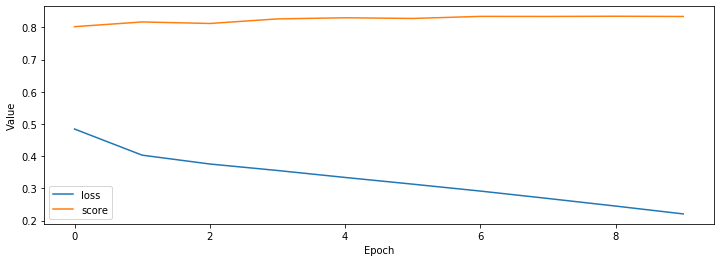

[Transformer (Attention Is All You Need) 구현하기 (2/3)](../transformer-02/)에서 포스팅된 내용을 기반으로 Naver 영화리뷰 감정분석 학습과정을 정리 하겠습니다.

Transformer와 같은 Encoder-Decoder 모델은 번역이나 채팅 데이터를 학습하는게 일반적이지만 이후 포스팅할 Pretrained Language Model과 각단한 성능 비교를 위해 Naver 영화리뷰 감정분석을 학습해 보도록 하겠습니다.

이 포스트는 Transformer를 모델 구현에 대한 설명 입니다. 논문에 대한 내용은 [Attention Is All You Need](https://arxiv.org/abs/1706.03762){:target="_blank"} 논문을 참고 하거나 블로그를 참고 하세요.

###### 미리 확인해야할 포스트

- [Sentencepiece를 활용해 Vocab 만들기](../vocab-with-sentencepiece/)
- [Naver 영화리뷰 감정분석 데이터 전처리 하기](../preprocess-nsmc/)
- [Transformer (Attention Is All You Need) 구현하기 (1/3)](../transformer-01/)
- [Transformer (Attention Is All You Need) 구현하기 (2/3)](../transformer-02/)

#### 1. Model

[Transformer (Attention Is All You Need) 구현하기 (2/3)](../transformer-02/)의 Transformer 클래스를 이용하여 Naver 영화리뷰 감정분석 분류 모델 클래스를 아래와 같이 정의 합니다.
1. Encoder input과 Decoder input을 입력으로 Transformer 모델을 실행 합니다. (줄: 12)
2. Transformer 출력의 max값을 구합니다. (줄: 14)
3. Linear를 실행하여 최종 예측 결과를 만듭니다. (줄: 16)

```python
""" naver movie classfication """
class MovieClassification(nn.Module):
    def __init__(self, config):
        super().__init__()
        self.config = config

        self.transformer = Transformer(self.config)
        self.projection = nn.Linear(self.config.d_hidn, self.config.n_output, bias=False)
    
    def forward(self, enc_inputs, dec_inputs):
        # (bs, n_dec_seq, d_hidn), [(bs, n_head, n_enc_seq, n_enc_seq)], [(bs, n_head, n_dec_seq, n_dec_seq)], [(bs, n_head, n_dec_seq, n_enc_seq)]
        dec_outputs, enc_self_attn_probs, dec_self_attn_probs, dec_enc_attn_probs = self.transformer(enc_inputs, dec_inputs)
        # (bs, d_hidn)
        dec_outputs, _ = torch.max(dec_outputs, dim=1)
        # (bs, n_output)
        logits = self.projection(dec_outputs)
        # (bs, n_output), [(bs, n_head, n_enc_seq, n_enc_seq)], [(bs, n_head, n_dec_seq, n_dec_seq)], [(bs, n_head, n_dec_seq, n_enc_seq)]
        return logits, enc_self_attn_probs, dec_self_attn_probs, dec_enc_attn_probs
```

#### 2. DataSet

###### DataSet

Naver 영화리뷰 감정분석 데이터 셋 입니다.
1. 입력 파일로 부터 'label'을 읽어 들입니다. (줄: 16)
2. 입력 파일로 부터 'doc' token을 읽어 숫자(token id)로 변경 합니다. (줄: 17)
3. Decoder 입력은 '[BOS]'로 고정 합니다. (줄: 26)

```python
""" 영화 분류 데이터셋 """
class MovieDataSet(torch.utils.data.Dataset):
    def __init__(self, vocab, infile):
        self.vocab = vocab
        self.labels = []
        self.sentences = []

        line_cnt = 0
        with open(infile, "r") as f:
            for line in f:
                line_cnt += 1

        with open(infile, "r") as f:
            for i, line in enumerate(tqdm(f, total=line_cnt, desc=f"Loading {infile}", unit=" lines")):
                data = json.loads(line)
                self.labels.append(data["label"])
                self.sentences.append([vocab.piece_to_id(p) for p in data["doc"]])
    
    def __len__(self):
        assert len(self.labels) == len(self.sentences)
        return len(self.labels)
    
    def __getitem__(self, item):
        return (torch.tensor(self.labels[item]),
                torch.tensor(self.sentences[item]),
                torch.tensor([self.vocab.piece_to_id("[BOS]")]))
```

###### collate_fn

배치단위로 데이터 처리를 위한 collate_fn 입니다.
1. Encoder inputs의 길이가 같아지도록 짧은 문장에 padding(0)을 추가 합니다. (줄: 5)  
   padding은 [Sentencepiece를 활용해 Vocab 만들기](../vocab-with-sentencepiece/)에서 '--pad_id=0'옵션으로 지정한 값 입니다.
2. Decoder inputs의 길이가 같아지도록 짧은 문장에 padding(0)을 추가 합니다. (줄: 6)  
3. Label은 길이가 1 고정이므로 stack 함수를 이용해 tensor로 만듭니다. (줄: 9)

```python
""" movie data collate_fn """
def movie_collate_fn(inputs):
    labels, enc_inputs, dec_inputs = list(zip(*inputs))

    enc_inputs = torch.nn.utils.rnn.pad_sequence(enc_inputs, batch_first=True, padding_value=0)
    dec_inputs = torch.nn.utils.rnn.pad_sequence(dec_inputs, batch_first=True, padding_value=0)

    batch = [
        torch.stack(labels, dim=0),
        enc_inputs,
        dec_inputs,
    ]
    return batch
```

###### DataLoader

위에서 정의한 DataSet과 collate_fn을 이용해 학습용(train_loader), 평가용(test_loader) DataLoader를 만듭니다.

```python
batch_size = 128
train_dataset = MovieDataSet(vocab, "<path of data>/ratings_train.json")
train_loader = torch.utils.data.DataLoader(train_dataset, batch_size=batch_size, shuffle=True, collate_fn=movie_collate_fn)
test_dataset = MovieDataSet(vocab, "<path of data>/ratings_test.json")
test_loader = torch.utils.data.DataLoader(test_dataset, batch_size=batch_size, shuffle=False, collate_fn=movie_collate_fn)
```

#### 3. Evaluate

학습된 MovieClassification 모델의 성능을 평가하기 위한 함수 입니다. 평가는 정확도(accuracy)를 사용 했습니다.

1. Encoder input과 Decoder input을 입력으로 MovieClassification을 실행합니다. (줄: 12)
2. 1번의 결과 중 첫 번째 값이 예측 logits 입니다. (줄: 13)
3. logits의 최대값의 index를 구합니다. (줄: 14)
4. 3번에게 구한 값과 labels의 값이 같은지 비교 합니다. (줄: 16)

```python
""" 모델 epoch 평가 """
def eval_epoch(config, model, data_loader):
    matchs = []
    model.eval()

    n_word_total = 0
    n_correct_total = 0
    with tqdm_notebook(total=len(data_loader), desc=f"Valid") as pbar:
        for i, value in enumerate(data_loader):
            labels, enc_inputs, dec_inputs = map(lambda v: v.to(config.device), value)

            outputs = model(enc_inputs, dec_inputs)
            logits = outputs[0]
            _, indices = logits.max(1)

            match = torch.eq(indices, labels).detach()
            matchs.extend(match.cpu())
            accuracy = np.sum(matchs) / len(matchs) if 0 < len(matchs) else 0

            pbar.update(1)
            pbar.set_postfix_str(f"Acc: {accuracy:.3f}")
    return np.sum(matchs) / len(matchs) if 0 < len(matchs) else 0
```

#### 4. Train

MovieClassification 모델을 학습하기 위한 함수 입니다.

1. Encoder input과 Decoder input을 입력으로 MovieClassification을 실행합니다. (줄: 11)
2. 1번의 결과 중 첫 번째 값이 예측 logits 입니다. (줄: 12)
3. logits 값과 labels의 값을 이용해 Loss를 계산합니다. (줄: 14)
4. loss, optimizer를 이용해 학습합니다. (줄: 18, 19)

```python
""" 모델 epoch 학습 """
def train_epoch(config, epoch, model, criterion, optimizer, train_loader):
    losses = []
    model.train()

    with tqdm_notebook(total=len(train_loader), desc=f"Train {epoch}") as pbar:
        for i, value in enumerate(train_loader):
            labels, enc_inputs, dec_inputs = map(lambda v: v.to(config.device), value)

            optimizer.zero_grad()
            outputs = model(enc_inputs, dec_inputs)
            logits = outputs[0]

            loss = criterion(logits, labels)
            loss_val = loss.item()
            losses.append(loss_val)

            loss.backward()
            optimizer.step()

            pbar.update(1)
            pbar.set_postfix_str(f"Loss: {loss_val:.3f} ({np.mean(losses):.3f})")
    return np.mean(losses)
```

학습을 위한 추가적인 내용을 선언 합니다.

1. GPU 사용 여부를 확인합니다. (줄: 1)
2. 출력 값 개수를 정의 합니다. (부정(0), 긍정(1) 2가지입니다.) (줄: 2)
3. learning_rate 및 학습 epoch를 선언 합니다. (줄: 5, 6)

```python
config.device = torch.device("cuda" if torch.cuda.is_available() else "cpu")
config.n_output = 2
print(config)

learning_rate = 5e-5
n_epoch = 10
```

출력 결과입니다.

```text
{'n_enc_vocab': 8007, 'n_dec_vocab': 8007, 'n_enc_seq': 256, 'n_dec_seq': 256, 'n_layer': 6, 'd_hidn': 256, 'i_pad': 0, 'd_ff': 1024, 'n_head': 4, 'd_head': 64, 'dropout': 0.1, 'layer_norm_epsilon': 1e-12, 'device': device(type='cuda'), 'n_output': 2}
```

위에서 선언된 내용을 이용해 학습을 실행하는 절차 입니다.

1. MovieClassification을 생성합니다. (줄: 1)
2. MovieClassification이 GPU 또는 CPU를 지원하도록 합니다. (줄: 2)
3. loss 함수를 선언 합니다. (줄: 4)
4. optimizer를 선언 합니다. (줄: 5)
5. 각 epoch 마다 학습을 합니다. (줄: 9)
5. 각 epoch 마다 평가를 합니다. (줄: 10)

```python
model = MovieClassification(config)
model.to(config.device)

criterion = torch.nn.CrossEntropyLoss()
optimizer = torch.optim.Adam(model.parameters(), lr=learning_rate)

losses, scores = [], []
for epoch in range(n_epoch):
    loss = train_epoch(config, epoch, model, criterion, optimizer, train_loader)
    score = eval_epoch(config, model, test_loader)

    losses.append(loss)
    scores.append(score)
```

#### 5. Result

학습결과 및 평가결과는 아래와 같습니다.

```python
data = {
    "loss": losses,
    "score": scores
}
df = pd.DataFrame(data)
display(df)

# graph
plt.figure(figsize=[8, 4])
plt.plot(losses)
plt.plot(scores)
plt.xlabel('Depth')
plt.xlim((0, n_epoch - 1))
plt.ylabel('Position')
plt.show()
```

{:class="table table-bordered"}
| loss     | score    |
|----------|----------|
| 0.482965 | 0.803348 |
| 0.404563 | 0.808489 |
| 0.377611 | 0.819709 |
| 0.356547 | 0.820049 |
| 0.335104 | 0.829430 |
| 0.314536 | 0.829670 |
| 0.293207 | 0.832370 |
| 0.270358 | 0.822509 |
| 0.245801 | 0.828670 |
| 0.224932 | 0.834970 |



#### 6. 참고

자세한 내용은 다음을 참고 하세요.

- [transformer-02.ipynb](https://github.com/paul-hyun/transformer-evolution/blob/master/tutorial/transformer-02.ipynb){:target="_blank"}
- [model.py](https://github.com/paul-hyun/transformer-evolution/blob/master/transformer/model.py){:target="_blank"}
- [data.py](https://github.com/paul-hyun/transformer-evolution/blob/master/transformer/data.py){:target="_blank"}
- [train.py](https://github.com/paul-hyun/transformer-evolution/blob/master/transformer/train.py){:target="_blank"}
- [Attention Is All You Need](https://arxiv.org/abs/1706.03762){:target="_blank"}