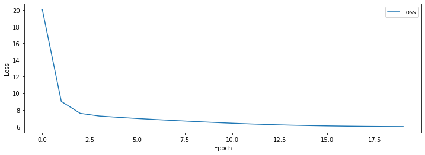

GPT는 Transformer Decoder를 활용한 Pretrained LM(Langauge Model)입니다.  
Pretrained LM이란 레이블이 없는 많은 데이터를 비지도 학습 방법으로 학습을 해서 모델이 언어를 이해 할 수 있도록 한 후 특정 Task에 적용해서 좋은 성능을 내는 방법을 의미 합니다.

이 포스트는 GPT 모델 구현에 대한 설명 입니다. 논문에 대한 내용은 [Improving Language Understanding by Generative Pre-Training](https://s3-us-west-2.amazonaws.com/openai-assets/research-covers/language-unsupervised/language_understanding_paper.pdf){:target="_blank"} 논문을 참고 하거나 다른 블로그를 참고 하세요.

###### 미리 확인해야할 포스트

- [Sentencepiece를 활용해 Vocab 만들기](../vocab-with-sentencepiece/)
- [Naver 영화리뷰 감정분석 데이터 전처리 하기](../preprocess-nsmc/)
- [Transformer (Attention Is All You Need) 구현하기 (1/3)](../transformer-01/)
- [Transformer (Attention Is All You Need) 구현하기 (2/3)](../transformer-02/)
- [Transformer (Attention Is All You Need) 구현하기 (3/3)](../transformer-03/)

#### 1. Config

Transformer와 파라미터를 동일하게 설정 했습니다.  
GPT는 Decoder만 사용하므로 항목 중 Encoder 부분은 제거 했습니다. 기본 파라미터는 [config.json](https://github.com/paul-hyun/transformer-evolution/blob/master/gpt/config.json){:target="_blank"}을 참고 하세요.

```python
config = Config({
    "n_dec_vocab": len(vocab),
    "n_dec_seq": 256,
    "n_layer": 6,
    "d_hidn": 256,
    "i_pad": 0,
    "d_ff": 1024,
    "n_head": 4,
    "d_head": 64,
    "dropout": 0.1,
    "layer_norm_epsilon": 1e-12
})
print(config)
```

#### 2. Decoder


GPT는 표준 Transformer의 Encoder는 사용하지 않고 Decoder만 사용하므로 Decoder에서 Encoder의 출력과 Attention을 하는 부분인 Encoder-Decoder Multi-Head Attention 부분을 제거해야 합니다.  
나머지 부분은 Transformer와 동일합니다.

###### Decoder Layer

표준 Transformer DecoderLayer에서 Encoder-Decoder Multi-Head Attention을 제거한 코드 입니다.

```python
""" decoder layer """
class DecoderLayer(nn.Module):
    def __init__(self, config):
        super().__init__()
        self.config = config

        self.self_attn = MultiHeadAttention(self.config)
        self.layer_norm1 = nn.LayerNorm(self.config.d_hidn, eps=self.config.layer_norm_epsilon)
        self.pos_ffn = PoswiseFeedForwardNet(self.config)
        self.layer_norm3 = nn.LayerNorm(self.config.d_hidn, eps=self.config.layer_norm_epsilon)
    
    def forward(self, dec_inputs, self_attn_mask):
        # (bs, n_dec_seq, d_hidn), (bs, n_head, n_dec_seq, n_dec_seq)
        self_att_outputs, self_attn_prob = self.self_attn(dec_inputs, dec_inputs, dec_inputs, self_attn_mask)
        self_att_outputs = self.layer_norm1(dec_inputs + self_att_outputs)
        # (bs, n_dec_seq, d_hidn)
        ffn_outputs = self.pos_ffn(self_att_outputs)
        ffn_outputs = self.layer_norm3(self_att_outputs + ffn_outputs)
        # (bs, n_dec_seq, d_hidn), (bs, n_head, n_dec_seq, n_dec_seq), (bs, n_head, n_dec_seq, n_enc_seq)
        return ffn_outputs, self_attn_prob
```

###### Decoder

표준 Transformer Decoder에서 Encoder출력을 DecoderLayer에 입력하는 부분을 제거한 코드 입니다.

```python
""" decoder """
class Decoder(nn.Module):
    def __init__(self, config):
        super().__init__()
        self.config = config

        self.dec_emb = nn.Embedding(self.config.n_dec_vocab, self.config.d_hidn)
        sinusoid_table = torch.FloatTensor(get_sinusoid_encoding_table(self.config.n_dec_seq + 1, self.config.d_hidn))
        self.pos_emb = nn.Embedding.from_pretrained(sinusoid_table, freeze=True)

        self.layers = nn.ModuleList([DecoderLayer(self.config) for _ in range(self.config.n_layer)])
    
    def forward(self, dec_inputs):
        positions = torch.arange(dec_inputs.size(1), device=dec_inputs.device, dtype=dec_inputs.dtype).expand(dec_inputs.size(0), dec_inputs.size(1)).contiguous() + 1
        pos_mask = dec_inputs.eq(self.config.i_pad)
        positions.masked_fill_(pos_mask, 0)
    
        # (bs, n_dec_seq, d_hidn)
        dec_outputs = self.dec_emb(dec_inputs) + self.pos_emb(positions)

        # (bs, n_dec_seq, n_dec_seq)
        dec_attn_pad_mask = get_attn_pad_mask(dec_inputs, dec_inputs, self.config.i_pad)
        # (bs, n_dec_seq, n_dec_seq)
        dec_attn_decoder_mask = get_attn_decoder_mask(dec_inputs)
        # (bs, n_dec_seq, n_dec_seq)
        dec_self_attn_mask = torch.gt((dec_attn_pad_mask + dec_attn_decoder_mask), 0)

        self_attn_probs = []
        for layer in self.layers:
            # (bs, n_dec_seq, d_hidn), (bs, n_dec_seq, n_dec_seq)
            dec_outputs, self_attn_prob = layer(dec_outputs, dec_self_attn_mask)
            self_attn_probs.append(self_attn_prob)
        # (bs, n_dec_seq, d_hidn), [(bs, n_dec_seq, n_dec_seq)]
        return dec_outputs, self_attn_probs
```

#### 3. GPT

GPT는 단순히 Transformer Decoder를 실행합니다.  
Pretrain된 모델을 저장하기위한 save, 저장된 모델을 읽기위한 load 함수가 추가로 정의 되었습니다.

```python
""" gpt """
class GPT(nn.Module):
    def __init__(self, config):
        super().__init__()
        self.config = config

        self.decoder = Decoder(self.config)
    
    def forward(self, dec_inputs):
        # (bs, n_seq, d_hidn), [(bs, n_head, n_dec_seq, n_dec_seq)]
        dec_outputs, dec_self_attn_probs = self.decoder(dec_inputs)
        # (bs, n_dec_seq, n_dec_vocab), [(bs, n_head, n_dec_seq, n_dec_seq)]
        return dec_outputs, dec_self_attn_probs
    
    def save(self, epoch, loss, path):
        torch.save({
            "epoch": epoch,
            "loss": loss,
            "state_dict": self.state_dict()
        }, path)
    
    def load(self, path):
        save = torch.load(path)
        self.load_state_dict(save["state_dict"])
        return save["epoch"], save["loss"]
```

#### 4. Pretrain Model


GPT를 Pretrain 하기위한 클래스 입니다.   
GPTPretrain 클래스의 목적은 입력 단어에 대한 다음 단어를 예측 하는 겁니다.

1. GPT의 결과를 입력으로 단어를 예측하기위한 projection_lm을 선언합니다. (줄: 9)
2. projection_lm은 Decoder의 Embedding과 weight를 share 합니다. (줄: 10)
3. GPT 실행결과를 입력으로 projection_lm을 실행해서 단어를 예측하도록 합니다. (줄: 16)
4. 입력에 다한 다음 단어를 예측하는 것이므로 결과의 마지막을 제외한 나머지를 리턴 합니다. (줄: 18)

```python
""" GPT pretrain """
class GPTPretrain(nn.Module):
    def __init__(self, config):
        super().__init__()
        self.config = config

        self.gpt = GPT(self.config)
        # lm
        self.projection_lm = nn.Linear(self.config.d_hidn, self.config.n_dec_vocab, bias=False)
        self.projection_lm.weight = self.gpt.decoder.dec_emb.weight
    
    def forward(self, dec_inputs):
        # (bs, n_dec_seq, d_hidn), [(bs, n_head, n_dec_seq, n_dec_seq)]
        dec_outputs, dec_self_attn_probs = self.gpt(dec_inputs)
        # (bs, n_dec_seq, n_dec_vocab)
        logits_lm = self.projection_lm(dec_outputs)
        # (bs, n_dec_seq - 1, n_dec_vocab), (bs, n_output), [(bs, n_head, n_dec_seq, n_dec_seq)]
        return logits_lm[:, :-1, :].contiguous(), dec_self_attn_probs
```

#### 5. Pretrain Data 생성

###### 단락별 pretrain 데이터 생성 함수

단락을 여러 개의 Pretrain 데이터로 만드는 함수 입니다.

1. 입력의 시작은 '[BOS]' 끝은 '[EOS]'입니다. tgt_seq는 n_seq에서 2개를뺀 값입니다. (줄: 4, 5)
2. 단락을 줄 단위로 for loop를 돌며 아래내용(3 ~ 6)을 실행 합니다. (줄: 10)
3. current_chunk에 line을 추가, current_length에 라인의 token 수를 더합니다. (줄: 11, 12)
4. 마지막 줄 이거나 current_length가 tgt_seq를 넘을 경우 학습데이터를 만듭니다. (줄: 13)
5. current_chunk의 값을 tokens로 만들고 tgt_seq를 초과하는 부분은 제거합니다. (줄: 16, 17)
6. '[BOS]' + tokens + '[EOS]' 형태로 데이터를 생성 합니다. (줄: 20)

```python
""" doc별 pretrain 데이터 생성 """
def create_pretrain_instances(doc, n_seq):
    # for [BOS], [EOS]
    max_seq = n_seq - 2
    tgt_seq = max_seq
    
    instances = []
    current_chunk = []
    current_length = 0
    for i in range(len(doc)):
        current_chunk.append(doc[i]) # line
        current_length += len(doc[i])
        if i == len(doc) - 1 or current_length >= tgt_seq:
            if 0 < len(current_chunk):
                tokens = []
                for chunk in current_chunk: tokens.extend(chunk)
                tokens = tokens[:tgt_seq]
                if 1 < len(tokens):
                    instance = {
                        "tokens": ["[BOS]"] + tokens + ["[EOS]"],
                    }
                    instances.append(instance)
            current_chunk = []
            current_length = 0
    return instances
```

###### pretrain 데이터 생성 함수

말뭉치를 읽어 Pretrain 데이터를 만드는 함수 입니다.

1. 말뭉치 파일 라인수를 확인 합니다. (줄: 3 ~ 6)
2. 말뭉치를 줄 단위로 for loop를 돌며 아래내용(3 ~ 4)을 실행 합니다. (줄: 9)
3. 줄의 문자를 vocab을 이용해 tokenize한 후 doc에 추가 합니다. (줄: 19 ~ 21)
4. 빈 줄이 나타날 경우 단락의 끝이므로 doc를 docs에 추가하고 doc를 새로 만듭니다. (줄: 14 ~ 17)
5. docs(단락배열)을 doc(단락) 단위로 for loop를 돌며 아래내용(6 ~ 7)을 실행 합니다. (줄: 28)
6. doc를 입력으로 위에서 정의한 create_pretrain_instances 함수를 호출합니다. (줄: 29)
7. 6변의 결과를 파일에 저장합니다. (줄: 30 ~ 32)

```python
""" pretrain 데이터 생성 """
def make_pretrain_data(vocab, in_file, out_file, n_seq):
    line_cnt = 0
    with open(in_file, "r") as in_f:
        for line in in_f:
            line_cnt += 1

    docs = []
    with open(in_file, "r") as f:
        doc = []
        with tqdm(total=line_cnt, desc=f"Loading") as pbar:
            for i, line in enumerate(f):
                line = line.strip()
                if line == "":
                    if 0 < len(doc):
                        docs.append(doc)
                        doc = []
                else:
                    pieces = vocab.encode_as_pieces(line)
                    if 0 < len(pieces):
                        doc.append(pieces)
                pbar.update(1)
        if doc:
            docs.append(doc)

    with open(out_file, "w") as out_f:
        with tqdm(total=len(docs), desc=f"Making") as pbar:
            for i, doc in enumerate(docs):
                instances = create_pretrain_instances(doc, n_seq)
                for instance in instances:
                    out_f.write(json.dumps(instance))
                    out_f.write("\n")
                pbar.update(1)
```

###### pretrain 데이터 생성 실행

pretrain 데이터를 만드는 코드 입니다.

```python
in_file = "<path of data>/kowiki.txt"
out_file = "<path of data>/kowiki_gpt.json"
n_seq = 256

if not os.path.isfile(out_file):
    make_pretrain_data(vocab, in_file, out_file, n_seq)
else:
    print(f"{out_file} exists")
```

#### 6. DataSet

###### DataSet

Pretrain DataSet 입니다.

1. 입력 파일로 부터 tokens 읽어 들입니다. (줄: 15)

```python
""" pretrain 데이터셋 """
class PretrainDataSet(torch.utils.data.Dataset):
    def __init__(self, vocab, infile):
        self.vocab = vocab
        self.sentences = []

        line_cnt = 0
        with open(infile, "r") as f:
            for line in f:
                line_cnt += 1

        with open(infile, "r") as f:
            for i, line in enumerate(tqdm(f, total=line_cnt, desc="Make Pretrain Dataset", unit=" lines")):
                instance = json.loads(line)
                self.sentences.append([vocab.piece_to_id(p) for p in instance["tokens"]])
    
    def __len__(self):
        return len(self.sentences)
    
    def __getitem__(self, item):
        return (torch.tensor(self.sentences[item]), torch.tensor(item))
```

###### collate_fn

배치단위로 데이터 처리를 위한 collate_fn 입니다.

1. Decoder inputs의 길이가 같아지도록 짧은 문장에 padding(0)을 추가 합니다. (줄: 5)  
   padding은 Sentencepiece를 활용해 Vocab 만들기에서 ‘–pad_id=0’옵션으로 지정한 값 입니다.

```python
""" pretrain data collate_fn """
def pretrin_collate_fn(inputs):
    dec_inputs, item = list(zip(*inputs))

    dec_inputs = torch.nn.utils.rnn.pad_sequence(dec_inputs, batch_first=True, padding_value=0)

    batch = [
        dec_inputs,
        torch.stack(item, dim=0),
    ]
    return batch
```

###### DataLoader

위에서 정의한 DataSet과 collate_fn을 이용해 학습용(train_loader) DataLoader를 만듭니다.

```python
""" pretrain 데이터 로더 """
batch_size = 128
dataset = PretrainDataSet(vocab, "<path of data>/kowiki_gpt.json")
train_loader = torch.utils.data.DataLoader(dataset, batch_size=batch_size, shuffle=True, collate_fn=pretrin_collate_fn)
```

#### 7. Pretrain

###### Train

GTP 모델을 Pretrain 하기 위한 함수 입니다.

1. Decoder input의 첫 벗째를 제외한 나머지가 정답 label 입니다. (줄: 9)  
   이유는 이전 단어들을 보고 다음단어를 예측하는 것이 목적함수이기 때문에 첫 번째는 제외합니다.
2. Decoder input을 입력으로 GPTPretrain을 실행합니다. (줄: 12)
3. 2번의 결과 중 첫 번째 값이 예측 logits 입니다. (줄: 13)
4. logits 값과 labels의 값을 이용해 Loss를 계산합니다. (줄: 15)
5. loss, optimizer를 이용해 학습합니다. (줄: 21, 22)

```python
""" 모델 epoch 학습 """
def train_epoch(config, epoch, model, criterion_lm, optimizer, train_loader):
    losses = []
    model.train()

    with tqdm(total=len(train_loader), desc=f"Train({epoch})") as pbar:
        for i, value in enumerate(train_loader):
            dec_inputs, _ = map(lambda v: v.to(config.device), value)
            labels_lm = dec_inputs[:, 1:].contiguous()

            optimizer.zero_grad()
            outputs = model(dec_inputs)
            logits_lm = outputs[0]

            loss_lm = criterion_lm(logits_lm.view(-1, logits_lm.size(2)), labels_lm.view(-1))
            loss = loss_lm 

            loss_val = loss_lm.item()
            losses.append(loss_val)

            loss.backward()
            optimizer.step()

            pbar.update(1)
            pbar.set_postfix_str(f"Loss: {loss_val:.3f} ({np.mean(losses):.3f})")
    return np.mean(losses)
```

학습을 위한 추가적인 내용을 선언 합니다.

1. GPU 사용 여부를 확인합니다. (줄: 1)
2. learning_rate 및 학습 epoch를 선언 합니다. (줄: 4, 5)

```python
config.device = torch.device("cuda" if torch.cuda.is_available() else "cpu")
print(config)

learning_rate = 5e-5
n_epoch = 20
```

출력 결과입니다.

```text
{'n_dec_vocab': 8007, 'n_dec_seq': 256, 'n_layer': 6, 'd_hidn': 256, 'i_pad': 0, 'd_ff': 1024, 'n_head': 4, 'd_head': 64, 'dropout': 0.1, 'layer_norm_epsilon': 1e-12, 'device': device(type='cuda')}
```

위에서 선언된 내용을 이용해 학습을 실행하는 절차 입니다.

1. GPTPretrain을 생성합니다. (줄: 1)
2. 기존에 학습된 pretrain 값이 있다면 이를 로드 합니다. (줄: 5 ~ 8)
2. GPTPretrain이 GPU 또는 CPU를 지원하도록 합니다. (줄: 10)
3. loss 함수를 선언 합니다. (줄: 12)
4. optimizer를 선언 합니다. (줄: 13)
5. 각 epoch 마다 학습을 합니다. (줄: 19)

```python
model = GPTPretrain(config)

save_pretrain = "<path of data>/save_gpt_pretrain.json"
best_epoch, best_loss = 0, 0
if os.path.isfile(save_pretrain):
    best_epoch, best_loss = model.gpt.load(save_pretrain)
    print(f"load pretrain from: {save_pretrain}, epoch={best_epoch}, loss={best_loss}")
    best_epoch += 1

model.to(config.device)

criterion_lm = torch.nn.CrossEntropyLoss()
optimizer = torch.optim.Adam(model.parameters(), lr=learning_rate)

losses = []
offset = best_epoch
for step in trange(n_epoch, desc="Epoch"):
    epoch = step + offset
    loss = train_epoch(config, epoch, model, criterion_lm, optimizer, train_loader)
    losses.append(loss)
    model.gpt.save(epoch, loss, save_pretrain)
```

#### 8. Result

학습결과는 아래와 같습니다.

```python
# data
data = {
    "loss": losses
}
df = pd.DataFrame(data)
display(df)

# graph
plt.figure(figsize=[8, 4])
plt.plot(losses)
plt.xlabel('Depth')
plt.xlim((0, n_epoch - 1))
plt.ylabel('Position')
plt.show()
```

{:class="table table-bordered"}
| epoch | loss  |
|-------|-------|
|  0    | 20.05 |
|  4    |  7.11 |
|  9    |  6.49 |
| 14    |  6.12 |
| 19    |  5.99 |



#### 9. 참고

다음 포스트 [GPT(Generative Pre-Training) 구현하기 (2/2)](../gpt-02/)에서는 GPT를 이용해서 ‘Naver 영화리뷰 감정분석’ 과정을 정리 하겠습니다.

자세한 내용은 다음을 참고 하세요.

- [gpt-01.ipynb](https://github.com/paul-hyun/transformer-evolution/blob/master/tutorial/gpt-01.ipynb){:target="_blank"}
- [model.py](https://github.com/paul-hyun/transformer-evolution/blob/master/gpt/model.py){:target="_blank"}
- [data.py](https://github.com/paul-hyun/transformer-evolution/blob/master/gpt/data.py){:target="_blank"}
- [pretrain.py](https://github.com/paul-hyun/transformer-evolution/blob/master/gpt/pretrain.py){:target="_blank"}
- [Improving Language Understanding by Generative Pre-Training](https://s3-us-west-2.amazonaws.com/openai-assets/research-covers/language-unsupervised/language_understanding_paper.pdf){:target="_blank"}
- [데이터 및 결과 파일](https://drive.google.com/open?id=15XGr-L-W6DSoR5TbniPMJASPsA0IDTiN){:target="_blank"}

