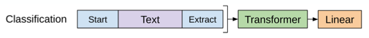
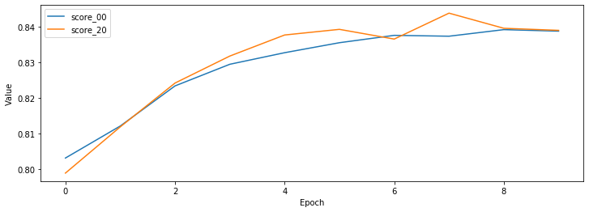

[GPT(Generative Pre-Training) 구현하기 (1/2)](../gpt-01/)에서 포스팅된 내용을 기반으로 Naver 영화리뷰 감정분석 학습과정을 정리 하겠습니다.  
Naver 영화리뷰 감정분석은 Classification task로 위 그림의 첫번째 줄과 같이 동작합니다.

이 포스트는 GPT 모델 구현에 대한 설명 입니다. 논문에 대한 내용은 [Improving Language Understanding by Generative Pre-Training](https://s3-us-west-2.amazonaws.com/openai-assets/research-covers/language-unsupervised/language_understanding_paper.pdf){:target="_blank"} 논문을 참고 하거나 다른 블로그를 참고 하세요.

###### 미리 확인해야할 포스트

- [Sentencepiece를 활용해 Vocab 만들기](../vocab-with-sentencepiece/)
- [Naver 영화리뷰 감정분석 데이터 전처리 하기](../preprocess-nsmc/)
- [Transformer (Attention Is All You Need) 구현하기 (1/3)](../transformer-01/)
- [Transformer (Attention Is All You Need) 구현하기 (2/3)](../transformer-02/)
- [Transformer (Attention Is All You Need) 구현하기 (3/3)](../transformer-03/)
- [GPT(Generative Pre-Training) 구현하기 (1/2)](../gpt-01/)

#### 1. Model

[GPT(Generative Pre-Training) 구현하기 (1/2)](../gpt-01/)의 GPT 클래스를 이용하여 Naver 영화리뷰 감정분석 분류 모델 클래스를 아래와 같이 정의 합니다.

1. Decoder input을 입력으로 GPT 모델을 실행 합니다. (줄: 16)
2. 1번 결과 값을 가지고 다음단어를 예측하는 logits_lm을 만듭니다. (줄: 18)  
   GPT는 특정 Task를 진행하면서 동시에 다음단어를 예측하는 lm을 학습할 수 있습니다.
3. 1변 결과의 마지막 값을 Classification을 위한 값으로 사용합니다. (줄: 20)

```python
""" naver movie classfication """
class MovieClassification(nn.Module):
    def __init__(self, config):
        super().__init__()
        self.config = config

        self.gpt = GPT(self.config)
        # lm
        self.projection_lm = nn.Linear(self.config.d_hidn, self.config.n_dec_vocab, bias=False)
        self.projection_lm.weight = self.gpt.decoder.dec_emb.weight
        # classfier
        self.projection_cls = nn.Linear(self.config.d_hidn, self.config.n_output, bias=False)
    
    def forward(self, dec_inputs):
        # (bs, n_dec_seq, d_hidn), [(bs, n_head, n_dec_seq, n_dec_seq)]
        dec_outputs, dec_self_attn_probs = self.gpt(dec_inputs)
        # (bs, n_dec_seq, n_dec_vocab)
        logits_lm = self.projection_lm(dec_outputs)
        # (bs, d_hidn)
        dec_outputs = dec_outputs[:, -1].contiguous()
        # (bs, n_output)
        logits_cls = self.projection_cls(dec_outputs)
        # (bs, n_dec_seq - 1, n_dec_vocab), (bs, n_output), [(bs, n_head, n_dec_seq, n_dec_seq)]
        return logits_lm[:, :-1, :].contiguous(), logits_cls, dec_self_attn_probs
```

#### 2. DataSet

###### DataSet



Naver 영화리뷰 감정분석 데이터 셋 입니다.
1. 입력 파일로 부터 'label'을 읽어 들입니다. (줄: 16)
2. 입력 파일로 부터 'doc' token을 읽어 숫자(token id)로 변경 합니다. (줄: 17)  
   위 그림과 같이 시작은 '[BOS]' 끝은 '[EOS]'가 되도록 합니다.

```python
""" 영화 분류 데이터셋 """
class MovieDataSet(torch.utils.data.Dataset):
    def __init__(self, vocab, infile):
        self.vocab = vocab
        self.labels = []
        self.sentences = []

        line_cnt = 0
        with open(infile, "r") as f:
            for line in f:
                line_cnt += 1

        with open(infile, "r") as f:
            for i, line in enumerate(tqdm(f, total=line_cnt, desc=f"Loading {infile}", unit=" lines")):
                data = json.loads(line)
                self.labels.append(data["label"])
                self.sentences.append([vocab.piece_to_id("[BOS]")] + [vocab.piece_to_id(p) for p in data["doc"]] + [vocab.piece_to_id("[EOS]")])
    
    def __len__(self):
        assert len(self.labels) == len(self.sentences)
        return len(self.labels)
    
    def __getitem__(self, item):
        return (torch.tensor(self.labels[item]),
                torch.tensor(self.sentences[item]))
```

###### collate_fn

배치단위로 데이터 처리를 위한 collate_fn 입니다.
1. Decoder inputs의 길이가 같아지도록 짧은 문장에 padding(0)을 추가 합니다. (줄: 5)  
   padding은 [Sentencepiece를 활용해 Vocab 만들기](../vocab-with-sentencepiece/)에서 '--pad_id=0'옵션으로 지정한 값 입니다.
2. Label은 길이가 1 고정이므로 stack 함수를 이용해 tensor로 만듭니다. (줄: 8)

```python
""" movie data collate_fn """
def movie_collate_fn(inputs):
    labels, dec_inputs = list(zip(*inputs))

    dec_inputs = torch.nn.utils.rnn.pad_sequence(dec_inputs, batch_first=True, padding_value=0)

    batch = [
        torch.stack(labels, dim=0),
        dec_inputs,
    ]
    return batch
```

###### DataLoader

위에서 정의한 DataSet과 collate_fn을 이용해 학습용(train_loader), 평가용(test_loader) DataLoader를 만듭니다.

```python
""" 데이터 로더 """
batch_size = 128
train_dataset = MovieDataSet(vocab, f"{data_dir}/ratings_train.json")
train_loader = torch.utils.data.DataLoader(train_dataset, batch_size=batch_size, shuffle=True, collate_fn=movie_collate_fn)
test_dataset = MovieDataSet(vocab, f"{data_dir}/ratings_test.json")
test_loader = torch.utils.data.DataLoader(test_dataset, batch_size=batch_size, shuffle=False, collate_fn=movie_collate_fn)
```

#### 3. Evaluate

학습된 MovieClassification 모델의 성능을 평가하기 위한 함수 입니다. 평가는 정확도(accuracy)를 사용 했습니다.

1. Decoder input을 입력으로 MovieClassification을 실행합니다. (줄: 12)
2. 1번의 결과 중 두 번째 값이 예측 logits 입니다. (줄: 13)
3. logits의 최대값의 index를 구합니다. (줄: 14)
4. 3번에게 구한 값과 labels의 값이 같은지 비교 합니다. (줄: 16)

```python
""" 모델 epoch 평가 """
def eval_epoch(config, model, data_loader):
    matchs = []
    model.eval()

    n_word_total = 0
    n_correct_total = 0
    with tqdm(total=len(data_loader), desc=f"Valid") as pbar:
        for i, value in enumerate(data_loader):
            labels, dec_inputs = map(lambda v: v.to(config.device), value)

            outputs = model(dec_inputs)
            logits_cls = outputs[1]
            _, indices = logits_cls.max(1)

            match = torch.eq(indices, labels).detach()
            matchs.extend(match.cpu())
            accuracy = np.sum(matchs) / len(matchs) if 0 < len(matchs) else 0

            pbar.update(1)
            pbar.set_postfix_str(f"Acc: {accuracy:.3f}")
    return np.sum(matchs) / len(matchs) if 0 < len(matchs) else 0
```

#### 4. Train

MovieClassification 모델을 학습하기 위한 함수 입니다.

1. Decoder input을 입력으로 MovieClassification을 실행합니다. (줄: 11)
2. 1번의 결과 중 두 번째 값이 예측 logits 입니다. (줄: 12)
3. logits 값과 labels의 값을 이용해 Loss를 계산합니다. (줄: 14)
4. loss, optimizer를 이용해 학습합니다. (줄: 20, 21)

```python
""" 모델 epoch 학습 """
def train_epoch(config, epoch, model, criterion_cls, optimizer, train_loader):
    losses = []
    model.train()

    with tqdm(total=len(train_loader), desc=f"Train({epoch})") as pbar:
        for i, value in enumerate(train_loader):
            labels, dec_inputs = map(lambda v: v.to(config.device), value)

            optimizer.zero_grad()
            outputs = model(dec_inputs)
            logits_cls = outputs[1]

            loss_cls = criterion_cls(logits_cls, labels)
            loss = loss_cls

            loss_val = loss_cls.item()
            losses.append(loss_val)

            loss.backward()
            optimizer.step()

            pbar.update(1)
            pbar.set_postfix_str(f"Loss: {loss_val:.3f} ({np.mean(losses):.3f})")
    return np.mean(losses)
```

학습을 위한 추가적인 내용을 선언 합니다.

1. GPU 사용 여부를 확인합니다. (줄: 1)
2. 출력 값 개수를 정의 합니다. (부정(0), 긍정(1) 2가지입니다.) (줄: 2)
3. learning_rate 및 학습 epoch를 선언 합니다. (줄: 5, 6)

```python
config.device = torch.device("cuda" if torch.cuda.is_available() else "cpu")
config.n_output = 2
print(config)

learning_rate = 5e-5
n_epoch = 10
```

출력 결과입니다.

```text
{'n_dec_vocab': 8007, 'n_dec_seq': 256, 'n_layer': 6, 'd_hidn': 256, 'i_pad': 0, 'd_ff': 1024, 'n_head': 4, 'd_head': 64, 'dropout': 0.1, 'layer_norm_epsilon': 1e-12, 'device': device(type='cuda'), 'n_output': 2}
```

위에서 선언된 내용을 이용해 학습을 실행하는 함수입니다.

1. MovieClassification이 GPU 또는 CPU를 지원하도록 합니다. (줄: 1)
2. loss 함수를 선언 합니다. (줄: 4)
3. optimizer를 선언 합니다. (줄: 5)
4. 각 epoch 마다 학습을 합니다. (줄: 10)
5. 각 epoch 마다 평가를 합니다. (줄: 11)

```python
def train(model):
    model.to(config.device)

    criterion_cls = torch.nn.CrossEntropyLoss()
    optimizer = torch.optim.Adam(model.parameters(), lr=learning_rate)

    best_epoch, best_loss, best_score = 0, 0, 0
    losses, scores = [], []
    for epoch in range(n_epoch):
        loss = train_epoch(config, epoch, model, criterion_cls, optimizer, train_loader)
        score = eval_epoch(config, model, test_loader)

        losses.append(loss)
        scores.append(score)

        if best_score < score:
            best_epoch, best_loss, best_score = epoch, loss, score
    print(f">>>> epoch={best_epoch}, loss={best_loss:.5f}, socre={best_score:.5f}")
    return losses, scores
```

###### Train (No Pretrain)

Pretrain을 사용하지 않고 학습을 진행 합니다.

1. MovieClassification을 생성합니다. (줄: 1)
2. 추가적인 처리 없이 생성된 MovieClassification으로 학습을 진행 합니다. (줄: 3)

```python
model = MovieClassification(config)

losses_00, scores_00 = train(model)
```

###### Train (20 epoch Pretrain)

20 epoch Pretrain된 모델을 이용해 학습을 진행 합니다.

1. MovieClassification을 생성합니다. (줄: 1)
2. [GPT(Generative Pre-Training) 구현하기 (1/2)](../gpt-01/)에서 Pretrain 모델을 로드 합니다. (줄: 3, 4)
3. MovieClassification으로 학습을 진행 합니다. (줄: 6)

```python
model = MovieClassification(config)

save_pretrain = "<path of data>/save_gpt_pretrain.pth"
model.gpt.load(save_pretrain)

losses_20, scores_20 = train(model)
```

#### 5. Result

학습결과 및 평가결과는 아래와 같습니다.  
Pretrain을 안한 경우는 정확도(score)가 83.9% 정도 나왔습니다.  
Pretrain을 20 epoch 한 경우는 정확도(score)가 84.4% 정도 나왔습니다.  

```python
# table
data = {
    "loss_00": losses_00,
    "socre_00": scores_00,
    "loss_20": losses_20,
    "socre_20": scores_20,
}
df = pd.DataFrame(data)
display(df)

# graph
plt.figure(figsize=[12, 4])
plt.plot(scores_00, label="score_00")
plt.plot(scores_20, label="score_20")
plt.legend()
plt.xlabel('Epoch')
plt.ylabel('Value')
plt.show()
```

{:class="table table-bordered"}
| loss_00  | socre_00 | loss_20  | socre_20 |
|----------|----------|----------|----------|
| 0.486320 | 0.803188 | 0.496960 | 0.798968 |
| 0.406357 | 0.812149 | 0.409752 | 0.811909 |
| 0.380282 | 0.823389 | 0.379406 | 0.824189 |
| 0.358909 | 0.829450 | 0.358584 | 0.831750 |
| 0.340809 | 0.832690 | 0.340274 | 0.837650 |
| 0.324291 | 0.835490 | 0.323264 | 0.839230 |
| 0.306918 | 0.837550 | 0.310658 | 0.836510 |
| 0.290276 | 0.837310 | 0.297167 | 0.843771 |
| 0.274559 | 0.839150 | 0.284450 | 0.839530 |
| 0.256189 | 0.838730 | 0.272207 | 0.838950 |



#### 6. 참고

자세한 내용은 다음을 참고 하세요.

- [gpt-02.ipynb](https://github.com/paul-hyun/transformer-evolution/blob/master/tutorial/gpt-02.ipynb){:target="_blank"}
- [model.py](https://github.com/paul-hyun/transformer-evolution/blob/master/gpt/model.py){:target="_blank"}
- [data.py](https://github.com/paul-hyun/transformer-evolution/blob/master/gpt/data.py){:target="_blank"}
- [train.py](https://github.com/paul-hyun/transformer-evolution/blob/master/gpt/train.py){:target="_blank"}
- [Improving Language Understanding by Generative Pre-Training](https://s3-us-west-2.amazonaws.com/openai-assets/research-covers/language-unsupervised/language_understanding_paper.pdf){:target="_blank"}
- [데이터 파일](https://drive.google.com/open?id=15XGr-L-W6DSoR5TbniPMJASPsA0IDTiN){:target="_blank"}

