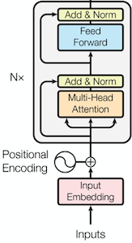
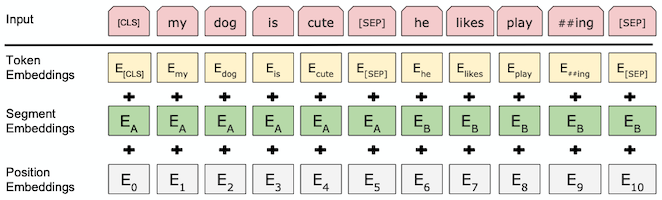
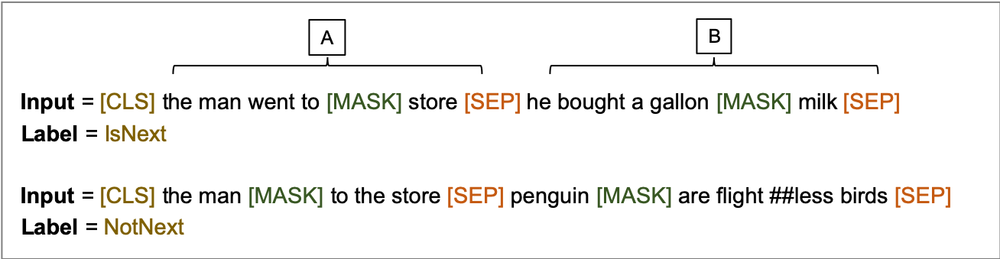
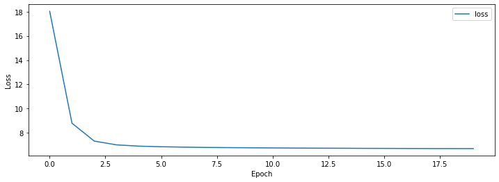

BERT Transformer Encoder를 활용한 Pretrained LM(Langauge Model)입니다.  
Pretrained LM이란 레이블이 없는 많은 데이터를 비지도 학습 방법으로 학습을 해서 모델이 언어를 이해 할 수 있도록 한 후 특정 Task에 적용해서 좋은 성능을 내는 방법을 의미 합니다.

이 포스트는 BERT 모델 구현에 대한 설명 입니다. 논문에 대한 내용은 [BERT: Pre-training of Deep Bidirectional Transformers for Language Understanding](https://arxiv.org/abs/1810.04805){:target="_blank"} 논문을 참고 하거나 다른 블로그를 참고 하세요.

###### 미리 확인해야할 포스트

- [Sentencepiece를 활용해 Vocab 만들기](../vocab-with-sentencepiece/)
- [Naver 영화리뷰 감정분석 데이터 전처리 하기](../preprocess-nsmc/)
- [Transformer (Attention Is All You Need) 구현하기 (1/3)](../transformer-01/)
- [Transformer (Attention Is All You Need) 구현하기 (2/3)](../transformer-02/)
- [Transformer (Attention Is All You Need) 구현하기 (3/3)](../transformer-03/)

#### 1. Config

Transformer와 파라미터를 동일하게 설정 했습니다.  
BERT는 Encoder만 사용하므로 항목 중 Decoder 부분은 제거 했습니다.  
BERT Encoder는 기본 입력에 추가로 Segment 정보를 입력 받는데 Segment개수를 정의하는 n_seg_type을 추가로 정의 했습니다.  
기본 파라미터는 [config.json](https://github.com/paul-hyun/transformer-evolution/blob/master/bert/config.json){:target="_blank"}을 참고 하세요.

```python
config = Config({
    "n_enc_vocab": len(vocab),
    "n_enc_seq": 256,
    "n_seg_type": 2,
    "n_layer": 6,
    "d_hidn": 256,
    "i_pad": 0,
    "d_ff": 1024,
    "n_head": 4,
    "d_head": 64,
    "dropout": 0.1,
    "layer_norm_epsilon": 1e-12
})
print(config)
```

#### 2. Encoder



BERT는 표준 Transformer의 Decoder는 사용하지 않고 Encoder만 사용합니다.  
Position Embedding 학습, Segment Embedding 추가 두가지 이외에 나머지 부분은 표준 Transformer와 동일합니다.

###### Encoder Layer

표준 Transformer EncoderLayer와 동일합니다.

```python
""" encoder layer """
class EncoderLayer(nn.Module):
    def __init__(self, config):
        super().__init__()
        self.config = config

        self.self_attn = MultiHeadAttention(self.config)
        self.layer_norm1 = nn.LayerNorm(self.config.d_hidn, eps=self.config.layer_norm_epsilon)
        self.pos_ffn = PoswiseFeedForwardNet(self.config)
        self.layer_norm2 = nn.LayerNorm(self.config.d_hidn, eps=self.config.layer_norm_epsilon)
    
    def forward(self, inputs, attn_mask):
        # (bs, n_enc_seq, d_hidn), (bs, n_head, n_enc_seq, n_enc_seq)
        att_outputs, attn_prob = self.self_attn(inputs, inputs, inputs, attn_mask)
        att_outputs = self.layer_norm1(inputs + att_outputs)
        # (bs, n_enc_seq, d_hidn)
        ffn_outputs = self.pos_ffn(att_outputs)
        ffn_outputs = self.layer_norm2(ffn_outputs + att_outputs)
        # (bs, n_enc_seq, d_hidn), (bs, n_head, n_enc_seq, n_enc_seq)
        return ffn_outputs, attn_prob
```

###### Encoder



표준 Transformer Encoder와 아래 내용이 다릅니다.

1. Position을 학습할 수 있도록 하였습니다. (줄: 8)  
   표준 Transformer에서는 sinusoid encoding을 구한 후 이 값으로 position embedding을 초기화 할 때 freeze 옵션을 True로 주어 position embedding이 학습되지 않도록 하였습니다.  
   BERT는 position embedding을 기본 값으로 초기화 한 후 학습되도록 하였습니다.
2. Segment Embedding을 추가 했습니다. (줄: 9)  
   Segment Embedding은 위 그림과 같이 두개의 문장이 들어 갈 경우 첫 번째 문장과 두 번째 문장을 구분하기 위해 사용 됩니다.
3. Encoder input에 Segment 정보를 추가 했습니다. (줄: 13)
4. Token, Position 및 Segment 3가지 Embedding을 더 합니다. (줄: 19)  
   표준 Transformer에서는 Token, Position 2가지 Embedding을 더 합니다.

나머지는 Transformer Encoder와 동일합니다.

```python
""" encoder """
class Encoder(nn.Module):
    def __init__(self, config):
        super().__init__()
        self.config = config

        self.enc_emb = nn.Embedding(self.config.n_enc_vocab, self.config.d_hidn)
        self.pos_emb = nn.Embedding(self.config.n_enc_seq + 1, self.config.d_hidn)
        self.seg_emb = nn.Embedding(self.config.n_seg_type, self.config.d_hidn)

        self.layers = nn.ModuleList([EncoderLayer(self.config) for _ in range(self.config.n_layer)])
    
    def forward(self, inputs, segments):
        positions = torch.arange(inputs.size(1), device=inputs.device, dtype=inputs.dtype).expand(inputs.size(0), inputs.size(1)).contiguous() + 1
        pos_mask = inputs.eq(self.config.i_pad)
        positions.masked_fill_(pos_mask, 0)

        # (bs, n_enc_seq, d_hidn)
        outputs = self.enc_emb(inputs) + self.pos_emb(positions)  + self.seg_emb(segments)

        # (bs, n_enc_seq, n_enc_seq)
        attn_mask = get_attn_pad_mask(inputs, inputs, self.config.i_pad)

        attn_probs = []
        for layer in self.layers:
            # (bs, n_enc_seq, d_hidn), (bs, n_head, n_enc_seq, n_enc_seq)
            outputs, attn_prob = layer(outputs, attn_mask)
            attn_probs.append(attn_prob)
        # (bs, n_enc_seq, d_hidn), [(bs, n_head, n_enc_seq, n_enc_seq)]
        return outputs, attn_probs
```

#### 3. BERT

BERT 모델 클래스 입니다.

1. BERT는 Transformer Encoder를 실행합니다. (줄: 14)
2. 1번의 결과(outputs)의 첫 번째([CLS]) Token을 outputs_cls로 저장 합니다. (줄: 16)
3. outputs_cls에 Linear 및 tanh를 실행합니다. (줄: 17, 18)
4. Pretrain된 모델을 저장하기위한 save 함수 입니다. (줄: 22 ~ 27)
5. Pretrain된 모델을 읽기위한 load 함수 입니다. (줄: 29 ~ 32)

```python
""" bert """
class BERT(nn.Module):
    def __init__(self, config):
        super().__init__()
        self.config = config

        self.encoder = Encoder(self.config)

        self.linear = nn.Linear(config.d_hidn, config.d_hidn)
        self.activation = torch.tanh
    
    def forward(self, inputs, segments):
        # (bs, n_seq, d_hidn), [(bs, n_head, n_enc_seq, n_enc_seq)]
        outputs, self_attn_probs = self.encoder(inputs, segments)
        # (bs, d_hidn)
        outputs_cls = outputs[:, 0].contiguous()
        outputs_cls = self.linear(outputs_cls)
        outputs_cls = self.activation(outputs_cls)
        # (bs, n_enc_seq, n_enc_vocab), (bs, d_hidn), [(bs, n_head, n_enc_seq, n_enc_seq)]
        return outputs, outputs_cls, self_attn_probs
    
    def save(self, epoch, loss, path):
        torch.save({
            "epoch": epoch,
            "loss": loss,
            "state_dict": self.state_dict()
        }, path)
    
    def load(self, path):
        save = torch.load(path)
        self.load_state_dict(save["state_dict"])
        return save["epoch"], save["loss"]
```

#### 4. Pretrain Model



BERT를 Pretrain을 위한 목적함수는 다음 두 가지 입니다.

- MLM (Masked Language Model)  
  위 그림과 같이 [MASK]된 부분의 단어를 예측하는 것을 MLM이라 합니다.  
  전체 단어의 15%를 선택한 후 그중 80%는 [MASK], 10%는 현재 단어 유지, 10%는 임의의 단어로 대체 합니다.
- NSP (Next Sentence Prediction)  
  위 그림과 같이 첫 번째([CLS]) Token으로 문장 A와 문장 B의 관계를 예측하는 것을 NSP라 합니다.  
  A 다음문장이 B가 맞을 경우는 True, A 다음문장이 B가 아닐 경우 False로 예측하도록 합니다.

BERT를 Pretrain 하기위한 클래스 입니다.   

1. BERT의 결과를 입력으로 NSP를 예측하기위한 projection_cls를 선언합니다. (줄: 9)
2. BERT의 결과를 입력으로 MLM을 예측하기위한 projection_lm을 선언합니다. (줄: 11)
3. projection_lm은 Encoder의 Embedding과 weight를 share 합니다. (줄: 12)
4. inputs, segments를 입력으로 BERT를 실행합니다. (줄: 16)
5. outputs_cls를 입력으로 projection_cls를 실행하여 NSP를 예측하도록 합니다. (줄: 18)
6. outputs를 입력으로 projection_lm을 실행하여 MLM을 예측하도록 합니다. (줄: 20)

```python
""" BERT pretrain """
class BERTPretrain(nn.Module):
    def __init__(self, config):
        super().__init__()
        self.config = config

        self.bert = BERT(self.config)
        # classfier
        self.projection_cls = nn.Linear(self.config.d_hidn, 2, bias=False)
        # lm
        self.projection_lm = nn.Linear(self.config.d_hidn, self.config.n_enc_vocab, bias=False)
        self.projection_lm.weight = self.bert.encoder.enc_emb.weight
    
    def forward(self, inputs, segments):
        # (bs, n_enc_seq, d_hidn), (bs, d_hidn), [(bs, n_head, n_enc_seq, n_enc_seq)]
        outputs, outputs_cls, attn_probs = self.bert(inputs, segments)
        # (bs, 2)
        logits_cls = self.projection_cls(outputs_cls)
        # (bs, n_enc_seq, n_enc_vocab)
        logits_lm = self.projection_lm(outputs)
        # (bs, n_enc_vocab), (bs, n_enc_seq, n_enc_vocab), [(bs, n_head, n_enc_seq, n_enc_seq)]
        return logits_cls, logits_lm, attn_probs
```

#### 5. Pretrain Data 생성

###### [MASK] 생성 함수

마스크를 생성하는 함수 입니다.  

1. token을 단어별로 index 배열 행태로 저장 합니다. (줄: 4 ~ 10)  
   u"\u2581"은 단어의 시작을 의미하는 값으로 시작하지 않으면 이전 Token과 연결된 subword 입니다.
2. Random 선택을 위해 단어의 index를 섞습니다. (줄: 11)
3. index를 for loop를 돌며 아래내용(4 ~ 9)을 실행 합니다. (줄: 10)
4. mask_lms의 개수가 mask_cnt를 넘지 않도록 합니다. (줄: 15 ~ 18)  
   mask_cnt는 전체 token개수의 15%에 해당하는 개수 입니다.
5. index에 대해 80% 확률로 [MASK]를 취합니다. (줄: 21, 22)
6. index에 대해 10% 확률로 현재 값을 유지 합니다. (줄: 24, 25)
7. index에 대해 10% 확률로 vocab_list에서 임의의 값을 선택합니다. (줄: 26, 27)
8. mask된 index의 값과 정답 label을 mask_lms에 저장 합니다. (줄: 28)
9. token index의 값을 mask 합니다. (줄: 29)
10. Random하게 mask된 값을 index순으로 정렬 합니다. (줄: 30)
11. 10번에서 정렬된 값을 이용해 mask_index, mask_label을 만듭니다. (줄 31, 32)

```python
""" 마스크 생성 """
def create_pretrain_mask(tokens, mask_cnt, vocab_list):
    cand_idx = []
    for (i, token) in enumerate(tokens):
        if token == "[CLS]" or token == "[SEP]":
            continue
        if 0 < len(cand_idx) and not token.startswith(u"\u2581"):
            cand_idx[-1].append(i)
        else:
            cand_idx.append([i])
    shuffle(cand_idx)

    mask_lms = []
    for index_set in cand_idx:
        if len(mask_lms) >= mask_cnt:
            break
        if len(mask_lms) + len(index_set) > mask_cnt:
            continue
        for index in index_set:
            masked_token = None
            if random() < 0.8: # 80% replace with [MASK]
                masked_token = "[MASK]"
            else:
                if random() < 0.5: # 10% keep original
                    masked_token = tokens[index]
                else: # 10% random word
                    masked_token = choice(vocab_list)
            mask_lms.append({"index": index, "label": tokens[index]})
            tokens[index] = masked_token
    mask_lms = sorted(mask_lms, key=lambda x: x["index"])
    mask_idx = [p["index"] for p in mask_lms]
    mask_label = [p["label"] for p in mask_lms]

    return tokens, mask_idx, mask_label
```

###### 최대 길이 초과하는 Token 자르기

token A, token B의 길이의 합이 특정 길이보다 클 경우 이를 줄이는 함수입니다.

1. token A의 길이가 길 경우 앞에서부터 토큰을 제거 합니다. (줄: 8, 9)
2. token B의 길이가 길 경우 뒤에서부터 토큰을 제거 합니다. (줄: 10, 11)

```python
""" 쵀대 길이 초과하는 토큰 자르기 """
def trim_tokens(tokens_a, tokens_b, max_seq):
    while True:
        total_length = len(tokens_a) + len(tokens_b)
        if total_length <= max_seq:
            break

        if len(tokens_a) > len(tokens_b):
            del tokens_a[0]
        else:
            tokens_b.pop()
```

###### 단락별 pretrain 데이터 생성 함수

단락을 여러 개의 Pretrain 데이터로 만드는 함수 입니다.

1. 특수 Token은 시작 '[CLS]', 구분자 '[SEP]' 2개 입니다.  
   tgt_seq는 n_seq에서 3개를 뺀 값입니다. (줄: 4, 5)
2. 단락을 줄 단위로 for loop를 돌며 아래내용(3 ~ 12)을 실행 합니다. (줄: 10)
3. current_chunk에 line을 추가, current_length에 라인의 token 수를 더합니다. (줄: 11, 12)
4. 마지막 줄 이거나 current_length가 tgt_seq를 넘을 경우 학습데이터를 만듭니다. (줄: 13)
5. current_chunk에서 Random하게 길이를 선택해서 tokens_a를 만듭니다. (줄: 15 ~ 20)
6. 50%의 확률로 다른 단락에서 tokens_b를 만듭니다. (줄: 23 ~ 33)  
   is_next의 값은 False(0) 입니다. (줄: 24)
7. 50%의 확률로 current_chunk에서 tokens_a 이후부터 tokens_b를 만듭니다. (줄: 34 ~ 37)  
   is_next의 값은 True(1) 입니다. (줄: 35)
8. 위에서 정의한 trim_tokens 함수를 실행하여 token 크기를 줄입니다. (줄: 39)
9. '[CLS]' + tokens_a + '[SEP]' + tokens_b + '[SEP]' 형태로 데이터를 생성 합니다. (줄: 43)
10. segment를 생성 합니다. (줄: 44)  
    9번에서 '[CLS]' + tokens_a + '[SEP]'는 0, tokens_b + '[SEP]'는 1 입니다.
11. 위에서 정의한 create_pretrain_mask 함수를 실행하여 Mask 합니다. (줄: 46)  
    Mask Token 개수는 전체 Token 수에 0.15(15%)를 곱해서 구합니다.
12. 위 결과를 가지고 데이터를 생성합니다. (줄: 48 ~ 55)

```python
""" doc별 pretrain 데이터 생성 """
def create_pretrain_instances(docs, doc_idx, doc, n_seq, mask_prob, vocab_list):
    # for [CLS], [SEP], [SEP]
    max_seq = n_seq - 3
    tgt_seq = max_seq
    
    instances = []
    current_chunk = []
    current_length = 0
    for i in range(len(doc)):
        current_chunk.append(doc[i]) # line
        current_length += len(doc[i])
        if i == len(doc) - 1 or current_length >= tgt_seq:
            if 0 < len(current_chunk):
                a_end = 1
                if 1 < len(current_chunk):
                    a_end = randrange(1, len(current_chunk))
                tokens_a = []
                for j in range(a_end):
                    tokens_a.extend(current_chunk[j])
                
                tokens_b = []
                if len(current_chunk) == 1 or random() < 0.5:
                    is_next = 0
                    tokens_b_len = tgt_seq - len(tokens_a)
                    random_doc_idx = doc_idx
                    while doc_idx == random_doc_idx:
                        random_doc_idx = randrange(0, len(docs))
                    random_doc = docs[random_doc_idx]

                    random_start = randrange(0, len(random_doc))
                    for j in range(random_start, len(random_doc)):
                        tokens_b.extend(random_doc[j])
                else:
                    is_next = 1
                    for j in range(a_end, len(current_chunk)):
                        tokens_b.extend(current_chunk[j])

                trim_tokens(tokens_a, tokens_b, max_seq)
                assert 0 < len(tokens_a)
                assert 0 < len(tokens_b)

                tokens = ["[CLS]"] + tokens_a + ["[SEP]"] + tokens_b + ["[SEP]"]
                segment = [0] * (len(tokens_a) + 2) + [1] * (len(tokens_b) + 1)

                tokens, mask_idx, mask_label = create_pretrain_mask(tokens, int((len(tokens) - 3) * mask_prob), vocab_list)

                instance = {
                    "tokens": tokens,
                    "segment": segment,
                    "is_next": is_next,
                    "mask_idx": mask_idx,
                    "mask_label": mask_label
                }
                instances.append(instance)

            current_chunk = []
            current_length = 0
    return instances
```

###### pretrain 데이터 생성 함수

말뭉치를 읽어 Pretrain 데이터를 만드는 함수 입니다.

1. 단어목록 vocab_list를 생성 합니다. 생성 시 unknown은 제거합니다. (줄: 3 ~ 6)  
   vocab_list는 위에서 정의한 create_pretrain_mask 함수의 입력으로 사용하기 위함 입니다.
2. 말뭉치 파일 라인수를 확인 합니다. (줄: 8 ~ 11)
3. 말뭉치를 줄 단위로 for loop를 돌며 아래내용(3 ~ 4)을 실행 합니다. (줄: 14)
4. 줄의 문자를 vocab을 이용해 tokenize한 후 doc에 추가 합니다. (줄: 24 ~ 26)
5. 빈 줄이 나타날 경우 단락의 끝이므로 doc를 docs에 추가하고 doc를 새로 만듭니다. (줄: 19 ~ 22)
6. count 횟수만큼 for loop를 돌며 (7 ~ 9) Pretrain 데이터를 만듭니다. (줄: 31)  
   BERT는 Mask를 15%만 하므로 한 번에 전체 단어를 학습할 수 없습니다. 한 말뭉치에 대해 통상 Pretrain 데이터 10개(150%) 정도 만들어서 학습하도록 합니다.
7. docs(단락배열)을 doc(단락) 단위로 for loop를 돌며 아래내용(6 ~ 7)을 실행 합니다. (줄: 28)
8. doc를 입력으로 위에서 정의한 create_pretrain_instances 함수를 호출합니다. (줄: 37)
9. 8변의 결과를 파일에 저장합니다. (줄: 39 ~ 41)

```python
""" pretrain 데이터 생성 """
def make_pretrain_data(vocab, in_file, out_file, count, n_seq, mask_prob):
    vocab_list = []
    for id in range(vocab.get_piece_size()):
        if not vocab.is_unknown(id):
            vocab_list.append(vocab.id_to_piece(id))

    line_cnt = 0
    with open(in_file, "r") as in_f:
        for line in in_f:
            line_cnt += 1
    
    docs = []
    with open(in_file, "r") as f:
        doc = []
        with tqdm(total=line_cnt, desc=f"Loading") as pbar:
            for i, line in enumerate(f):
                line = line.strip()
                if line == "":
                    if 0 < len(doc):
                        docs.append(doc)
                        doc = []
                else:
                    pieces = vocab.encode_as_pieces(line)
                    if 0 < len(pieces):
                        doc.append(pieces)
                pbar.update(1)
        if doc:
            docs.append(doc)

    for index in range(count):
        output = out_file.format(index)
        if os.path.isfile(output): continue

        with open(output, "w") as out_f:
            with tqdm(total=len(docs), desc=f"Making") as pbar:
                for i, doc in enumerate(docs):
                    instances = create_pretrain_instances(docs, i, doc, n_seq, mask_prob, vocab_list)
                    for instance in instances:
                        out_f.write(json.dumps(instance))
                        out_f.write("\n")
                    pbar.update(1)
```

###### pretrain 데이터 생성 실행

pretrain 데이터를 만드는 코드 입니다.

- 말뭉치 개수(count)는 10로 합니다.
- sequence 길이(n_seq)는 256으로 합니다.
- Mask 확률(mask_prob)는 15%로 합니다.

```python
in_file = "<path of data>/kowiki.txt"
out_file = "<path of data>/kowiki_bert_{}.json"
count = 10
n_seq = 256
mask_prob = 0.15

make_pretrain_data(vocab, in_file, out_file, count, n_seq, mask_prob)
```

#### 6. DataSet

###### DataSet

Pretrain DataSet 입니다.

1. 입력 파일에서 아래 내용을 읽습니다. (줄: 18 ~ 23)  
   - is_next: tokens_a와 tokens_b가 인접한 문장인지 여부 
   - tokens: 문장 tokens
   - segment: tokens_a(0)와 tokens_b(1)을 구분하기 위한 값
   - mask_idx: tokens내의 mask index
   - mask_label: tokens내의 mask된 부분의 정답
2. 값이 모두 -1인 label_lm 변수를 만듭니다. (줄: 24)
3. label_lm의 mask_idx 위치에 mask_label값을 저장 합니다. (줄: 25)  
   이렇게 하면 mask_idx 위치는 mask_label이 나머지는 -1이 됩니다.

```python
""" pretrain 데이터셋 """
class PretrainDataSet(torch.utils.data.Dataset):
    def __init__(self, vocab, infile):
        self.vocab = vocab
        self.labels_cls = []
        self.labels_lm = []
        self.sentences = []
        self.segments = []

        line_cnt = 0
        with open(infile, "r") as f:
            for line in f:
                line_cnt += 1

        with open(infile, "r") as f:
            for i, line in enumerate(tqdm(f, total=line_cnt, desc=f"Loading {infile}", unit=" lines")):
                instance = json.loads(line)
                self.labels_cls.append(instance["is_next"])
                sentences = [vocab.piece_to_id(p) for p in instance["tokens"]]
                self.sentences.append(sentences)
                self.segments.append(instance["segment"])
                mask_idx = np.array(instance["mask_idx"], dtype=np.int)
                mask_label = np.array([vocab.piece_to_id(p) for p in instance["mask_label"]], dtype=np.int)
                label_lm = np.full(len(sentences), dtype=np.int, fill_value=-1)
                label_lm[mask_idx] = mask_label
                self.labels_lm.append(label_lm)
    
    def __len__(self):
        assert len(self.labels_cls) == len(self.labels_lm)
        assert len(self.labels_cls) == len(self.sentences)
        assert len(self.labels_cls) == len(self.segments)
        return len(self.labels_cls)
    
    def __getitem__(self, item):
        return (torch.tensor(self.labels_cls[item]),
                torch.tensor(self.labels_lm[item]),
                torch.tensor(self.sentences[item]),
                torch.tensor(self.segments[item]))
```

###### collate_fn

배치단위로 데이터 처리를 위한 collate_fn 입니다.

1. labels_lm의 길이가 같아지도록 짧은 문장에 padding(-1)을 추가 합니다. (줄: 5)  
2. inputs의 길이가 같아지도록 짧은 문장에 padding(0)을 추가 합니다. (줄: 6)  
   padding은 Sentencepiece를 활용해 Vocab 만들기에서 ‘–pad_id=0’옵션으로 지정한 값 입니다.
3. segments의 길이가 같아지도록 짧은 문장에 padding(0)을 추가 합니다. (줄: 7)
4. labels_cls는 길이가 1 고정이므로 stack 함수를 이용해 tensor로 만듭니다. (줄: 10)

```python
""" pretrain data collate_fn """
def pretrin_collate_fn(inputs):
    labels_cls, labels_lm, inputs, segments = list(zip(*inputs))

    labels_lm = torch.nn.utils.rnn.pad_sequence(labels_lm, batch_first=True, padding_value=-1)
    inputs = torch.nn.utils.rnn.pad_sequence(inputs, batch_first=True, padding_value=0)
    segments = torch.nn.utils.rnn.pad_sequence(segments, batch_first=True, padding_value=0)

    batch = [
        torch.stack(labels_cls, dim=0),
        labels_lm,
        inputs,
        segments
    ]
    return batch
```

###### DataLoader

위에서 정의한 DataSet과 collate_fn을 이용해 학습용(train_loader) DataLoader를 만듭니다.  
위에서 생성한 pretrain 데이터 중 첫 번째 값을 읽습니다.

```python
""" pretrain 데이터 로더 """
batch_size = 128
dataset = PretrainDataSet(vocab, f"{data_dir}/kowiki_bert_0.json")
train_loader = torch.utils.data.DataLoader(dataset, batch_size=batch_size, shuffle=True, collate_fn=pretrin_collate_fn)
```

#### 7. Pretrain

###### Train

BERT 모델을 Pretrain 하기 위한 함수 입니다.

1. inputs, segements를 입력으로 BERTPretrain을 실행합니다. (줄: 11)
2. 1번의 결과 중 첫 번째 값이 NSP(logits_cls), 두 번째 값이 MLM(logits_lm) 입니다. (줄: 12)
3. logits_cls 값과 labels_cls 값을 이용해 NSP Loss(loss_cls)를 계산합니다. (줄: 14)
4. logits_lm 값과 labels_lm 값을 이용해 MLM Loss(loss_lm)를 계산합니다. (줄: 15)
5. loss_cls와 loss_lm을 더해 loss를 생성합니다. (줄: 16)
6. loss, optimizer를 이용해 학습합니다. (줄: 21, 22)

```python
""" 모델 epoch 학습 """
def train_epoch(config, epoch, model, criterion_lm, criterion_cls, optimizer, train_loader):
    losses = []
    model.train()

    with tqdm(total=len(train_loader), desc=f"Train({epoch})") as pbar:
        for i, value in enumerate(train_loader):
            labels_cls, labels_lm, inputs, segments = map(lambda v: v.to(config.device), value)

            optimizer.zero_grad()
            outputs = model(inputs, segments)
            logits_cls, logits_lm = outputs[0], outputs[1]

            loss_cls = criterion_cls(logits_cls, labels_cls)
            loss_lm = criterion_lm(logits_lm.view(-1, logits_lm.size(2)), labels_lm.view(-1))
            loss = loss_cls + loss_lm

            loss_val = loss_lm.item()
            losses.append(loss_val)

            loss.backward()
            optimizer.step()

            pbar.update(1)
            pbar.set_postfix_str(f"Loss: {loss_val:.3f} ({np.mean(losses):.3f})")
    return np.mean(losses)
```

학습을 위한 추가적인 내용을 선언 합니다.

1. GPU 사용 여부를 확인합니다. (줄: 1)
2. learning_rate 및 학습 epoch를 선언 합니다. (줄: 4, 5)

```python
config.device = torch.device("cuda" if torch.cuda.is_available() else "cpu")
print(config)

learning_rate = 5e-5
n_epoch = 20
```

출력 결과입니다.

```text
{'n_enc_vocab': 8007, 'n_enc_seq': 256, 'n_seg_type': 2, 'n_layer': 6, 'd_hidn': 256, 'i_pad': 0, 'd_ff': 1024, 'n_head': 4, 'd_head': 64, 'dropout': 0.1, 'layer_norm_epsilon': 1e-12, 'device': device(type='cuda')}
```

위에서 선언된 내용을 이용해 학습을 실행하는 절차 입니다.

1. BERTPretrain을 생성합니다. (줄: 1)
2. 기존에 학습된 pretrain 값이 있다면 이를 로드 합니다. (줄: 5 ~ 8)
2. BERTPretrain이 GPU 또는 CPU를 지원하도록 합니다. (줄: 10)
3. MLM loss(criterion_lm) 및 NLP loss(criterion_cls) 함수를 선언 합니다. (줄: 12, 13)
4. optimizer를 선언 합니다. (줄: 14)
5. 각 epoch 마다 새로 train_loader를 생성 합니다. (줄: 20 ~ 23)  
   step이 0인 경우는 위에서 생성했기 때문에 생성하지 않습니다.
6. 각 epoch 마다 학습을 합니다. (줄: 25)

```python
model = BERTPretrain(config)

save_pretrain = f"{data_dir}/save_bert_pretrain.pth"
best_epoch, best_loss = 0, 0
if os.path.isfile(save_pretrain):
    best_epoch, best_loss = model.bert.load(save_pretrain)
    print(f"load pretrain from: {save_pretrain}, epoch={best_epoch}, loss={best_loss}")
    best_epoch += 1

model.to(config.device)

criterion_lm = torch.nn.CrossEntropyLoss(ignore_index=-1, reduction='mean')
criterion_cls = torch.nn.CrossEntropyLoss()
optimizer = torch.optim.Adam(model.parameters(), lr=learning_rate)

losses = []
offset = best_epoch
for step in range(n_epoch):
    epoch = step + offset
    if 0 < step:
        del train_loader
        dataset = PretrainDataSet(vocab, f"{data_dir}/kowiki_bert_{epoch % count}.json")
        train_loader = torch.utils.data.DataLoader(dataset, batch_size=batch_size, shuffle=True, collate_fn=pretrin_collate_fn)

    loss = train_epoch(config, epoch, model, criterion_lm, criterion_cls, optimizer, train_loader)
    losses.append(loss)
    model.bert.save(epoch, loss, save_pretrain)
```

#### 8. Result

학습결과는 아래와 같습니다.

```python
# data
data = {
    "loss": losses
}
df = pd.DataFrame(data)
display(df)

# graph
plt.figure(figsize=[8, 4])
plt.plot(losses)
plt.xlabel('Depth')
plt.xlim((0, n_epoch - 1))
plt.ylabel('Position')
plt.show()
```

{:class="table table-bordered"}
| epoch | loss      |
|-------|-----------|
| 0     | 18.027608 |
| 4     | 6.909906  |
| 9     | 6.774536  |
| 14    | 6.727837  |
| 19    | 6.707203  |



#### 9. 참고

다음 포스트 [BERT(Bidirectional Encoder Representations from Transformers) 구현하기 (2/2)](../bert-02/)에서는 BERT를 이용해서 ‘Naver 영화리뷰 감정분석’ 과정을 정리 하겠습니다.

자세한 내용은 다음을 참고 하세요.

- [bert-01.ipynb](https://github.com/paul-hyun/transformer-evolution/blob/master/tutorial/bert-01.ipynb){:target="_blank"}
- [model.py](https://github.com/paul-hyun/transformer-evolution/blob/master/bert/model.py){:target="_blank"}
- [data.py](https://github.com/paul-hyun/transformer-evolution/blob/master/bert/data.py){:target="_blank"}
- [pretrain.py](https://github.com/paul-hyun/transformer-evolution/blob/master/bert/pretrain.py){:target="_blank"}
- [BERT: Pre-training of Deep Bidirectional Transformers for Language Understanding](https://arxiv.org/abs/1810.04805){:target="_blank"}
- [데이터 및 결과 파일](https://drive.google.com/open?id=15XGr-L-W6DSoR5TbniPMJASPsA0IDTiN){:target="_blank"}

