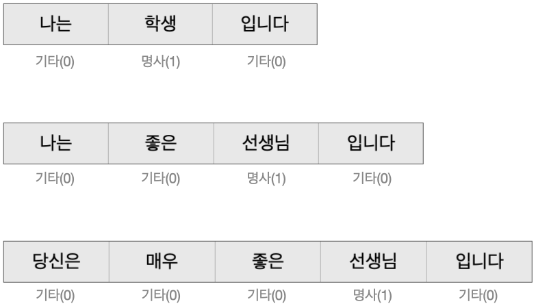
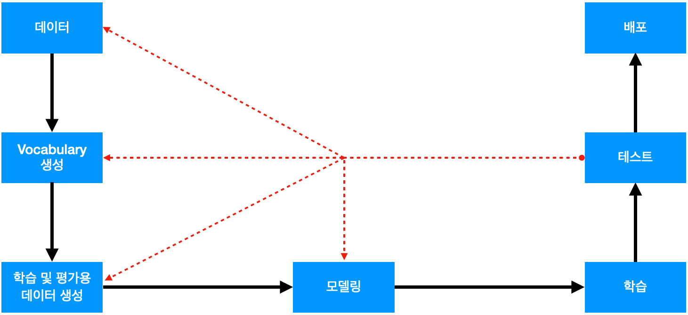
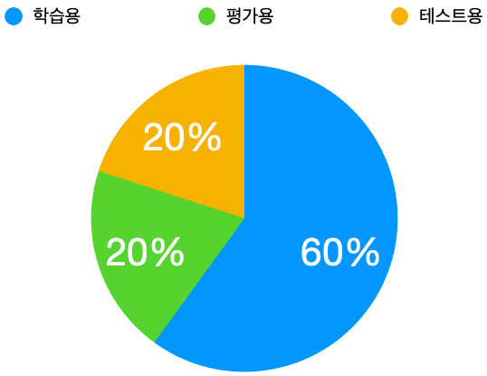
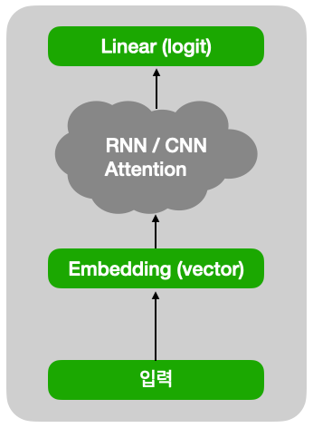
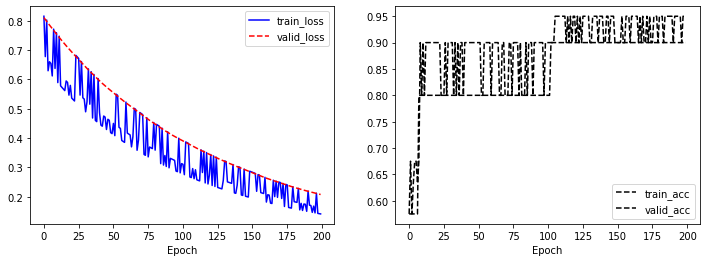

많은 분이 자연어처리를 처음 접하게 되면 새로운 개념으로 인해 어려워합니다. 이 포스트는 자연어처리를 처음 접하고 어려워하는 분들이 직접 간단한 프로젝트를 만들어 보면서 자연어처리의 개념을 이해할 수 있도록 하는 데 목적이 있습니다.

<span style="color:blue">***Learning by Doing***</span>

전체적인 개념을 이해에 목적이 있음으로 전체 과정을 최대한 간단한 내용으로 설명하고 자세한 내용은 추후 다른 포스트를 통해서 보완할 예정입니다. 그러므로 설명이 부족한 부분이 있더라도 우선 전체적인 개념을 이해하는 데 목적을 두고 보시길 바랍니다.


개발 환경은 [google colab](https://colab.research.google.com/){:target="_blank"}을 사용하며 개발 언어는 [pytorch](https://pytorch.org/){:target="_blank"}를 사용합니다. 이 포스트를 작성할 시점의 pytorch 버전은 1.7.1 입니다.


**소스코드**

- Colab에서 동작하는 소스코드는 [01-01-sequence-prediction.ipynb]()을 참고하시면 됩니다.
- 로컬 컴퓨터에서 동작하는 소스코드는 [01-01-sequence-prediction.py]()를 참고하시면 됩니다.


#### 1. 프로젝트의 목적

이번 프로젝트는 문장의 각 단어를 명사(1)와 기타(O)로 분류하는 단어 단위 분류모델입니다.



위 그림과 같이 단어가 명사일 경우는 1을 명사가 아닌 경우는 0을 예측 합니다.


이와같이 문장에 대한 각 단어별로 예측하는 대표적인 Task는 [NER(Named Entity Recognition)](https://m.blog.naver.com/PostView.nhn?blogId=koys007&logNo=221403872271&proxyReferer=https:%2F%2Fwww.google.com%2F){:target="_blank"}로 문장 내에서 ‘사람’, ‘장소’, ‘시간’, ‘단체’ 등의 정보를 분류하는 모델입니다.


#### 2. 프로제트 Workflow

우선 자연어처리 프로젝트의 workflow를 간단하게 살펴보면 다음과 같습니다.



- **데이터**
  - 목적에 필요한 정답이 포함된 데이터를 수집하거나 직접 생성 합니다.
  - 이 프로젝트의 경우는 각 단어가 명사인지 여부를 표시해놓은 데이터가 필요합니다.
- **Vocabulary 생성**
  - 수집된 데이터를 일정한 단위로 일련번호를 부여하는 과정입니다.
  - 자연어처리에서는 컴퓨터에 입력할 때 글자가 아닌 vocabulary에 부여된 일련번호를 입력합니다.
- **학습 및 평가용 데이터 생성**
  - 데이터를 vocabulary를 이용해서 일련번호로 변경 후 학습에 적합한 형태로 가공하는 과정입니다.
- **모델링**
  - 목적에 적합한 모델을 생성합니다.
- **학습**
  - 데이터를 이용해서 모델을 학습하는 과정입니다.
- **테스트**
  - 학습된 모델을 테스트하는 과정입니다.
  - 모델을 테스트해서 성능이 기준치보다 좋으면 서비스에 배포 합니다.
  - 만일 모델의 성능이 기준치보다 성능이 낮은 경우는 원인을 분석하고 문제가 된다고 생각되는 과정으로 돌아가서 그 과정을 개선하고 다시 학습하고 테스트해 봅니다.
- **배포**
  - 학습된 모델을 이용하여 실제 문제에 적용해서 문제를 개선하는 과정입니다.

이제 workflow에 따라서 최대한 간략하게 프로젝트를 진행해 보겠습니다.

#### 3. 프로제트 환경

Google colab에서 프로젝트에 필요한 환경을 설정하는 과정입니다.


우선 필요한 library를 import 합니다.

```python
import easydict
import random

import matplotlib.pyplot as plt
import numpy as np
import torch
```

다음은 프로젝트에 필요한 환경을 설정합니다.

```python
# 학습환경 설정
args = easydict.EasyDict({
    # random seed value
    "seed": 1234,
    # number of epoch
    "n_epoch": 200,
    # number of batch
    "n_batch": 2,
    # learning rate
    "lr": 0.001,
    # weights 저장 위치
    "save_path": "01-01-sequence-prediction.pth",
    # CPU 또는 GPU 사용여부 결정
    "device": torch.device("cuda" if torch.cuda.is_available() else "cpu")
})

print(args)
```

환경에 대한 내용은 아래와 같습니다.

- **seed**: Random seed를 설정하기 위한 값입니다.
- **n_epoch**: 전체 학습용 데이터를 몇 번 학습할 것인가를 결정하는 값입니다.
- **n_batch**: 데이터를 몇 개 단위로 분할해서 처리할 것인가를 결정하는 값입니다.
- **lr**: learning rate 입니다.
- **save_path**: 모델의 weights를 저장할 위치입니다.
- **device**: 학습 또는 실행을 CPU에서 할 것인지 GPU에서 할 것인지를 결정하는 값입니다. GPU 사용 가능 여부에 따라서 자동으로 결정되도록 코딩되어 있습니다.

위 코드의 실행 결과는 아래와 같습니다. 이처럼 다양한 설정을 한곳에 모아놓은 것이 더 편리하고 관리하기 쉽습니다.

```text
{'seed': 1234, 'n_epoch': 1000, 'n_batch': 2, 'lr': 0.001, 'save_path': '01-01-sequence-prediction.pth', 'device': device(type='cpu')}
```

다음은 random seed를 설정해줍니다.

```python
# random seed 설정
random.seed(args.seed)
np.random.seed(args.seed)
torch.manual_seed(args.seed)
torch.cuda.manual_seed_all(args.seed)
```

Random seed를 설정하는 이유는 pytorch가 random하게 초깃값을 설정하는데 이 값이 다를 경우 학습 결과가 달라질 수 있어서 항상 같은 값을 가지도록 하기 위해서입니다. Random seed 값은 임의의 값을 사용하면 됩니다.

#### 4. 데이터

목적에 맞는 데이터를 수집하고 정답 라벨을 만드는 과정은 엄청나게 어렵고 또한 중요한 과정입니다. 전체 과정 중 가장 중요한 과정이라고 할 수 있습니다.


좋은 품질의 데이터는 많을수록 좋습니다. 통상 수천에서 수십만 개 정도의 데이터가 있어야 하며 데이터 수가 적다면 좋은 결과를 기대하기 어렵습니다.


이렇게 수집된 데이터를 학습용(60%), 검증용(20%), 테스트용(20%) 형태로 분할하는 것이 좋습니다. 만일 데이터 수가 적다면 학습용(80%), 검증 및 테스트용(20%) 형태로 분할합니다. 중요한 것은 학습용 이외에 적당한 양의 평가 데이터가 필요하다는 것입니다.



이번 프로젝트는 자연어처리를 이해하는 데 목적이 있기 때문에 아주 간단하게 학습용 데이터 3개만 가지고 진행하겠습니다.


우선 아래와 같이 입력 데이터를 선언합니다.

```python
# 입력 문장
raw_inputs = [
    "나는 학생 입니다",
    "나는 좋은 선생님 입니다",
    "당신은 매우 좋은 선생님 입니다"
]
```

다음은 정답 데이터를 선언합니다.

```python
# 정답: 명사(1), 기타(0)
raw_labels = [
    [0, 1, 0],
    [0, 0, 1, 0],
    [0, 0, 0, 1, 0]
]
```

위와 같이 입력 문장에 대해서 띄어쓰기 단위로 각 단어가 명사인 경우는 1, 아닌 경우는 0으로 표시되어 있습니다.


#### 5. Vocabulary 생성

Vocabulary는 입력할 문장을 일정한 단위로 일련번호를 부여하는 것을 의미합니다. 컴퓨터에는 우리가 인식하는 글자를 직접 입력할 수 없기 때문에 Vocabulary의 일련번호로 변경해서 입력해야 합니다.


Vocabulary를 구성하기 위한 분할의 단위는 ‘글자 단위’, ‘띄어쓰기 단위’로 분할하거나 '형태소 단위'로 분할하는 등 다양한 방법이 있습니다. 이번 프로젝트에서는 가장 간단한 ‘띄어쓰기 단위’로 분할한 Vocabulary를 사용합니다.


우선 학습할 전체 문장을 띄어쓰기 단위로 분할합니다.

```python
# 문장을 띄어쓰기단위로 분할
words = []
for s in raw_inputs:
    words.extend(s.split())

print(words)
```

위 코드의 실행 결과는 아래와 같습니다. 입력문장이 띄어쓰기 단위로 분할되었습니다.

```text
['나는', '학생', '입니다', '나는', '좋은', '선생님', '입니다', '당신은', '매우', '좋은', '선생님', '입니다']
```

위 코드의 실행 결과를 보면 ‘나는’, ‘선생님’, ‘좋은’, ‘입니다’ 등의 단어들이 중복되어있습니다. 다음 코드를 실행해서 중복단어를 제거합니다.

```python
# 중복단어 제거
words = list(dict.fromkeys(words))

print(words)
```

위 코드의 실행 결과는 아래와 같습니다. 중복된 단어가 제거된 것을 확인할 수 있습니다.

```text
['나는', '학생', '입니다', '좋은', '선생님', '당신은', '매우']
```

이제 각 단어에 일련번호를 부여합니다. 이때 추가로 특수값 [PAD], [UNK] 2개를 지정합니다.

- 자연어처리에서는 특성상 문장의 길이가 다를 수 있습니다. 이때 길이가 짧은 문장의 뒷부분 또는 앞부분에 [PAD]를 추가해 줍니다. 이렇게 해야만 여러 개의 문장을 동시에 처리할 수 있습니다.
- 입력문장 중에 vocabulary에 없는 단어가 포함되어 있을 수 있습니다. 이때 이 단어를 [UNK]로 변경해서 처리합니다.


```python
# 각 단어별 일련번호
word_to_id = {"[PAD]": 0, "[UNK]": 1}
for w in words:
    word_to_id[w] = len(word_to_id)

print(word_to_id)
```

위 코드의 실행 결과는 아래와 같습니다. 단어별로 일련번호가 부여된 것을 확인할 수 있습니다.

```text
{'[PAD]': 0, '[UNK]': 1, '나는': 2, '학생': 3, '입니다': 4, '좋은': 5, '선생님': 6, '당신은': 7, '매우': 8}
```

이제 반대로 각 일련번호를 단어로 변경할 수 있도록 합니다.

```python
# 각 번호별 단어
id_to_word = {i: w for w, i in word_to_id.items()}

print(id_to_word)
```

위 코드의 실행 결과는 아래와 같습니다. 일련번호별로 단어가 부여된 것을 확인할 수 있습니다.

```text
{0: '[PAD]', 1: '[UNK]', 2: '나는', 3: '학생', 4: '입니다', 5: '좋은', 6: '선생님', 7: '당신은', 8: '매우'}
```

이제 단어를 일련번호로 변경하거나 반대로 일련번호를 단어로 변경할 수 있습니다.


#### 6. 학습 및 평가용 데이터 생성

이제 만들어진 Vocabulary를 이용해서 입력데이터를 학습이 가능한 일련번호 형태로 변경합니다.


```python
# 입력 데이터
inputs = []
for s in raw_inputs:
    inputs.append([word_to_id[w] for w in s.split()])
    
print(inputs)
```

위 코드의 실행 결과는 아래와 같습니다. 입력문장이 일련번호로 변경되었습니다.

```text
[[2, 3, 4], [2, 5, 6, 4], [7, 8, 5, 6, 4]]
```

정답의 경우는 이미 0, 1의 번호로 되어 있기 때문에 그대로 사용합니다.

```python
# 정답 데이터
labels = raw_labels

print(labels)
```

위 코드의 실행 결과는 아래와 같습니다.

```text
[[0, 1, 0], [0, 0, 1, 0], [0, 0, 0, 1, 0]]
```

다음은 데이터를 처리할 DataSet 클래스를 정의합니다.


```python
class SimpleDataSet(torch.utils.data.Dataset):
    """ 데이터셋 클래스 """

    def __init__(self, inputs, labels):
        """
        생성자
        :param inputs: 입력
        :param labels: 정답
        """
        self.inputs = inputs
        self.labels = labels

    def __len__(self):
        """ 데이터셋 길이 """
        assert len(self.inputs) == len(self.labels)
        return len(self.labels)

    def __getitem__(self, index):
        """
        데이터 한 개 조회
        :param index: 데이터 위치
        """
        return (
            torch.tensor(self.inputs[index]),
            torch.tensor(self.labels[index]),
        )

    def collate_fn(self, batch):
        """
        batch단위로 데이터 처리
        :param batch: batch 단위 데이터
        """
        inputs, labels = list(zip(*batch))

        inputs = torch.nn.utils.rnn.pad_sequence(inputs, batch_first=True, padding_value=0)
        labels = torch.nn.utils.rnn.pad_sequence(labels, batch_first=True, padding_value=0)

        batch = [
            inputs,
            labels,
        ]

        return batch
```

위와 같은 DataSet 클래스를 사용하면 pytorch에서 다양한 방법으로 활용하기 쉽습니다. 클래스의 함수에 대한 내용은 아래와 같습니다.

- def &#95;&#95;init&#95;&#95;(self, inputs, labels):
  - DataSet 클래스 생성자입니다. 초기에 데이터 관련한 값을 전달해 줍니다.
- def &#95;&#95;len&#95;&#95;(self):
  - DataSet의 데이터 개수를 조회합니다.
- def &#95;&#95;get_item&#95;&#95;(self, index):
  - DataSet에서 한 개의 특정한 item을 조회할 때 사용합니다.
- def collate_fn(self, batch):
  - batch단위로 데이터를 처리할 때 사용합니다. 위 함수는 입력문장의 길이가 다를 경우 짧은 문장의 뒷부분에 [PAD]를 의미하는 0을 추가해서 문장의 길이를 동일하게 만들어주는 역할을 합니다. PAD(0)은 vocabulary에 정의된 값입니다.

이제 DataSet 클래스를 생성합니다.

```python
# dataset
dataset = SimpleDataSet(inputs, labels)

print(len(dataset))
```

위 코드의 실행 결과는 아래와 같습니다. 데이터 개수 3이 출력되는 것을 확인할 수 있습니다.

```text
3
```

다음은 데이터의 순서를 섞기 위한 sampler를 생성합니다. 학습용 데이터의 경우는 고정된 데이터 순서를 여러 번 반복해서 학습하게 되면 데이터 순서에서 오는 편향이 발생할 수 있습니다. 이를 완화하기위해서 순서를 섞습니다. 반면 검증 및 테스트 데이터는 학습하지 않기 때문에 순서를 섞지 않습니다.

```python
# random sample data
sampler = torch.utils.data.RandomSampler(dataset)
```

이제 학습용 데이터를 처리하기 위한 Train data loader를 생성합니다.

```python
# train loader
train_loader = torch.utils.data.DataLoader(dataset, batch_size=args.n_batch, sampler=sampler, collate_fn=dataset.collate_fn)
```

위 코드의 설명은 다음과 같습니다.
- batch_size는 2: 한 번에 데이터를 두 개씩 처리하겠다는 의미입니다.
- batch_size가 2이기 때문에 입력문장의 길이가 다를 수 있습니다. 이 경우 데이터 길이를 맞추기 위해서 collate_fn을 지정했습니다.
- 학습 데이터의 경우는 순서를 섞어주기 위해서 sampler를 추가했습니다.

다음은 검증용 데이터를 처리하기 위한 Valid data loader를 생성합니다. 검증용 데이터는 학습용 데이터와 다른 데이터를 사용해야 하지만 지금은 자연어처리를 이해하는 데 목적이 있기 때문에 같은 데이터를 사용하겠습니다.

```python
# dataset
dataset = SimpleDataSet(inputs, labels)
# valid loader
valid_loader = torch.utils.data.DataLoader(dataset, batch_size=args.n_batch, sampler=None, collate_fn=dataset.collate_fn)
```

위 코드에서 검증용 데이터는 순서를 섞지 않기 위해서 sampler를 None으로 지정했습니다. 나머지는 Train data loader와 동일합니다.


검증용 데이터와 동일한 방법으로 테스트용 데이터 처리를 위한 Test data loader를 생성합니다.

```python
# dataset
dataset = SimpleDataSet(inputs, labels)
# test loader
test_loader = torch.utils.data.DataLoader(dataset, batch_size=args.n_batch, sampler=None, collate_fn=dataset.collate_fn)
```

#### 7.1. 모델링 (Tutorial)

이제 단어분류를 할 모델을 생성합니다. 간단하게 모델의 동작을 직접 확인해 본 후 모델 클래스를 생성해 보도록 하겠습니다.


우선 입력을 정의합니다.

```python
# model tutorial 입력
t_inputs = torch.tensor(inputs[:1])
t_labels = torch.tensor(labels[:1])

print(t_inputs, t_labels)
```

위 코드의 실행 결과는 아래와 같습니다. 입력 1개와 정답 1개를 각각 pytorch tensor로 만들었습니다.

```text
tensor([[2, 3, 4]]) tensor([[0, 1, 0]])
```

다음은 입력의 숫자를 단어벡터로 변환합니다. 자연어처리에서는 숫자로된 입력을 어떤 의미를 갖는 단어벡터로 변경해서 학습합니다.

```python
# 단어 일련번호를 단어 벡터로 변환
embed = torch.nn.Embedding(len(word_to_id), 4)
hidden = embed(t_inputs)

print(hidden.shape, hidden)
```

위 코드의 실행 결과는 아래와 같습니다. 숫자로 된 입력이 벡터 형태로 변경된 것을 확인할 수 있습니다. 이 벡터값들은 pytorch가 랜덤하게 초기화한 값으로 아직은 특별한 의미를 갖는 것은 아닙니다. 학습이 진행되면서 목적에 맞는 벡터값으로 변경됩니다.

```text
torch.Size([1, 3, 4]) tensor([[[ 0.0323, -1.6593, -1.8773,  0.7372],
         [ 0.3910,  0.5158, -1.0042,  0.9860],
         [ 0.3147, -1.0369,  0.2100,  0.6144]]], grad_fn=<EmbeddingBackward>)
```

다음은 위에서 생성된 벡터를 RNN, CNN, Attention 등의 Neural Network을 이용하여 문장 및 단어의 특징을 추출해야 하지만 이번 과정에서는 생략합니다.


위 과정을 통해서 특징이 추출된 단어의 특징값을 이용하여 단어가 명사(1) 또는 기타(0)인지 여부를 예측합니다. 0 또는 1을 예측하기 위해서 출력값은 2로 합니다.

```python
# 단어 명사(1) 또는 기타(0) 예측
linear = torch.nn.Linear(4, 2)
logits = linear(hidden)

print(logits.shape, logits)
```

위 코드의 실행 결과는 아래와 같습니다. 각 단어가 명사(1) 또는 기타(0) 인지 점수를 나타내는 값으로 예측했습니다. 두 값 중 첫 번째 값이 크면 기타(0)이고 두 번째 값이 크면 명사(1)입니다. 아래의 결과에서는 첫 번째 행 경우는 [-0.3154,  0.6910]으로 0.6910이 크기 때문에 명사(1)을 예측한 것이고 두 번째 행 경우는 [ 0.8069,  0.3165]으로 0.8069이 크기 때문에 기타(0)을 예측한 것입니다.

```text
torch.Size([1, 3, 2]) tensor([[[-0.3154,  0.6910],
         [ 0.8069,  0.3165],
         [ 0.0340, -0.2783]]], grad_fn=<AddBackward0>)
```

다음은 예측된 값과 실제 정답의 차이를 CrossEntropy loss를 계산합니다. 이 loss 값이 줄어드는 방향으로 학습을 진행하고 통상 loss가 줄어들면 모델이 더 잘 예측하게 됩니다. CrossEntropy loss를 계산하고 줄이는 과정은 모델링 과정이 아니고 학습 시에 진행합니다.

```python
# CrossEntropy loss 계산
loss_fn = torch.nn.CrossEntropyLoss()
loss = loss_fn(logits.view(-1, logits.size(-1)), t_labels.view(-1))

print(loss)
```

위 코드의 실행 결과는 아래와 같습니다.

```text
tensor(0.9451, grad_fn=<NllLossBackward>)
```

#### 7.2. 모델링 (Class)

모델링 (Tutorial) 과정에서 CrossEntropy loss를 계산하는 과정을 제외한 나머지 과정을 하나의 클래스로 만들면 아래와 같습니다.

```python
class SequencePrediction(torch.nn.Module):
    """ 단어단위 예측 모델 """

    def __init__(self, n_vocab):
        """
        생성자
        :param n_vocab: number of vocab
        """
        super().__init__()
        self.embed = torch.nn.Embedding(n_vocab, 4)
        self.linear = torch.nn.Linear(4, 2)

    def forward(self, inputs):
        """
        모델 실행
        :param inputs: input data
        """
        hidden = self.embed(inputs)
        logits = self.linear(hidden)
        return logits
```


클래스의 함수에 대한 내용은 아래와 같습니다.

- def &#95;&#95;init&#95;&#95;(self, n_vocab):
  - SequencePrediction 모델 클래스 생성자입니다. 모델이 사용할 Neural Netowrk을 생성합니다.
- def forward(self, inputs):
  - SequencePrediction 모델을 실행합니다. 모델의 목적에 맞게 Neural Netowrk을 실행해서 결과를 얻습니다.


이 모델을 간단하게 그림으로 표현하면 아래와 같습니다.



이제 학습용 모델 클래스를 생성합니다. 이때 입력값 vocabulary 개수는 word_to_id 개수입니다.

```python
# 학습용 모델 생성
model = SequencePrediction(len(word_to_id))
model.to(args.device)

print(model)
```

위 코드의 실행 결과는 아래와 같습니다. 모델의 간단한 구조를 확인할 수 있습니다.

```text
SequencePrediction(
  (embed): Embedding(9, 4)
  (linear): Linear(in_features=4, out_features=2, bias=True)
)
```

#### 8. 학습

이제 데이터를 이용해서 모델 학습을 진행합니다. 우선 학습에 필요한 loss 함수와 optimizer를 생성합니다.
- loss 함수는 정답과 예측값과의 차이를 계산하는 함수입니다. 분류 문제를 푸는 경우 보통 CrossEntropyLoss를 사용합니다. loss가 적다는 의미는 예측값과 정답의 차이가 작다는 의미입니다.
- optimizer는 loss가 줄어드는 방향으로 모델의 파라미터를 변경하는 역할을 담당합니다. 일반적으로 Adam을 많이 사용합니다.

```python
# loss & optimizer 생성
loss_fn = torch.nn.CrossEntropyLoss()
optimizer = torch.optim.Adam(model.parameters(), lr=args.lr)
```

다음은 모델의 성능을 평가할 함수를 정의합니다. 모델이 얼마나 정답을 잘 예측하는지 측정하기 위해서입니다.

```python
def accuracy_fn(logits, labels):
    """
    model accuracy 측정
    :param logits: 예측 값
    :param labels: 정답
    """
    # 값이 최대인 index 값
    _, indices = logits.max(-1)
    # label과 비교
    matchs = torch.eq(indices, labels).cpu().numpy()
    total = np.ones_like(matchs)
    acc_val = np.sum(matchs) / max(1, np.sum(total))
    return acc_val
```

위 함수에 대한 내용은 아래와 같습니다.

- **line 8**: 예측 score 중 값이 최대인 'indices'를 생성합니다. 첫 번째 값이 최대이면 0 두 번째 값이 최대이면 1입니다.
- **line 10**: 예측값과 정답을 비교해서 'matchs'를 생성합니다. 두 값이 같으면 True(1)이고 다르면 False(0)입니다.
- **line 11**: 'match'와 모양이 동일하고 값이 모두 1인 'total'을 생성합니다. 
- **line 12**: match / total 수식으로 예측의 정확도를 'acc_val'을 계산합니다. 분모가 0이 되면 오류가 발생하기 때문에 max(1, total)을 이용해서 최솟값이 1이 되도록 합니다.
- **line 13**: 'acc_val'를 반환합니다.

다음은 각 epoch 별로 학습을 진행할 함수를 정의합니다. epoch이란 모든 학습데이터를 한번 학습을 완료하는 것을 의미합니다. 자연어처리에서는 학습데이터를 여러 번 학습하기 때문에 이처럼 epoch 별 학습함수를 정의하면 관리가 조금 더 편리합니다.

```python
def train_epoch(args, model, loader, loss_fn, optimizer):
    """
    1 epoch 학습
    :param args: 입력 arguments
    :param model: 모델
    :param loader: 데이터로더
    :param loss_fn: loss 계산함수
    :param optimizer: optimizer
    """
    # model을 train 모드로 전환
    model.train()
    # loss 및 accuracy 저장
    losses, access = [], []
    # data loader에서 batch단위로 처리
    for batch in loader:
        # optimizer 초기화
        optimizer.zero_grad()
        # batch 입력값 처리 (CPU or GPU)
        inputs, labels = map(lambda v: v.to(args.device), batch)
        # 모델 실행
        logits = model(inputs)
        # loss 계산
        loss = loss_fn(logits.view(-1, logits.size(-1)), labels.view(-1))
        loss.backward()
        # model weight 변경
        optimizer.step()
        # loss 저장
        loss_val = loss.item()
        losses.append(loss_val)
        # accuracy 계산 및 저장
        acc_val = accuracy_fn(logits, labels)
        access.append(acc_val)

    return np.mean(losses), np.mean(access)
```

위 함수에 대한 내용은 아래와 같습니다.

- **line 11**: 모델을 train 모드로 변경합니다.
- **line 13**: loss를 저장할 변수 'losses'와 accuracy를 저장할 변수 'access'를 생성합니다.
- **line 15**: data loader로부터 데이터를 batch단위로 읽어옵니다. batch단위로 읽는 이유는 학습할 데이터는 보통 몇천 개 이상일 경우가 많은데 이것을 한꺼번에 처리가 불가능하기 때문에 나눠서 처리합니다. 이처럼 batch단위로 처리하는 1번의 과정을 step이라고 합니다.
- **line 17**: 'optimizer'의 gradient를 모두 0으로 초기화 합니다. 즉 이전에 step에서 계산된 gradient를 0으로 변경 합니다.
- **line 19**: batch단위 입력을 GPU 또는 CPU에 로딩합니다. CPU를 사용하는 경우라면 이미 로딩되어 있음으로 의미 없는 부분입니다. 그렇지만 이렇게 구현하면 CPU/GPU 둘 다 수정 없이 동작합니다.
- **line 21**: 'inputs'을 입력으로 모델의 'forward'함수를 실행하고 결과로 'logits'을 받습니다.
- **line 23~24**: loss 함수 'loss_fn'을 이용해 loss를 계산하고 loss의 'backward' 함수를 실행해서 미분을 통해 gradient를 구합니다.
- **line 26**: 'optimizer'를 이용해서 model의 paramters 값들을 loss가 감소하는 방향으로 변경합니다.
- **line 28~29**: 'loss'에서 값을 받아서 'losses'에 저장합니다. 'losses'에는 진행된 모든 step의 loss가 저장되어 있습니다.
- **line 31~32**: 'accuracy_fn' 함수를 이용해서 예측의 정확도를 'acc_val'을 계산하고 'access'에 저장합니다.
- **line 34**: 'losses'의 평균값 및 'access'의 평균값을 반환합니다.

다음은 각 epoch 별로 평가를 진행할 함수를 정의합니다.

```python
def eval_epoch(args, model, loader, loss_fn):
    """
    1 epoch 평가
    :param args: 입력 arguments
    :param model: 모델
    :param loader: 데이터로더
    :param loss_fn: loss 계산함수
    """
    # model을 eval 모드로 전환
    model.eval()
    # loss 및 accuracy 저장
    losses, access = [], []
    # 실행시에 gradint 계산 비활성화
    with torch.no_grad():
        for batch in loader:
            # batch 입력값 처리 (CPU or GPU)
            inputs, labels = map(lambda v: v.to(args.device), batch)
            # 모델 실행
            logits = model(inputs)
            # loss 계산
            loss = loss_fn(logits.view(-1, logits.size(-1)), labels.view(-1))
            # loss 저장
            loss_val = loss.item()
            losses.append(loss_val)
            # accuracy 계산 및 저장
            acc_val = accuracy_fn(logits, labels)
            access.append(acc_val)

    return np.mean(losses), np.mean(access)
```

위 함수에 대한 내용은 아래와 같습니다.

- **line 10**: 모델을 eval 모드로 변경합니다.
- **line 12**: loss를 저장할 변수 'losses'와 accuracy를 저장할 변수 'access'를 생성합니다.
- **line 14**: pytorch가 gradient를 계산하지 않도록 선언합니다. 
- **line 15**: data loader로부터 데이터를 batch단위로 읽어옵니다.
- **line 17**: batch단위 입력을 GPU 또는 CPU에 로딩합니다.
- **line 19**: 'inputs'을 입력으로 모델의 'forward'함수를 실행하고 결과로 'logits'을 받습니다.
- **line 21**: loss 함수 'loss_fn'을 이용해 loss를 계산합니다.
- **line 23~24**: 'loss'에서 값을 받아서 'losses'에 저장합니다.
- **line 26~27**: 'accuracy_fn' 함수를 이용해서 예측의 정확도를 'acc_val'을 계산하고 'access'에 저장합니다.
- **line 29**: 'losses'의 평균값 및 'access'의 평균값을 반환합니다.

다음은 학습과정을 기록할 'history' 변수와 가장좋은 accuracy를 기록할 'best_acc' 변수를 생성합니다.

```python
# 학습 history
history = {"train_loss": [], "train_acc": [], "valid_loss": [], "valid_acc": []}
# 가장 좋은 acc 값
best_acc = 0
```

이제 위에서 정의한 학습 관련 함수와 변수들을 이용해서 학습을 진행합니다.

```python
# 학습 및 평가
for e in range(args.n_epoch):
    train_loss, train_acc = train_epoch(args, model, train_loader, loss_fn, optimizer)
    valid_loss, valid_acc = eval_epoch(args, model, valid_loader, loss_fn)
    # 학습 history 저장
    history["train_loss"].append(train_loss)
    history["train_acc"].append(train_acc)
    history["valid_loss"].append(valid_loss)
    history["valid_acc"].append(valid_acc)
    # 학습과정 출력
    print(f"eopch: {e + 1:3d}, train_loss: {train_loss:.5f}, train_acc: {train_acc: .5f}, valid_loss: {valid_loss:.5f}, valid_acc: {valid_acc:.5f}")
    # best weight 저장
    if best_acc < valid_acc:
        best_acc = valid_acc
        # 저장
        torch.save(
            {"state_dict": model.state_dict(), "valid_acc": valid_acc},
            args.save_path,
        )
        # 저장내용 출력
        print(f"  >> save weights: {args.save_path}")
```

위 코드의 내용은 아래와 같습니다.

- **line 2**: 'n_epoch' 회수만큼 전체 데이터를 반복해서 학습합니다.
- **line 3**: 'train_epoch' 함수를 실행해서 학습을 실행하고 loss와 accuracy를 'train_loss' 와 'train_acc' 변수에 각각 저장합니다.
- **line 4**: 'eval_epoch' 함수를 실행해서 평가를 실행하고 loss와 accuracy를 'valid_loss' 와 'valid_acc' 변수에 각각 저장합니다.
- **line 6~9**: 'history'에 'train_loss', 'train_acc', 'valid_loss', 'valid_acc'를 저장합니다.
- **line 11**: 학습과정을 출력합니다.
- **line 13**: 'best_acc'와 'valid_acc'를 비교합니다. 'valid_acc'가 클 경우는 이전 모델보다 성능이 좋아졌으므로 모델의 paramter 및 관련 정보를 저장합니다.
- **line 14**: 'valid_acc' 값을 'best_acc'에 저장합니다.
- **line 16~19**: 'torch.save' 함수를 이용해서 모델 weights 및 필요한 정보를 저장합니다.
  - 'model.state_dict()'가 모델 weights 입니다.
  - 기타 추가로 필요하다고 생각되는 내용을 json 형태로 추가해서 저장합니다.
  - 저장 위치는 고정해서 이전에 저장된 값이 있다면 덮어쓰도록 했습니다.
- **line 21**: 모델이 저장되었음을 출력합니다.

위 코드의 실행 결과는 아래와 같습니다. 실행 과정을 확인할 수 있습니다. 출력 내용이 많아서 일부만 적어놨습니다.

```text
eopch: 110, train_loss: 0.46279, train_acc:  0.77500, valid_loss: 0.44635, valid_acc: 0.81250
eopch: 111, train_loss: 0.44553, train_acc:  0.81250, valid_loss: 0.44302, valid_acc: 0.81250
eopch: 112, train_loss: 0.51975, train_acc:  0.61667, valid_loss: 0.43970, valid_acc: 0.93750
  >> save weights: 01-01-sequence-prediction.pth
eopch: 113, train_loss: 0.51632, train_acc:  0.83333, valid_loss: 0.43642, valid_acc: 0.93750
eopch: 114, train_loss: 0.43563, train_acc:  0.93750, valid_loss: 0.43317, valid_acc: 0.93750
eopch: 115, train_loss: 0.44639, train_acc:  0.95000, valid_loss: 0.42994, valid_acc: 0.93750
```

지금까지 학습과정을 그래프로 표현할 함수를 정의합니다.

```python
def draw_history(history):
    """
    학습과정 그래프 출력
    :param history: 학습 이력
    """
    plt.figure(figsize=(12, 4))

    plt.subplot(1, 2, 1)
    plt.plot(history["train_loss"], "b-", label="train_loss")
    plt.plot(history["valid_loss"], "r--", label="valid_loss")
    plt.xlabel("Epoch")
    plt.legend()

    plt.subplot(1, 2, 2)
    plt.plot(history["train_acc"], "k--", label="train_acc")
    plt.plot(history["valid_acc"], "k--", label="valid_acc")
    plt.xlabel("Epoch")
    plt.legend()

    plt.show()
```

학습과정을 그래프로 출력합니다.

```python
# 학습과정 그래프 출력
draw_history(history)
```

위 코드의 실행 결과는 아래와 같습니다. 학습과정을 그래프로 확인할 수 있습니다.



#### 8. 테스트

이제 학습된 모델을 테스트해 봅니다. 모델을 테스트하는 이유는 이 모델이 실제 현장에 배포가 가능한지를 확인해보기 위함입니다. 실제 상황에서는 더 다양하고 엄밀하게 테스트를 진행해야 합니다.


우선 테스트용 모델을 생성합니다.

```python
# 테스트용 모델 생성
model = SequencePrediction(len(word_to_id))
model.to(args.device)

print(model)
```

위 코드의 실행 결과는 아래와 같습니다. 모델의 간단한 구조를 확인할 수 있습니다.

```text
SequencePrediction(
  (embed): Embedding(9, 4)
  (linear): Linear(in_features=4, out_features=2, bias=True)
)
```

현재 테스트용 모델은 pytorch에 의해서 랜덤하게 초기화된 모델입니다. 이 모델을 이용해서 성능을 평가해 봅니다. 데이터는 테스트용 데이터를 사용합니다.

```python
# 랜덤 초기화 모델 평가
valid_loss, valid_acc = eval_epoch(args, model, test_loader, loss_fn)

print(valid_loss, valid_acc)
```

위 코드의 실행 결과는 아래와 같습니다. accuracy가 61% 정도입니다.

```text
0.9769936203956604 0.6125
```

다음은 학습된 모델의 weights를 이용해서 초기화를 한 후 테스트를 해 봅니다. 우선 저장된 값을 읽어 옵니다.

```python
# 저장된 데이터 로드
save_dict = torch.load(args.save_path)

print(save_dict)
```

위 코드의 실행 결과는 아래와 같습니다. 학습 시에 저장한 형식 그대로 'state_dict'와 'valid_acc'값을 확인할 수 있습니다.

```text
{'state_dict': OrderedDict([('embed.weight', tensor([[-1.5986,  0.5935, -1.0098,  0.5566],
        [ 0.2288, -0.8229, -0.8648,  2.0531],
        [ 0.6113, -0.4870,  1.2000,  0.3480],
        [-0.0036,  1.4245,  0.0757,  0.7710],
        [-0.6534, -0.2555,  1.0890,  1.7307],
        [-0.2264,  0.4584,  0.3790,  1.1410],
        [ 0.9990,  0.6042,  0.0959,  0.2155],
        [ 2.0933,  1.2377, -0.1000,  1.0133],
        [ 1.4456, -1.2784,  1.1496,  1.6060]])), ('linear.weight', tensor([[ 0.1280,  0.0281, -0.2525,  0.2063],
        [-0.2088,  0.0083, -0.5166, -0.3678]])), ('linear.bias', tensor([ 0.0157, -0.4599]))]), 'valid_acc': 0.775}
```

이제 학습된 weights로 모델을 초기화합니다.

```python
# 학습된 weights로 모델 초기화
model.load_state_dict(save_dict['state_dict'])
```

다시한번 모델 성능을 평가해 봅니다.

```python
# 학습된 weights로 초기화 모델 평가
valid_loss, valid_acc = eval_epoch(args, model, test_loader, loss_fn)

print(valid_loss, valid_acc)
```

위 코드의 실행 결과는 아래와 같습니다. accuracy가 100% 입니다.

```text
0.5432646572589874 1.0
```

만일 테스트 결과가 만족스럽지 않다면 이전 과정 ('데이터', 'vocabulary 생성', '학습 및 평가용 데이터 생성', '모델링', '학습') 중에서 성능 저하의 원인이 되는 부분을 개선하고 학습하고 테스트하는 과정을 반복해야 합니다. 이런 시행착오를 줄이기 위한 효과적인 방법은 많은 논문 또는 블로그를 참고하는 것입니다.

#### 9. 배포

이제 테스트 과정이 잘 되었다는 가정하에서 학습됨 모델을 이용해 간단하게 사용자 입력을 받아서 단어의 명사 여부를 예측해 보겠습니다.


우선 배포용 모델을 생성합니다. 하고 학습된 weights로 모델을 초기화합니다.

```python
# 배포용 모델 생성
model = SequencePrediction(len(word_to_id))
model.to(args.device)

# 저장된 데이터 로드
save_dict = torch.load(args.save_path)

# 학습된 weights로 모델 초기화
model.load_state_dict(save_dict['state_dict'])
```

이제 입력을 받아서 단어별 명사 여부를 예측하는 함수를 정의합니다.

```python
def do_predict(word_to_id, model, string):
    """
    입력에 대한 답변 생성하는 함수
    :param word_to_id: vocabulary
    :param model: model
    :param string: 입력 문자열
    """
    # token 생성
    token = [word_to_id[w] for w in string.strip().split()]

    model.eval()
    with torch.no_grad():
        inputs = torch.tensor([token]).to(args.device)
        logits = model(inputs)
        _, indices = logits.max(-1)
        y_pred = indices[0].numpy()
    result = ["명사" if i == 1 else "기타" for i in y_pred]
    return result
```

위 함수에 대한 내용은 아래와 같습니다.

- **line 9**: 입력 문장을 vocabulary를 이용해서 일련번호로 변경합니다.
- **line 11**: 모델을 eval 모드로 변경합니다.
- **line 12**: pytorch가 gradient를 계산하지 않도록 선언합니다.
- **line 13**: 입력 'inputs'를 생성합니다. 이때 입력을 1개만 처리하므로 batch 개수는 1입니다.
- **line 14**: 'inputs'을 입력으로 모델의 'forward'함수를 실행하고 결과로 'logits'을 받습니다.
- **line 15**: 'logits' 중 값이 최대인 'indices'를 생성합니다.
- **line 16**: 'indices'의 값을 numpy 형태로 변경해서 'y_pred' 변수에 저장합니다.
- **line 17**: 예측값이 1인 경우는 '명사' 0인 경우는 '기타'로 바꿔서 'result' 변수에 저장합니다.
- **line 18**: 'result'를 반환합니다.

이제 마지막으로 위 함수를 실행해서 예측을 해 봅니다.

```python
# 예측 실행
do_predict(word_to_id, model, "당신은 선생님 입니다")
```

위 코드의 실행 결과는 아래와 같습니다. 결과는 '당신은(기타:0)', '선생님(명사:1)', '입니다(기타:0)'으로 예측했습니다.

```text
['기타', '명사', '기타']
```

지금까지 자연어처리를 이해하는 데 도움이 될 수 있도록 간단한 프로젝트 하나를 만들어봤습니다. 이후 포스트에서 이 프로젝트를 기반으로 자연어처리 관련된 여러 가지 내용을 다뤄보도록 하겠습니다.
