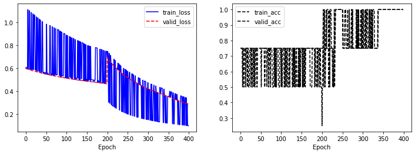

이 포스트는 이전 프로젝트 [간단한 단어분류 프로젝트를 통한 자연어처리 이해](../nlp-tutorial-01-01-sequence-prediction/)에 이어서 다음은 문장을 분류하는 프로젝트를 만들어 보면서 자연어처리의 개념을 이해할 수 있도록 하는 데 목적이 있습니다.


많은 내용이 이전 포스트 [간단한 단어분류 프로젝트를 통한 자연어처리 이해](../nlp-tutorial-01-01-sequence-prediction/)와 중복되므로 이전 포스트를 어느정도 이해했다는 가정하에 중복되는 내용은 최대한 간략하게 설명하고 이전 포스트와 달라진 부분을 위주로 설명하겠습니다.


전체적인 개념을 이해에 목적이 있음으로 전체 과정을 최대한 간단한 내용으로 설명하고 자세한 내용은 추후 다른 포스트를 통해서 보완할 예정입니다. 그러므로 설명이 부족한 부분이 있더라도 우선 전체적인 개념을 이해하는 데 목적을 두고 보시길 바랍니다.


개발 환경은 [google colab](https://colab.research.google.com/){:target="_blank"}을 사용하며 개발 언어는 [pytorch](https://pytorch.org/){:target="_blank"}를 사용합니다. 이 포스트를 작성할 시점의 pytorch 버전은 1.7.1 입니다.


**소스코드**

- Colab에서 동작하는 소스코드는 [01-02-sentence-prediction.ipynb](https://github.com/paul-hyun/torch-nlp-tutorial/blob/main/01-simple-project/01-02-sentence-prediction.ipynb){:target="_blank"}을 참고하시면 됩니다.
- 로컬 컴퓨터에서 동작하는 소스코드는 [01-02-sentence-prediction.py](https://github.com/paul-hyun/torch-nlp-tutorial/blob/main/01-simple-project/01-02-sentence-prediction.py){:target="_blank"}를 참고하시면 됩니다.


#### 1. 프로젝트의 목적

이번 프로젝트는 문장의 주체를 학생(1) 또는 기타(O)로 분류하는 문장 단위 분류모델입니다.


위 그림과 같이 문장의 주체가 학생인 경우는 1을 아닌 경우는 0을 예측 합니다.


이와 같이 문장을 분류하는 Task는 다음과 같은 종류들이 있습니다.
- **감정분류**: 문장의 내용이 긍정인지 부정인지를 분류하는 Task입니다.
- **스펨분류**: 이메일의 내용이 스팸인지 아닌지를 분류하는 Task입니다.
- **유사도**: 두 문장이 같은 비슷한 내용인지 아닌지를 분류하는 Task입니다.
- **유사도 기반 검색**: 사용자 질의(query)와 문서(context)의 유사도 점수(score)를 구해서 점수가 높은 문서(context)를 검색하는 Task입니다.
- **NLI(Natural language inference)**: 두 문장이 비슷한지(entailment), 반대되는지(contradiction), 관계가 없는지(neutral) 분류하는 Task입니다.
- **기타**: 그 외에도 다양한 Task가 있습니다.


#### 2. 프로제트 Workflow

[간단한 단어분류 프로젝트를 통한 자연어처리 이해](../nlp-tutorial-01-01-sequence-prediction/)를 참고하세요.

#### 3. 프로제트 환경

Google colab에서 프로젝트에 필요한 환경을 설정하는 과정입니다.


우선 필요한 library를 import 합니다.

```python
import argparse
import random

import matplotlib.pyplot as plt
import numpy as np
import torch
```

다음은 프로젝트에 필요한 환경을 설정합니다.

```python
# 학습환경 설정
args = {
    # random seed value
    "seed": 1234,
    # number of epoch
    "n_epoch": 200,
    # number of batch
    "n_batch": 2,
    # learning rate
    "lr": 0.001,
    # weights 저장 위치
    "save_path": "01-02-sentence-prediction.pth",
    # CPU 또는 GPU 사용여부 결정
    "device": torch.device("cuda" if torch.cuda.is_available() else "cpu")
}
args = argparse.Namespace(**args)

print(args)
```

위 코드의 실행 결과는 아래와 같습니다.

```text
Namespace(device=device(type='cpu'), lr=0.001, n_batch=2, n_epoch=200, save_path='01-02-sentence-prediction.pth', seed=1234)
```

다음은 random seed를 설정해줍니다.

```python
# random seed 설정
random.seed(args.seed)
np.random.seed(args.seed)
torch.manual_seed(args.seed)
torch.cuda.manual_seed_all(args.seed)
```


#### 4. 데이터

우선 아래와 같이 입력 데이터를 선언합니다.

```python
# 입력 문장
raw_inputs = [
    "나는 학생 입니다",
    "나는 좋은 선생님 입니다",
    "당신은 매우 좋은 선생님 입니다"
]
```

다음은 정답 데이터를 선언합니다.

```python
# 정답: 학생(1), 기타(0)
raw_labels = [1, 0, 0]
```

위와 같이 입력 문장의 주체가 학생인 경우는 1, 아닌 경우는 0으로 표시되어 있습니다. 문장단위 예측이므로 문장별로 1개의 정답을 갖습니다.


#### 5. Vocabulary 생성

우선 학습할 전체 문장을 띄어쓰기 단위로 분할합니다.

```python
# 문장을 띄어쓰기단위로 분할
words = []
for s in raw_inputs:
    words.extend(s.split())

print(words)
```

위 코드의 실행 결과는 아래와 같습니다. 입력문장이 띄어쓰기 단위로 분할되었습니다.

```text
['나는', '학생', '입니다', '나는', '좋은', '선생님', '입니다', '당신은', '매우', '좋은', '선생님', '입니다']
```

위 코드의 실행 결과를 보면 ‘나는’, ‘선생님’, ‘좋은’, ‘입니다’ 등의 단어들이 중복되어있습니다. 다음 코드를 실행해서 중복단어를 제거합니다.

```python
# 중복단어 제거
words = list(dict.fromkeys(words))

print(words)
```

위 코드의 실행 결과는 아래와 같습니다. 중복된 단어가 제거된 것을 확인할 수 있습니다.

```text
['나는', '학생', '입니다', '좋은', '선생님', '당신은', '매우']
```

이제 각 단어에 일련번호를 부여합니다. 이때 추가로 특수값 [PAD], [UNK] 2개를 지정합니다.

```python
# 각 단어별 일련번호
word_to_id = {"[PAD]": 0, "[UNK]": 1}
for w in words:
    word_to_id[w] = len(word_to_id)

print(word_to_id)
```

위 코드의 실행 결과는 아래와 같습니다. 단어별로 일련번호가 부여된 것을 확인할 수 있습니다.

```text
{'[PAD]': 0, '[UNK]': 1, '나는': 2, '학생': 3, '입니다': 4, '좋은': 5, '선생님': 6, '당신은': 7, '매우': 8}
```

이제 반대로 각 일련번호를 단어로 변경할 수 있도록 합니다.

```python
# 각 번호별 단어
id_to_word = {i: w for w, i in word_to_id.items()}

print(id_to_word)
```

위 코드의 실행 결과는 아래와 같습니다. 일련번호별로 단어가 부여된 것을 확인할 수 있습니다.

```text
{0: '[PAD]', 1: '[UNK]', 2: '나는', 3: '학생', 4: '입니다', 5: '좋은', 6: '선생님', 7: '당신은', 8: '매우'}
```


#### 6. 학습 및 평가용 데이터 생성

이제 만들어진 Vocabulary를 이용해서 입력데이터를 학습이 가능한 일련번호 형태로 변경합니다.


```python
# 입력 데이터
inputs = []
for s in raw_inputs:
    inputs.append([word_to_id[w] for w in s.split()])
    
print(inputs)
```

위 코드의 실행 결과는 아래와 같습니다. 입력문장이 일련번호로 변경되었습니다.

```text
[[2, 3, 4], [2, 5, 6, 4], [7, 8, 5, 6, 4]]
```

정답의 경우는 이미 0, 1의 번호로 되어 있기 때문에 그대로 사용합니다.

```python
# 정답 데이터
labels = raw_labels

print(labels)
```

위 코드의 실행 결과는 아래와 같습니다.

```text
[1, 0, 0]
```

다음은 데이터를 처리할 DataSet 클래스를 정의합니다.


```python
class SimpleDataSet(torch.utils.data.Dataset):
    """ 데이터셋 클래스 """

    def __init__(self, inputs, labels):
        """
        생성자
        :param inputs: 입력
        :param labels: 정답
        """
        self.inputs = inputs
        self.labels = labels

    def __len__(self):
        """ 데이터셋 길이 """
        assert len(self.inputs) == len(self.labels)
        return len(self.labels)

    def __getitem__(self, index):
        """
        데이터 한 개 조회
        :param index: 데이터 위치
        """
        return (
            torch.tensor(self.inputs[index]),
            torch.tensor(self.labels[index]),
        )

    def collate_fn(self, batch):
        """
        batch단위로 데이터 처리
        :param batch: batch 단위 데이터
        """
        inputs, labels = list(zip(*batch))

        inputs = torch.nn.utils.rnn.pad_sequence(inputs, batch_first=True, padding_value=0)
        labels = torch.stack(labels)

        batch = [
            inputs,
            labels,
        ]

        return batch
```

위와 같은 DataSet 클래스를 사용하면 pytorch에서 다양한 방법으로 활용하기 쉽습니다. 클래스의 함수에 대한 내용은 아래와 같습니다.

- def &#95;&#95;init&#95;&#95;(self, inputs, labels):
  - DataSet 클래스 생성자입니다. 초기에 데이터 관련한 값을 전달해 줍니다.
- def &#95;&#95;len&#95;&#95;(self):
  - DataSet의 데이터 개수를 조회합니다.
- def &#95;&#95;get_item&#95;&#95;(self, index):
  - DataSet에서 한 개의 특정한 item을 조회할 때 사용합니다.
- def collate_fn(self, batch):
  - batch단위로 데이터를 처리할 때 사용합니다. 위 함수는 입력문장의 길이가 다를 경우 짧은 문장의 뒷부분에 [PAD]를 의미하는 0을 추가해서 문장의 길이를 동일하게 만들어주는 역할을 합니다.
  - label은 길이가 1로 같으므로 길이를 맞추지 않고 stack을 이용해 하나의 행렬을 만듭니다. PAD(0)은 vocabulary에 정의된 값입니다.

이제 DataSet 클래스를 생성합니다.

```python
# dataset
dataset = SimpleDataSet(inputs, labels)

print(len(dataset))
```

위 코드의 실행 결과는 아래와 같습니다. 데이터 개수 3이 출력되는 것을 확인할 수 있습니다.

```text
3
```

다음은 데이터의 순서를 섞기 위한 sampler를 생성합니다.

```python
# random sample data
sampler = torch.utils.data.RandomSampler(dataset)
```

이제 학습용 데이터를 처리하기 위한 Train data loader를 생성합니다.

```python
# train loader
train_loader = torch.utils.data.DataLoader(dataset, batch_size=args.n_batch, sampler=sampler, collate_fn=dataset.collate_fn)
```

다음은 검증용 데이터를 처리하기 위한 Valid data loader를 생성합니다. 검증용 데이터는 학습용 데이터와 다른 데이터를 사용해야 하지만 지금은 자연어처리를 이해하는 데 목적이 있기 때문에 같은 데이터를 사용하겠습니다.

```python
# dataset
dataset = SimpleDataSet(inputs, labels)
# valid loader
valid_loader = torch.utils.data.DataLoader(dataset, batch_size=args.n_batch, sampler=None, collate_fn=dataset.collate_fn)
```

위 코드에서 검증용 데이터는 순서를 섞지 않기 위해서 sampler를 None으로 지정했습니다. 나머지는 Train data loader와 동일합니다.


검증용 데이터와 동일한 방법으로 테스트용 데이터 처리를 위한 Test data loader를 생성합니다.

```python
# dataset
dataset = SimpleDataSet(inputs, labels)
# test loader
test_loader = torch.utils.data.DataLoader(dataset, batch_size=args.n_batch, sampler=None, collate_fn=dataset.collate_fn)
```

#### 7.1. 모델링 (Tutorial)

이제 단어분류를 할 모델을 생성합니다. 간단하게 모델의 동작을 직접 확인해 본 후 모델 클래스를 생성해 보도록 하겠습니다.


우선 입력을 정의합니다.

```python
# model tutorial 입력
t_inputs = torch.tensor(inputs[:1])
t_labels = torch.tensor(labels[:1])

print(t_inputs, t_labels)
```

위 코드의 실행 결과는 아래와 같습니다. 입력 1개와 정답 1개를 각각 pytorch tensor로 만들었습니다.

```text
tensor([[2, 3, 4]]) tensor([1])
```

다음은 입력의 숫자를 단어벡터로 변환합니다. 자연어처리에서는 숫자로된 입력을 어떤 의미를 갖는 단어벡터로 변경해서 학습합니다.

```python
# 단어 일련번호를 단어 벡터로 변환
embed = torch.nn.Embedding(len(word_to_id), 4)
hidden = embed(t_inputs)

print(hidden.shape, hidden)
```

위 코드의 실행 결과는 아래와 같습니다. 숫자로 된 입력이 벡터 형태로 변경된 것을 확인할 수 있습니다. 이 벡터값들은 pytorch가 랜덤하게 초기화한 값으로 아직은 특별한 의미를 갖는 것은 아닙니다. 학습이 진행되면서 목적에 맞는 벡터값으로 변경됩니다.

```text
torch.Size([1, 3, 4]) tensor([[[-0.2153,  0.8840, -0.7584, -0.3689],
         [-0.3424, -1.4020,  0.3206, -1.0219],
         [ 0.7988, -0.0923, -0.7049, -1.6024]]], grad_fn=<EmbeddingBackward>)
```

다음은 위에서 생성된 벡터를 RNN, CNN, Attention 등의 Neural Network을 이용하여 문장 및 단어의 특징을 추출해야 하지만 이번 과정에서는 생략합니다.


위 과정을 통해서 특징이 추출된 단어의 특징값을 문장을 대표하는 특징값으로 변경합니다. 변경 방법은 각 단어의 특징값의 최댓값을 구하는 것입니다.

```python
# 단어를 특징 중 최대값을 문장의 특징으로 사용
hidden, _ = torch.max(hidden, dim=1)

print(hidden.shape, hidden)
```

위 코드의 실행 결과는 아래와 같습니다. 위 단어의 특징값 중 최댓값으로 구성된 문장의 특징값을 확인할 수 있습니다. 문장의 특징값을 구하는 방법은 다양합니다. 최댓값을 사용하는 방법도 많이 사용되는 방법 중 하나입니다.

```text
torch.Size([1, 4]) tensor([[ 0.7988,  0.8840,  0.3206, -0.3689]], grad_fn=<MaxBackward0>)
```

위 과정을 통해서 특징이 추출된 문장의 특징값을 이용하여 문장의 주체가 학생(1) 또는 기타(0)인지를 예측합니다. 0 또는 1을 예측하기 위해서 출력값은 2로 합니다.

```python
# 문장 학생(1) 또는 기타(0) 예측
linear = torch.nn.Linear(4, 2)
logits = linear(hidden)

print(logits.shape, logits)
```

위 코드의 실행 결과는 아래와 같습니다. 문장의 주체가 학생(1) 또는 기타(0) 인지 점수를 나타내는 값으로 예측했습니다. 두 값 중 첫 번째 값이 크면 기타(0)이고 두 번째 값이 크면 학생(1)입니다. 아래의 결과에서는 [-0.6278,  0.5786]으로 0.5786이 크기 때문에 학생(1)을 예측한 것입니다.

```text
torch.Size([1, 2]) tensor([[-0.6278,  0.5786]], grad_fn=<AddmmBackward>)
```

다음은 예측된 값과 실제 정답의 차이를 CrossEntropy loss를 계산합니다. 이 loss 값이 줄어드는 방향으로 학습을 진행하고 통상 loss가 줄어들면 모델이 더 잘 예측하게 됩니다. CrossEntropy loss를 계산하고 줄이는 과정은 모델링 과정이 아니고 학습 시에 진행합니다.

```python
# CrossEntropy loss 계산
loss_fn = torch.nn.CrossEntropyLoss()
loss = loss_fn(logits.view(-1, logits.size(-1)), t_labels.view(-1))

print(loss)
```

위 코드의 실행 결과는 아래와 같습니다.

```text
tensor(0.2618, grad_fn=<NllLossBackward>)
```

#### 7.2. 모델링 (Class)

모델링 (Tutorial) 과정에서 CrossEntropy loss를 계산하는 과정을 제외한 나머지 과정을 하나의 클래스로 만들면 아래와 같습니다.

```python
class SentencePrediction(torch.nn.Module):
    """ 문장단위 예측 모델 """

    def __init__(self, n_vocab):
        """
        생성자
        :param n_vocab: number of vocab
        """
        super().__init__()
        self.embed = torch.nn.Embedding(n_vocab, 4)
        self.linear = torch.nn.Linear(4, 2)

    def forward(self, inputs):
        """
        모델 실행
        :param inputs: input data
        """
        hidden = self.embed(inputs)
        hidden, _ = torch.max(hidden, dim=1)
        logits = self.linear(hidden)
        return logits
```


클래스의 함수에 대한 내용은 아래와 같습니다.

- def &#95;&#95;init&#95;&#95;(self, n_vocab):
  - SentencePrediction 모델 클래스 생성자입니다. 모델이 사용할 Neural Netowrk을 생성합니다.
- def forward(self, inputs):
  - SentencePrediction 모델을 실행합니다. 모델의 목적에 맞게 Neural Netowrk을 실행해서 결과를 얻습니다.


이 모델을 간단하게 그림으로 표현하면 아래와 같습니다.


이제 학습용 모델 클래스를 생성합니다. 이때 입력값 vocabulary 개수는 word_to_id 개수입니다.

```python
# 학습용 모델 생성
model = SentencePrediction(len(word_to_id))
model.to(args.device)

print(model)
```

위 코드의 실행 결과는 아래와 같습니다. 모델의 간단한 구조를 확인할 수 있습니다.

```text
SentencePrediction(
  (embed): Embedding(9, 4)
  (linear): Linear(in_features=4, out_features=2, bias=True)
)
```

#### 8. 학습

이제 데이터를 이용해서 모델 학습을 진행합니다. 우선 학습에 필요한 loss 함수와 optimizer를 생성합니다.

```python
# loss & optimizer 생성
loss_fn = torch.nn.CrossEntropyLoss()
optimizer = torch.optim.Adam(model.parameters(), lr=args.lr)
```

다음은 모델의 성능을 평가할 함수를 정의합니다. 모델이 얼마나 정답을 잘 예측하는지 측정하기 위해서입니다.

```python
def accuracy_fn(logits, labels):
    """
    model accuracy 측정
    :param logits: 예측 값
    :param labels: 정답
    """
    # 값이 최대인 index 값
    _, indices = logits.max(-1)
    # label과 비교
    matchs = torch.eq(indices, labels).cpu().numpy()
    total = np.ones_like(matchs)
    acc_val = np.sum(matchs) / max(1, np.sum(total))
    return acc_val
```

다음은 각 epoch 별로 학습을 진행할 함수를 정의합니다. 

```python
def train_epoch(args, model, loader, loss_fn, optimizer):
    """
    1 epoch 학습
    :param args: 입력 arguments
    :param model: 모델
    :param loader: 데이터로더
    :param loss_fn: loss 계산함수
    :param optimizer: optimizer
    """
    # model을 train 모드로 전환
    model.train()
    # loss 및 accuracy 저장
    losses, access = [], []
    # data loader에서 batch단위로 처리
    for batch in loader:
        # optimizer 초기화
        optimizer.zero_grad()
        # batch 입력값 처리 (CPU or GPU)
        inputs, labels = map(lambda v: v.to(args.device), batch)
        # 모델 실행
        logits = model(inputs)
        # loss 계산
        loss = loss_fn(logits.view(-1, logits.size(-1)), labels.view(-1))
        loss.backward()
        # model weight 변경
        optimizer.step()
        # loss 저장
        loss_val = loss.item()
        losses.append(loss_val)
        # accuracy 계산 및 저장
        acc_val = accuracy_fn(logits, labels)
        access.append(acc_val)

    return np.mean(losses), np.mean(access)
```

다음은 각 epoch 별로 평가를 진행할 함수를 정의합니다.

```python
def eval_epoch(args, model, loader, loss_fn):
    """
    1 epoch 평가
    :param args: 입력 arguments
    :param model: 모델
    :param loader: 데이터로더
    :param loss_fn: loss 계산함수
    """
    # model을 eval 모드로 전환
    model.eval()
    # loss 및 accuracy 저장
    losses, access = [], []
    # 실행시에 gradint 계산 비활성화
    with torch.no_grad():
        for batch in loader:
            # batch 입력값 처리 (CPU or GPU)
            inputs, labels = map(lambda v: v.to(args.device), batch)
            # 모델 실행
            logits = model(inputs)
            # loss 계산
            loss = loss_fn(logits.view(-1, logits.size(-1)), labels.view(-1))
            # loss 저장
            loss_val = loss.item()
            losses.append(loss_val)
            # accuracy 계산 및 저장
            acc_val = accuracy_fn(logits, labels)
            access.append(acc_val)

    return np.mean(losses), np.mean(access)
```

다음은 학습과정을 기록할 'history' 변수와 가장좋은 accuracy를 기록할 'best_acc' 변수를 생성합니다.

```python
# 학습 history
history = {"train_loss": [], "train_acc": [], "valid_loss": [], "valid_acc": []}
# 가장 좋은 acc 값
best_acc = 0
```

이제 위에서 정의한 학습 관련 함수와 변수들을 이용해서 학습을 진행합니다.

```python
# 학습 및 평가
for e in range(args.n_epoch):
    train_loss, train_acc = train_epoch(args, model, train_loader, loss_fn, optimizer)
    valid_loss, valid_acc = eval_epoch(args, model, valid_loader, loss_fn)
    # 학습 history 저장
    history["train_loss"].append(train_loss)
    history["train_acc"].append(train_acc)
    history["valid_loss"].append(valid_loss)
    history["valid_acc"].append(valid_acc)
    # 학습과정 출력
    print(f"eopch: {e + 1:3d}, train_loss: {train_loss:.5f}, train_acc: {train_acc: .5f}, valid_loss: {valid_loss:.5f}, valid_acc: {valid_acc:.5f}")
    # best weight 저장
    if best_acc < valid_acc:
        best_acc = valid_acc
        # 저장
        torch.save(
            {"state_dict": model.state_dict(), "valid_acc": valid_acc},
            args.save_path,
        )
        # 저장내용 출력
        print(f"  >> save weights: {args.save_path}")
```

위 코드의 실행 결과는 아래와 같습니다. 실행 과정을 확인할 수 있습니다. 출력 내용이 많아서 일부만 적어놨습니다.

```text
eopch:  32, train_loss: 0.62759, train_acc:  0.50000, valid_loss: 0.56896, valid_acc: 0.75000
eopch:  33, train_loss: 0.56771, train_acc:  0.75000, valid_loss: 0.56566, valid_acc: 0.75000
eopch:  34, train_loss: 0.62090, train_acc:  1.00000, valid_loss: 0.56230, valid_acc: 1.00000
  >> save weights: 01-02-sentence-prediction.pth
eopch:  35, train_loss: 0.56105, train_acc:  1.00000, valid_loss: 0.55895, valid_acc: 1.00000
eopch:  36, train_loss: 0.22293, train_acc:  1.00000, valid_loss: 0.55568, valid_acc: 1.00000
eopch:  37, train_loss: 0.55452, train_acc:  1.00000, valid_loss: 0.55262, valid_acc: 1.00000
```

지금까지 학습과정을 그래프로 표현할 함수를 정의합니다.

```python
def draw_history(history):
    """
    학습과정 그래프 출력
    :param history: 학습 이력
    """
    plt.figure(figsize=(12, 4))

    plt.subplot(1, 2, 1)
    plt.plot(history["train_loss"], "b-", label="train_loss")
    plt.plot(history["valid_loss"], "r--", label="valid_loss")
    plt.xlabel("Epoch")
    plt.legend()

    plt.subplot(1, 2, 2)
    plt.plot(history["train_acc"], "k--", label="train_acc")
    plt.plot(history["valid_acc"], "k--", label="valid_acc")
    plt.xlabel("Epoch")
    plt.legend()

    plt.show()
```

학습과정을 그래프로 출력합니다.

```python
# 학습과정 그래프 출력
draw_history(history)
```

위 코드의 실행 결과는 아래와 같습니다. 학습과정을 그래프로 확인할 수 있습니다.



#### 9. 테스트

이제 학습된 모델을 테스트해 봅니다. 모델을 테스트하는 이유는 이 모델이 실제 현장에 배포가 가능한지를 확인해보기 위함입니다. 실제 상황에서는 더 다양하고 엄밀하게 테스트를 진행해야 합니다.


우선 테스트용 모델을 생성합니다.

```python
# 테스트용 모델 생성
model = SentencePrediction(len(word_to_id))
model.to(args.device)

print(model)
```

위 코드의 실행 결과는 아래와 같습니다. 모델의 간단한 구조를 확인할 수 있습니다.

```text
SentencePrediction(
  (embed): Embedding(9, 4)
  (linear): Linear(in_features=4, out_features=2, bias=True)
)
```

현재 테스트용 모델은 pytorch에 의해서 랜덤하게 초기화된 모델입니다. 이 모델을 이용해서 성능을 평가해 봅니다. 데이터는 테스트용 데이터를 사용합니다.

```python
# 랜덤 초기화 모델 평가
valid_loss, valid_acc = eval_epoch(args, model, test_loader, loss_fn)

print(valid_loss, valid_acc)
```

위 코드의 실행 결과는 아래와 같습니다. accuracy가 25% 정도입니다.

```text
0.752669632434845 0.25
```

다음은 학습된 모델의 weights를 이용해서 초기화를 한 후 테스트를 해 봅니다. 우선 저장된 값을 읽어 옵니다.

```python
# 저장된 데이터 로드
save_dict = torch.load(args.save_path)

print(save_dict)
```

위 코드의 실행 결과는 아래와 같습니다. 학습 시에 저장한 형식 그대로 'state_dict'와 'valid_acc'값을 확인할 수 있습니다.

```text
{'state_dict': OrderedDict([('embed.weight', tensor([[ 2.5778,  0.6080, -0.0840, -1.1623],
        [-0.7324, -0.3980, -0.2705, -1.9422],
        [-0.3898,  0.5603,  0.4599, -1.2823],
        [-0.2596,  0.0841,  0.1379,  1.8627],
        [-0.5309,  1.1335, -0.5636, -1.6085],
        [ 0.9946,  0.7637, -0.4822, -0.3099],
        [ 1.2101, -0.3155, -0.7717,  0.4705],
        [-1.3201, -0.4313, -0.1156,  0.4851],
        [-2.3366, -0.8358,  1.6331,  0.3221]])), ('linear.weight', tensor([[ 0.3424, -0.1843,  0.2478, -0.4757],
        [-0.4902,  0.2471, -0.2083,  0.4326]])), ('linear.bias', tensor([0.0099, 0.3005]))]), 'valid_acc': 1.0}
```

이제 학습된 weights로 모델을 초기화합니다.

```python
# 학습된 weights로 모델 초기화
model.load_state_dict(save_dict['state_dict'])
```

다시한번 모델 성능을 평가해 봅니다.

```python
# 학습된 weights로 초기화 모델 평가
valid_loss, valid_acc = eval_epoch(args, model, test_loader, loss_fn)

print(valid_loss, valid_acc)
```

위 코드의 실행 결과는 아래와 같습니다. accuracy가 100% 입니다.

```text
0.5623021721839905 1.0
```

만일 테스트 결과가 만족스럽지 않다면 이전 과정 ('데이터', 'vocabulary 생성', '학습 및 평가용 데이터 생성', '모델링', '학습') 중에서 성능 저하의 원인이 되는 부분을 개선하고 학습하고 테스트하는 과정을 반복해야 합니다. 이런 시행착오를 줄이기 위한 효과적인 방법은 많은 논문 또는 블로그를 참고하는 것입니다.


#### 10. 배포

이제 테스트 과정이 잘 되었다는 가정하에서 학습됨 모델을 이용해 간단하게 사용자 입력을 받아서 단어의 명사 여부를 예측해 보겠습니다.


우선 배포용 모델을 생성합니다. 하고 학습된 weights로 모델을 초기화합니다.

```python
# 배포용 모델 생성
model = SentencePrediction(len(word_to_id))
model.to(args.device)

# 저장된 데이터 로드
save_dict = torch.load(args.save_path)

# 학습된 weights로 모델 초기화
model.load_state_dict(save_dict['state_dict'])
```

이제 입력을 받아서 단어별 명사 여부를 예측하는 함수를 정의합니다.

```python
def do_predict(word_to_id, model, string):
    """
    입력에 대한 답변 생성하는 함수
    :param word_to_id: vocabulary
    :param model: model
    :param string: 입력 문자열
    """
    # token 생성
    token = [word_to_id[w] for w in string.strip().split()]

    model.eval()
    with torch.no_grad():
        inputs = torch.tensor([token]).to(args.device)
        logits = model(inputs)
        _, indices = logits.max(-1)
        y_pred = indices[0].numpy()
    result = "학생" if y_pred == 1 else "기타"
    return result
```

위 함수에 대한 내용은 아래와 같습니다.

- **line 9**: 입력 문장을 vocabulary를 이용해서 일련번호로 변경합니다.
- **line 11**: 모델을 eval 모드로 변경합니다.
- **line 12**: pytorch가 gradient를 계산하지 않도록 선언합니다.
- **line 13**: 입력 'inputs'를 생성합니다. 이때 입력을 1개만 처리하므로 batch 개수는 1입니다.
- **line 14**: 'inputs'을 입력으로 모델의 'forward'함수를 실행하고 결과로 'logits'을 받습니다.
- **line 15**: 'logits' 중 값이 최대인 'indices'를 생성합니다.
- **line 16**: 'indices'의 값을 numpy 형태로 변경해서 'y_pred' 변수에 저장합니다.
- **line 17**: 예측값이 1인 경우는 '학생' 0인 경우는 '기타'로 바꿔서 'result' 변수에 저장합니다.
- **line 18**: 'result'를 반환합니다.

이제 마지막으로 위 함수를 실행해서 예측을 해 봅니다.

```python
# 예측 실행
do_predict(word_to_id, model, "당신은 선생님 입니다")
```

위 코드의 실행 결과는 아래와 같습니다. 결과는 문장을 학생(1)으로 예측했습니다.

```text
'학생'
```

지금까지 자연어처리를 이해하는 데 도움이 될 수 있도록 간단한 프로젝트 두개 만들어봤습니다. 이후 포스트에서 이 두개 프로젝트를 기반으로 자연어처리 관련된 여러 가지 내용을 다뤄보도록 하겠습니다.
