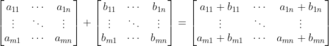
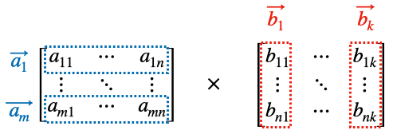
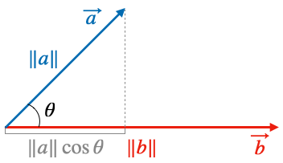
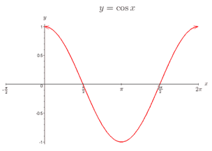

이 포스트는 자연어처리에서 사용되는 기본적인 행렬연산에 대해서 설명하는데 목적이 있습니다. 행렬연산에 대해서 알고 계시는 분은 다음 포스트를 참고하세요.


###### 미리 확인해야할 포스트

- [간단한 단어분류 프로젝트를 통한 자연어처리 이해](../nlp-tutorial-01-01-sequence-prediction/)
- [간단한 문장분류 프로젝트를 통한 자연어처리 이해](../nlp-tutorial-01-02-sentence-prediction/)


개발 환경은 [google colab](https://colab.research.google.com/){:target="_blank"}을 사용하며 개발 언어는 [pytorch](https://pytorch.org/){:target="_blank"}를 사용합니다. 이 포스트를 작성할 시점의 pytorch 버전은 1.7.1 입니다.


**소스코드**

- Colab에서 동작하는 소스코드는 [02-01-matrix-equations.ipynb](https://github.com/paul-hyun/torch-nlp-tutorial/blob/main/02-inputs-outputs/02-01-matrix-equations.ipynb){:target="_blank"}을 참고하시면 됩니다.
- 로컬 컴퓨터에서 동작하는 소스코드는 [02-01-matrix-equations.py](https://github.com/paul-hyun/torch-nlp-tutorial/blob/main/02-inputs-outputs/02-01-matrix-equations.py){:target="_blank"}를 참고하시면 됩니다.


#### 1. 환경

Google colab에서 필요한 환경을 설정하는 과정입니다.


우선 필요한 library를 import 합니다.

```python
import easydict
import random

import matplotlib.pyplot as plt
import numpy as np
import torch
```

다음은 필요한 환경을 설정합니다.

```python
# 환경 설정
args = easydict.EasyDict({
    # random seed value
    "seed": 1234,
    # CPU 또는 GPU 사용여부 결정
    "device": torch.device("cuda" if torch.cuda.is_available() else "cpu")
})

print(args)
```

위 코드의 실행 결과는 아래와 같습니다.

```text
{'seed': 1234, 'device': device(type='cpu')}
```

다음은 random seed를 설정해줍니다.

```python
# random seed 설정
random.seed(args.seed)
np.random.seed(args.seed)
torch.manual_seed(args.seed)
torch.cuda.manual_seed_all(args.seed)
```


#### 1. 행렬 A

우선 아래와 같이 실습을 위한 5행 4열의 행렬을 선언합니다. 5행 4열의 행렬의 모양을 **$5 \times 4$**로 표현합니다.

```python
# A 행렬 선언
A = np.random.randint(-9, 10, (5, 4)) / 10
A = torch.tensor(A)
print(A)
```

위 코드의 실행 결과는 아래와 같습니다. 랜덤 행렬 A가 생성되었습니다.

```text
tensor([[ 0.6000, -0.3000,  0.3000,  0.6000],
        [ 0.8000,  0.0000,  0.2000,  0.3000],
        [ 0.7000, -0.4000,  0.7000,  0.0000],
        [ 0.6000,  0.9000,  0.7000,  0.3000],
        [-0.4000, -0.7000, -0.3000, -0.6000]], dtype=torch.float64)
```

#### 2. Element Wise Sum

행렬 간의 더하기를 해 보겠습니다. 전제조건은 두 행렬의 모양이 같아야 합니다. 아래 수식과 같이 $m \times n$ 행렬 A와 $m \times n$ 행렬 B의 합은 행렬의 같은 위치의 성분들을 더한 것과 같습니다.



행렬의 합은 교환법칙, 결합법칙이 성립합니다.
- $A + B = B + A$
- $(A + B) + C = A + (B + C)$


행렬의 더하기를 이제 실습으로 확인해 보겠습니다. 우선 A와 더하기를 할 행렬 B를 선언 후 더합니다. 행렬 B도 행렬 A와 같이 **$5 \times 4$** 행렬이어야 합니다. 두 행렬의 더히기를 코드로 표현할 때는 $A + B$와 같이 '$+$' 기호를 사용합니다.

```python
# B 행렬 합
B = np.random.randint(-9, 10, (5, 4)) / 10
B = torch.tensor(B)

print(A)
print(B)
print(A + B)
```

위 코드의 실행 결과는 아래와 같습니다. 행렬의 각 성분들끼리 더해진 것을 확인할 수 있습니다.

```text
tensor([[ 0.6000, -0.3000,  0.3000,  0.6000],
        [ 0.8000,  0.0000,  0.2000,  0.3000],
        [ 0.7000, -0.4000,  0.7000,  0.0000],
        [ 0.6000,  0.9000,  0.7000,  0.3000],
        [-0.4000, -0.7000, -0.3000, -0.6000]], dtype=torch.float64)
tensor([[-0.2000,  0.2000, -0.9000,  0.0000],
        [ 0.2000,  0.7000, -0.6000, -0.7000],
        [ 0.3000, -0.8000,  0.2000,  0.2000],
        [ 0.8000,  0.5000, -0.2000,  0.1000],
        [ 0.2000,  0.5000,  0.8000,  0.4000]], dtype=torch.float64)
tensor([[ 0.4000, -0.1000, -0.6000,  0.6000],
        [ 1.0000,  0.7000, -0.4000, -0.4000],
        [ 1.0000, -1.2000,  0.9000,  0.2000],
        [ 1.4000,  1.4000,  0.5000,  0.4000],
        [-0.2000, -0.2000,  0.5000, -0.2000]], dtype=torch.float64)
```


###### 2.1. Broadcasting $(m \times n) + (m \times 1)$

다음은 행렬 덧셈에서의 브로드캐스팅에 대해서 알아보겠습니다. 브로드캐스팅은 행령을 더할 때 행 또는 열의 개수가 1일때 자동으로 복사된 성분으로 계산해주는 기능을 말합니다. 자세한 내용은 [numpy Broadcasting](https://numpy.org/doc/stable/user/basics.broadcasting.html){:target="_blank"}을 참고하세요.


아래 수식과 같이 $m \times n$ 행렬 A과 $m \times 1$ 행렬 B의 합은 행렬 B의 열을 n번 복사해서 $m \times n$ 행렬로 변경후 행렬의 같은 위치의 성분들을 더한 것과 같습니다.

$$
\begin{bmatrix}
a_{11} & \cdots & a_{1n} \\
\vdots & \ddots & \vdots \\
a_{m1} & \cdots & a_{mn} \\
\end{bmatrix}

+

\begin{bmatrix}
b_{11} \\
\vdots \\
b_{m1} \\
\end{bmatrix}

=

\begin{bmatrix}
a_{11} + b_{11} & \cdots & a_{1n} + b_{11} \\
\vdots & \ddots & \vdots \\
a_{m1} + b_{m1} & \cdots & a_{mn} + b_{m1} \\
\end{bmatrix}
$$

행렬의 브로드캐스팅 더하기를 이제 실습으로 확인해 보겠습니다. 우선 A와 더하기를 할 행렬 B를 선언한 후 더하기를 실행합니다. 이때 행렬 B는 행렬 A와 다르게 **$5 \times 1$** 행렬로 선언합니다.

```python
# B 행렬 Boradcasting 합
B = np.random.randint(-9, 10, (5, 1)) / 10
B = torch.tensor(B)

print(A)
print(B)
print(A + B)
```

위 코드의 실행 결과는 아래와 같습니다. 행렬 B가 브로드캐스팅 후 각 성분들끼리 더해진 것을 확인할 수 있습니다.

```text
tensor([[ 0.6000, -0.3000,  0.3000,  0.6000],
        [ 0.8000,  0.0000,  0.2000,  0.3000],
        [ 0.7000, -0.4000,  0.7000,  0.0000],
        [ 0.6000,  0.9000,  0.7000,  0.3000],
        [-0.4000, -0.7000, -0.3000, -0.6000]], dtype=torch.float64)
tensor([[-0.9000],
        [ 0.3000],
        [-0.4000],
        [ 0.8000],
        [-0.4000]], dtype=torch.float64)
tensor([[-0.3000, -1.2000, -0.6000, -0.3000],
        [ 1.1000,  0.3000,  0.5000,  0.6000],
        [ 0.3000, -0.8000,  0.3000, -0.4000],
        [ 1.4000,  1.7000,  1.5000,  1.1000],
        [-0.8000, -1.1000, -0.7000, -1.0000]], dtype=torch.float64)
```

결과 검증을 위해 pytorch의 [repeat](https://pytorch.org/docs/stable/tensors.html) 함수를 이용해 행렬 B를 A와 같은 모양으로 열을 복사한 B1 행렬을 이용한 합을 구해봅니다.

```python
# B 행렬 열복사 후 합
B1 = B.repeat(1, 4)

print(B1)
print(A + B1)
```

위 코드의 실행 결과는 아래와 같습니다. 위 브로드캐스팅 더하기와 결과가 같은것을 확인할 수 있습니다.

```text
tensor([[-0.9000, -0.9000, -0.9000, -0.9000],
        [ 0.3000,  0.3000,  0.3000,  0.3000],
        [-0.4000, -0.4000, -0.4000, -0.4000],
        [ 0.8000,  0.8000,  0.8000,  0.8000],
        [-0.4000, -0.4000, -0.4000, -0.4000]], dtype=torch.float64)
tensor([[-0.3000, -1.2000, -0.6000, -0.3000],
        [ 1.1000,  0.3000,  0.5000,  0.6000],
        [ 0.3000, -0.8000,  0.3000, -0.4000],
        [ 1.4000,  1.7000,  1.5000,  1.1000],
        [-0.8000, -1.1000, -0.7000, -1.0000]], dtype=torch.float64)
```


###### 2.2. Broadcasting $(m \times n) + (1 \times n)$

두번째 경우는 아래 수식과 같이 $m \times n$ 행렬 A과 $1 \times n$ 행렬 B의 합은 행렬 B의 행을 m번 복사해서 $m \times n$ 행렬로 변경후 행렬의 같은 위치의 성분들을 더한 것과 같습니다.

$$
\begin{bmatrix}
a_{11} & \cdots & a_{1n} \\
\vdots & \ddots & \vdots \\
a_{m1} & \cdots & a_{mn} \\
\end{bmatrix}

+

\begin{bmatrix}
b_{11} & \cdots & b_{1n} \\
\end{bmatrix}

=

\begin{bmatrix}
a_{11} + b_{11} & \cdots & a_{1n} + b_{1n} \\
\vdots & \ddots & \vdots \\
a_{m1} + b_{11} & \cdots & a_{mn} + b_{1n} \\
\end{bmatrix}
$$

이제 실습으로 확인해 보겠습니다. 우선 A와 더하기를 할 행렬 B를 선언한 후 더하기를 실행합니다. 행렬 B를 행렬 A와 다르게 **$1 \times 4$** 행렬로 선언합니다.

```python
# B 행렬 Boradcasting 합
B = np.random.randint(-9, 10, (1, 4)) / 10
B = torch.tensor(B)

print(A)
print(B)
print(A + B)
```

위 코드의 실행 결과는 아래와 같습니다. 행렬 B가 브로드캐스팅 후 각 성분들끼리 더해진 것을 확인할 수 있습니다.

```text
tensor([[ 0.6000, -0.3000,  0.3000,  0.6000],
        [ 0.8000,  0.0000,  0.2000,  0.3000],
        [ 0.7000, -0.4000,  0.7000,  0.0000],
        [ 0.6000,  0.9000,  0.7000,  0.3000],
        [-0.4000, -0.7000, -0.3000, -0.6000]], dtype=torch.float64)
tensor([[ 0.4000,  0.7000,  0.0000, -0.1000]], dtype=torch.float64)
tensor([[ 1.0000,  0.4000,  0.3000,  0.5000],
        [ 1.2000,  0.7000,  0.2000,  0.2000],
        [ 1.1000,  0.3000,  0.7000, -0.1000],
        [ 1.0000,  1.6000,  0.7000,  0.2000],
        [ 0.0000,  0.0000, -0.3000, -0.7000]], dtype=torch.float64)
```


결과 검증을 위해 pytorch의 [repeat](https://pytorch.org/docs/stable/tensors.html) 함수를 이용해 행렬 B를 A와 같은 모양으로 행을 복사한 B1 행렬을 이용한 합을 구해봅니다.

```python
# B 행렬 열복사 후 합
B1 = B.repeat(1, 4)

print(B1)
print(A + B1)
```

위 코드의 실행 결과는 아래와 같습니다. 위 브로드캐스팅 더하기와 결과가 같은것을 확인할 수 있습니다.

```text
tensor([[ 0.4000,  0.7000,  0.0000, -0.1000],
        [ 0.4000,  0.7000,  0.0000, -0.1000],
        [ 0.4000,  0.7000,  0.0000, -0.1000],
        [ 0.4000,  0.7000,  0.0000, -0.1000],
        [ 0.4000,  0.7000,  0.0000, -0.1000]], dtype=torch.float64)
tensor([[ 1.0000,  0.4000,  0.3000,  0.5000],
        [ 1.2000,  0.7000,  0.2000,  0.2000],
        [ 1.1000,  0.3000,  0.7000, -0.1000],
        [ 1.0000,  1.6000,  0.7000,  0.2000],
        [ 0.0000,  0.0000, -0.3000, -0.7000]], dtype=torch.float64)
```


###### 2.3. Broadcasting $(m \times n) + (1 \times 1)$

두번째 경우는 아래 수식과 같이 $m \times n$ 행렬 A과 $1 \times 1$ 행렬 B의 합은 행렬 B를 복사해서 $m \times n$ 행렬로 변경후 행렬의 같은 위치의 성분들을 더한 것과 같습니다. 이때 B는 행렬이 아닌 실수 스칼라 값이어도 동일합니다.

$$
\begin{bmatrix}
a_{11} & \cdots & a_{1n} \\
\vdots & \ddots & \vdots \\
a_{m1} & \cdots & a_{mn} \\
\end{bmatrix}

+

\begin{bmatrix}
b_{11} \\
\end{bmatrix}
=

\begin{bmatrix}
a_{11} + b_{11} & \cdots & a_{1n} + b_{11} \\
\vdots & \ddots & \vdots \\
a_{m1} + b_{11} & \cdots & a_{mn} + b_{11} \\
\end{bmatrix}
$$

이제 실습으로 확인해 보겠습니다. 우선 A와 더하기를 할 행렬 B를 선언한 후 더하기를 실행합니다. 행렬 B를 행렬 A와 다르게 **$1 \times 1$** 행렬로 선언합니다.

```python
# B 행렬 Boradcasting 합
B = np.random.randint(-9, 10, (1, 1)) / 10
B = torch.tensor(B)

print(A)
print(B)
print(A + B)
```

위 코드의 실행 결과는 아래와 같습니다. 행렬 B가 브로드캐스팅 후 각 성분들끼리 더해진 것을 확인할 수 있습니다.

```text
tensor([[ 0.6000, -0.3000,  0.3000,  0.6000],
        [ 0.8000,  0.0000,  0.2000,  0.3000],
        [ 0.7000, -0.4000,  0.7000,  0.0000],
        [ 0.6000,  0.9000,  0.7000,  0.3000],
        [-0.4000, -0.7000, -0.3000, -0.6000]], dtype=torch.float64)
tensor([[0.3000]], dtype=torch.float64)
tensor([[ 0.9000,  0.0000,  0.6000,  0.9000],
        [ 1.1000,  0.3000,  0.5000,  0.6000],
        [ 1.0000, -0.1000,  1.0000,  0.3000],
        [ 0.9000,  1.2000,  1.0000,  0.6000],
        [-0.1000, -0.4000,  0.0000, -0.3000]], dtype=torch.float64)
```


결과 검증을 위해 pytorch의 [repeat](https://pytorch.org/docs/stable/tensors.html) 함수를 이용해 행렬 B를 A와 같은 모양으로 행을 복사한 B1 행렬을 이용한 합을 구해봅니다.

```python
# B 행렬 행과 열 복사 후 합
B1 = B.repeat(5, 4)

print(B1)
print(A + B1)
```

위 코드의 실행 결과는 아래와 같습니다. 위 브로드캐스팅 더하기와 결과가 같은것을 확인할 수 있습니다.

```text
tensor([[0.3000, 0.3000, 0.3000, 0.3000],
        [0.3000, 0.3000, 0.3000, 0.3000],
        [0.3000, 0.3000, 0.3000, 0.3000],
        [0.3000, 0.3000, 0.3000, 0.3000],
        [0.3000, 0.3000, 0.3000, 0.3000]], dtype=torch.float64)
tensor([[ 0.9000,  0.0000,  0.6000,  0.9000],
        [ 1.1000,  0.3000,  0.5000,  0.6000],
        [ 1.0000, -0.1000,  1.0000,  0.3000],
        [ 0.9000,  1.2000,  1.0000,  0.6000],
        [-0.1000, -0.4000,  0.0000, -0.3000]], dtype=torch.float64)
```


#### 3. Element Wise Product

행렬 간의 element wise product를 해 보겠습니다. element wise product는 기호로는 $\odot$와 같이 표현합니다. 더하기와 비슷하게 전제조건은 두 행렬의 모양이 같아야 합니다. 아래 수식과 같이 $m \times n$ 행렬 A와 $m \times n$ 행렬 B의 element wise product는 행렬의 같은 위치의 성분들을 곱한 것과 같습니다.

$$
\begin{bmatrix}
a_{11} & \cdots & a_{1n} \\
\vdots & \ddots & \vdots \\
a_{m1} & \cdots & a_{mn} \\
\end{bmatrix}

\odot

\begin{bmatrix}
b_{11} & \cdots & b_{1n} \\
\vdots & \ddots & \vdots \\
b_{m1} & \cdots & b_{mn} \\
\end{bmatrix}

=

\begin{bmatrix}
a_{11} \times b_{11} & \cdots & a_{1n} \times b_{1n} \\
\vdots & \ddots & \vdots \\
a_{m1} \times b_{m1} & \cdots & a_{mn} \times b_{mn} \\
\end{bmatrix}
$$


행렬의 element wise product는 교환법칙, 결합법칙이 성립합니다.
- $A \odot B = B \odot A$
- $(A \odot B) \odot C = A \odot (B \odot C)$


행렬의 element wise product를 이제 실습으로 확인해 보겠습니다. 우선 행렬 B를 선언 후 행렬 A와 element wise product를 실행합니다. 행렬 B도 행렬 A와 같이 **$5 \times 4$** 행렬이어야 합니다. 두 행렬의 element wise product를 코드로 표현할 때는 $A * B$와 같이 '$*$' 기호를 사용합니다.

```python
# B 행렬 element wise product
B = np.random.randint(-9, 10, (5, 4)) / 10
B = torch.tensor(B)

print(A)
print(B)
print(A * B)
```

위 코드의 실행 결과는 아래와 같습니다. 행렬의 각 성분들끼리 곱해진 것을 확인할 수 있습니다.

```text
tensor([[ 0.6000, -0.3000,  0.3000,  0.6000],
        [ 0.8000,  0.0000,  0.2000,  0.3000],
        [ 0.7000, -0.4000,  0.7000,  0.0000],
        [ 0.6000,  0.9000,  0.7000,  0.3000],
        [-0.4000, -0.7000, -0.3000, -0.6000]], dtype=torch.float64)
tensor([[-0.3000,  0.3000,  0.6000,  0.8000],
        [ 0.9000,  0.5000, -0.7000, -0.4000],
        [ 0.4000, -0.3000, -0.2000, -0.5000],
        [-0.6000, -0.4000,  0.5000,  0.6000],
        [ 0.6000,  0.6000, -0.7000,  0.1000]], dtype=torch.float64)
tensor([[-0.1800, -0.0900,  0.1800,  0.4800],
        [ 0.7200,  0.0000, -0.1400, -0.1200],
        [ 0.2800,  0.1200, -0.1400, -0.0000],
        [-0.3600, -0.3600,  0.3500,  0.1800],
        [-0.2400, -0.4200,  0.2100, -0.0600]], dtype=torch.float64)
```


###### 3.1. Broadcasting $(m \times n) + (m \times 1)$

다음은 행렬 element wise product에서의 브로드캐스팅은 행열의 더하기와 차이가 앖습니다.


아래 수식과 같이 $m \times n$ 행렬 A과 $m \times 1$ 행렬 B의 합은 행렬 B의 열을 n번 복사해서 $m \times n$ 행렬로 변경후 행렬의 같은 위치의 성분들을 곱한 것과 같습니다.

$$
\begin{bmatrix}
a_{11} & \cdots & a_{1n} \\
\vdots & \ddots & \vdots \\
a_{m1} & \cdots & a_{mn} \\
\end{bmatrix}

\odot

\begin{bmatrix}
b_{11} \\
\vdots \\
b_{m1} \\
\end{bmatrix}

=

\begin{bmatrix}
a_{11} \times b_{11} & \cdots & a_{1n} \times b_{11} \\
\vdots & \ddots & \vdots \\
a_{m1} \times b_{m1} & \cdots & a_{mn} \times b_{m1} \\
\end{bmatrix}
$$

이제 실습으로 확인해 보겠습니다. 우선 행렬 B를 선언한 후 행렬 A와 element wise product를 실행합니다. 이때 행렬 B는 행렬 A와 다르게 **$5 \times 1$** 행렬로 선언합니다.

```python
# B 행렬 Boradcasting element wise product
B = np.random.randint(-9, 10, (5, 1)) / 10
B = torch.tensor(B)

print(A)
print(B)
print(A * B)
```

위 코드의 실행 결과는 아래와 같습니다. 행렬 B가 브로드캐스팅 후 각 성분들끼리 곱해진 것을 확인할 수 있습니다.

```text
tensor([[ 0.6000, -0.3000,  0.3000,  0.6000],
        [ 0.8000,  0.0000,  0.2000,  0.3000],
        [ 0.7000, -0.4000,  0.7000,  0.0000],
        [ 0.6000,  0.9000,  0.7000,  0.3000],
        [-0.4000, -0.7000, -0.3000, -0.6000]], dtype=torch.float64)
tensor([[-0.5000],
        [ 0.9000],
        [-0.2000],
        [ 0.2000],
        [ 0.5000]], dtype=torch.float64)
tensor([[-0.3000,  0.1500, -0.1500, -0.3000],
        [ 0.7200,  0.0000,  0.1800,  0.2700],
        [-0.1400,  0.0800, -0.1400, -0.0000],
        [ 0.1200,  0.1800,  0.1400,  0.0600],
        [-0.2000, -0.3500, -0.1500, -0.3000]], dtype=torch.float64)
```

결과 검증은 행렬의 더하기와 차이가 없으므로 생략합니다.


###### 3.2. Broadcasting $(m \times n) + (1 \times n)$

두번째 경우는 아래 수식과 같이 $m \times n$ 행렬 A과 $1 \times n$ 행렬 B의 합은 행렬 B의 행을 m번 복사해서 $m \times n$ 행렬로 변경후 행렬의 같은 위치의 성분들을 곱한 것과 같습니다.

$$
\begin{bmatrix}
a_{11} & \cdots & a_{1n} \\
\vdots & \ddots & \vdots \\
a_{m1} & \cdots & a_{mn} \\
\end{bmatrix}

\odot

\begin{bmatrix}
b_{11} & \cdots & b_{1n} \\
\end{bmatrix}

=

\begin{bmatrix}
a_{11} \times b_{11} & \cdots & a_{1n} \times b_{1n} \\
\vdots & \ddots & \vdots \\
a_{m1} \times b_{11} & \cdots & a_{mn} \times b_{1n} \\
\end{bmatrix}
$$

이제 실습으로 확인해 보겠습니다. 우선 행렬 B를 선언한 후 행렬 A와 element wise product를 실행합니다. 행렬 B를 행렬 A와 다르게 **$1 \times 4$** 행렬로 선언합니다.

```python
# B 행렬 Boradcasting element wise product
B = np.random.randint(-9, 10, (1, 4)) / 10
B = torch.tensor(B)

print(A)
print(B)
print(A * B)
```

위 코드의 실행 결과는 아래와 같습니다. 행렬 B가 브로드캐스팅 후 각 성분들끼리 더해진 것을 확인할 수 있습니다.

```text
tensor([[ 0.6000, -0.3000,  0.3000,  0.6000],
        [ 0.8000,  0.0000,  0.2000,  0.3000],
        [ 0.7000, -0.4000,  0.7000,  0.0000],
        [ 0.6000,  0.9000,  0.7000,  0.3000],
        [-0.4000, -0.7000, -0.3000, -0.6000]], dtype=torch.float64)
tensor([[ 0.9000,  0.0000, -0.9000, -0.7000]], dtype=torch.float64)
tensor([[ 0.5400, -0.0000, -0.2700, -0.4200],
        [ 0.7200,  0.0000, -0.1800, -0.2100],
        [ 0.6300, -0.0000, -0.6300, -0.0000],
        [ 0.5400,  0.0000, -0.6300, -0.2100],
        [-0.3600, -0.0000,  0.2700,  0.4200]], dtype=torch.float64)
```

결과 검증은 행렬의 더하기와 차이가 없으므로 생략합니다.


###### 3.3. Broadcasting $(m \times n) + (1 \times 1)$

두번째 경우는 아래 수식과 같이 $m \times n$ 행렬 A과 $1 \times 1$ 행렬 B의 합은 행렬 B를 복사해서 $m \times n$ 행렬로 변경후 행렬의 같은 위치의 성분들을 곱한 것과 같습니다. 이때 B는 행렬이 아닌 실수 스칼라 값이어도 동일합니다.

$$
\begin{bmatrix}
a_{11} & \cdots & a_{1n} \\
\vdots & \ddots & \vdots \\
a_{m1} & \cdots & a_{mn} \\
\end{bmatrix}

\odot

\begin{bmatrix}
b_{11} \\
\end{bmatrix}
=

\begin{bmatrix}
a_{11} \times b_{11} & \cdots & a_{1n} \times b_{11} \\
\vdots & \ddots & \vdots \\
a_{m1} \times b_{11} & \cdots & a_{mn} \times b_{11} \\
\end{bmatrix}
$$

이제 실습으로 확인해 보겠습니다. 우선 행렬 B를 선언한 후 행렬 A와 element wise product를 실행합니다. 행렬 B를 행렬 A와 다르게 **$1 \times 1$** 행렬로 선언합니다.

```python
# B 행렬 Boradcasting element wise product
B = np.random.randint(-9, 10, (1, 1)) / 10
B = torch.tensor(B)

print(A)
print(B)
print(A * B)
```

위 코드의 실행 결과는 아래와 같습니다. 행렬 B가 브로드캐스팅 후 각 성분들끼리 곱해진 것을 확인할 수 있습니다.

```text
tensor([[ 0.6000, -0.3000,  0.3000,  0.6000],
        [ 0.8000,  0.0000,  0.2000,  0.3000],
        [ 0.7000, -0.4000,  0.7000,  0.0000],
        [ 0.6000,  0.9000,  0.7000,  0.3000],
        [-0.4000, -0.7000, -0.3000, -0.6000]], dtype=torch.float64)
tensor([[-0.8000]], dtype=torch.float64)
tensor([[-0.4800,  0.2400, -0.2400, -0.4800],
        [-0.6400, -0.0000, -0.1600, -0.2400],
        [-0.5600,  0.3200, -0.5600, -0.0000],
        [-0.4800, -0.7200, -0.5600, -0.2400],
        [ 0.3200,  0.5600,  0.2400,  0.4800]], dtype=torch.float64)
```

결과 검증은 행렬의 더하기와 차이가 없으므로 생략합니다.


#### 4. Matrix multiplication

행렬 간의 matrix multiplication를 해 보겠습니다. Matrix multiplication는 기호로는 $A \times B$와 같이 표현합니다. 또는 간단하게 $AB$ 기호를 생락하기도 합니다. 전제조건은 첫 번째 행렬의 열의 개수와 두 번째 행렬의 행의 개수가 같아야 합니다. 아래 수식과 같이 $m \times n$ 행렬 A와 $n \times k$ 행렬 B의 matrix multiplication은 A의 행들과 B의 열들을 dot product 한 것과 같습니다.


결과는 첫 번째 행렬의 행 개수와 두 번째 행렬의 열 개수와 동일한 $m \times k$ 행렬입니다.

$$
\begin{bmatrix}
a_{11} & \cdots & a_{1n} \\
\vdots & \ddots & \vdots \\
a_{m1} & \cdots & a_{mn} \\
\end{bmatrix}

\times

\begin{bmatrix}
b_{11} & \cdots & b_{1n} \\
\vdots & \ddots & \vdots \\
b_{m1} & \cdots & b_{mn} \\
\end{bmatrix}

=

\begin{bmatrix}
a_{11}b_{11} + \cdots + a_{1n}b_{n1} & \cdots & a_{11}b_{1k} + \cdots + a_{1n}b_{nk} \\
\vdots & \ddots & \vdots \\
a_{m1}b_{11} + \cdots + a_{mn}b_{n1} & \cdots & a_{1m}b_{1k} + \cdots + a_{mn}b_{nk} \\
\end{bmatrix}
$$


행렬의 matrix multiplication은 교환법칙은 성립하지 않고 결합법칙은 성립합니다.
- $A \times B \ne B \times A$
- $(A \times B) \times C = A \times (B \times C)$


위 행렬을 아래와 같이 행벡터와 열벡터로 표현할 수 있습니다.



이제 matrix multiplication을 행벡터와 열벡터 수식으로 표현하면 아래와 같습니다.

$$
\begin{bmatrix}
\vec{a_{1}} \\
\vdots \\
\vec{a_{m}} \\
\end{bmatrix}

\times

\begin{bmatrix}
\vec{b_{1}} & \cdots & \vec{b_{k}} \\
\end{bmatrix}

=

\begin{bmatrix}
\vec{a_{1}} \bullet \vec{b_{1}} & \cdots & \vec{a_{1}} \bullet \vec{b_{k}} \\
\vdots & \ddots & \vdots \\
\vec{a_{m}} \bullet \vec{b_{1}} & \cdots & \vec{a_{m}} \bullet \vec{b_{k}} \\
\end{bmatrix}
$$


행렬의 matrix multiplication을 실습으로 확인해 보겠습니다. 우선 행렬 B를 선언 후 행렬 A와 matrix multiplication을 실행합니다. 행렬 B의 행은 행렬 A의 열과 같아야 하고 행렬 B의 열은 아무 값이나 주어도 됩니다. 다음과 같이 **$4 \times 3$** B 행렬을 선언합니다. 두 행렬의 matrix multiplication은 pytorch의 [matmul](https://pytorch.org/docs/stable/generated/torch.matmul.html){:target="_blank"} 함수를 이용해서 구합니다.

```python
# B 행렬 matrix multiplication
B = np.random.randint(-9, 10, (4, 3)) / 10
B = torch.tensor(B)

print(A)
print(B)
print(torch.matmul(A, B))
```

위 코드의 실행 결과는 아래와 같습니다.

```text
tensor([[ 0.6000, -0.3000,  0.3000,  0.6000],
        [ 0.8000,  0.0000,  0.2000,  0.3000],
        [ 0.7000, -0.4000,  0.7000,  0.0000],
        [ 0.6000,  0.9000,  0.7000,  0.3000],
        [-0.4000, -0.7000, -0.3000, -0.6000]], dtype=torch.float64)
tensor([[ 0.9000,  0.8000, -0.2000],
        [-0.5000, -0.2000,  0.8000],
        [-0.9000,  0.0000,  0.9000],
        [ 0.0000, -0.8000,  0.5000]], dtype=torch.float64)
tensor([[ 0.4200,  0.0600,  0.2100],
        [ 0.5400,  0.4000,  0.1700],
        [ 0.2000,  0.6400,  0.1700],
        [-0.5400,  0.0600,  1.3800],
        [ 0.2600,  0.3000, -1.0500]], dtype=torch.float64)
```

결과 검증을 위해 A의 행벡터와 B의 열벡터의 dot product를 pytorch이 [dot](https://pytorch.org/docs/stable/generated/torch.dot.html){:target="_blank"} 함수를 이용해 직접 구해보겠습니다.

```python
# 직접계산
result = torch.zeros(A.size(0), B.size(-1))
for row in range(A.size(0)):
    for col in range(B.size(-1)):
        result[row][col] = torch.dot(A[row], B[:, col])

print(result)
```

위 코드의 실행 결과는 아래와 같습니다. pytorch의 [matmul](https://pytorch.org/docs/stable/generated/torch.matmul.html){:target="_blank"}의 결과와 동일한 것을 확인할 수 있습니다.

```text
tensor([[ 0.4200,  0.0600,  0.2100],
        [ 0.5400,  0.4000,  0.1700],
        [ 0.2000,  0.6400,  0.1700],
        [-0.5400,  0.0600,  1.3800],
        [ 0.2600,  0.3000, -1.0500]])
```


###### 4.1. 열벡터 연산으로의 해석 

딥러닝에서 수식으로 모델을 설명할 때 열벡터로 표현하는 경우가 대부분입니다. 위 행벡터와 열벡터의 수식을 열벡터로 표현하면 아래와 같습니다. A 행렬과 B의 열벡터들의 matrix multiplication으로 표현할 수 있습니다.

$$
A

\times

\begin{bmatrix}
\vec{b_{1}} & \cdots & \vec{b_{k}} \\
\end{bmatrix}

=

\begin{bmatrix}
A \times \vec{b_{1}} & \cdots & A \times \vec{b_{k}} \\
\end{bmatrix}
$$

행렬과 하나의 열벡터의 matrix multiplication은 다음과 같이 표현할 수 있습니다.

$$
\begin{bmatrix}
a_{11} & a_{12} & a_{13} \\
a_{21} & a_{22} & a_{23} \\
a_{31} & a_{32} & a_{33} \\
\end{bmatrix}

\times

\begin{bmatrix}
x \\
y \\
x \\
\end{bmatrix}

=

x\begin{bmatrix}
a_{11} \\
a_{21} \\
a_{31} \\
\end{bmatrix}

+

y\begin{bmatrix}
a_{12} \\
a_{22} \\
a_{32} \\
\end{bmatrix}

+

z\begin{bmatrix}
a_{13} \\
a_{23} \\
a_{33} \\
\end{bmatrix}

=

\begin{bmatrix}
a_{11}x + a_{12}y + a_{13}z \\
a_{21}x + a_{22}y + a_{23}z \\
a_{31}x + a_{32}y + a_{33}z \\
\end{bmatrix}
$$


###### 4.2. 행벡터 연산으로의 해석 

드믈지만 딥러닝에서 수식으로 모델을 설명할 때 행벡터로 표현하는 경우가 있습니다. 위 행벡터와 열벡터의 수식을 행벡터로 표현하면 아래와 같습니다. A의 행벡터와 행렬 B의 matrix multiplication으로 표현할 수 있습니다.

$$
\begin{bmatrix}
\vec{a_{1}} \\
\vdots \\
\vec{a_{m}} \\
\end{bmatrix}

\times

B

=

\begin{bmatrix}
\vec{a_{1}} \times B \\
\cdots \\
\vec{a_{m}} \times B \\
\end{bmatrix}
$$

하나의 행벡터와 행렬의 matrix multiplication은 다음과 같이 표현할 수 있습니다.

$$
\begin{bmatrix}
x & y & z \\
\end{bmatrix}

\times

\begin{bmatrix}
b_{11} & b_{12} & b_{13} \\
b_{21} & b_{22} & b_{23} \\
b_{31} & b_{32} & b_{33} \\
\end{bmatrix}

=

x\begin{bmatrix}
b_{11} & b_{12} & b_{13} \\
\end{bmatrix}

+

y\begin{bmatrix}
b_{21} & b_{22} & b_{23} \\
\end{bmatrix}

+

z\begin{bmatrix}
b_{31} & b_{32} & b_{33} \\
\end{bmatrix}

=

\begin{bmatrix}
b_{11}x + b_{21}y + b_{31}z & b_{12}x + b_{22}y + b_{32}z & b_{13}x + b_{23}y + b_{33}z \\
\end{bmatrix}
$$


#### 5. Dot Product

두 벡터간의 dot product에 대해서 알아보겠습니다. Dot product의 기호는 $\vec{a} \bullet \vec{b}$와 같이 표현합니다. 전제조건은 두 벡터의 차원 수가 같아야 합니다. 아래 수식과 같이 같은 위치의 성분들을 곱해서 전체를 더한 것과 같습니다. 결과는 하나의 스칼라 값입니다.

$$
\begin{bmatrix}
a_{1} \\
\vdots \\
a_{n} \\
\end{bmatrix}

\bullet

\begin{bmatrix}
b_{1} \\
\vdots \\
b_{n} \\
\end{bmatrix}

=

\begin{bmatrix}
a_{1}b_{1} + \cdots + a_{n}b_{n} \\
\end{bmatrix}
$$

두 벡터의 dot product를 기하적으로 표현하면 다음과 같습니다. 두 벡터의 길이의 곱에 두 벡터가 이루는 내각 $\theta$에 cosine을 취한 값을 더하는 것입니다.



위 그림을 수식으로 표현하면 다음과 같습니다.

$$
\lVert a \rVert \lVert b \rVert \cos \theta
$$

cosine 값은 아래그림과 같이 변합나다.



- 두 벡터의 방향이 같을 때 cosine 값이 1이 되어 dot-product 값이 최대가 됩니다
- 두 벡터의 방향이 직각을 이룰 때 cosine 값이 0이 되어 dot-product 값이 0이 됩니다. 이때를 직교(orthogonality) 한다고 표현합니다.
- 두 벡터가 방향이 반대 방향일 때 cosine 값이 -1이 되어 dot-product 값이 최소가 됩니다.

즉 dot-product는 두 벡터가 얼마나 유사한지를 비교할 수 있는 기준으로 사용할 수 있습니다.


벡터의 dot product를 실습으로 확인해 보겠습니다. 우선 두개의 벡터를 선언합니다.

```python
# a, b 벡터 선언
a = np.random.randint(-9, 10, (5,)) / 10
a = torch.tensor(a)

b = np.random.randint(-9, 10, (5,)) / 10
b = torch.tensor(b)

print(a)
print(b)
```

위 코드의 실행 결과는 아래와 같습니다. 두 개의 벡터가 생성되었습니다.

```text
tensor([ 0.4000,  0.2000,  0.6000,  0.7000, -0.9000], dtype=torch.float64)
tensor([ 0.8000, -0.9000,  0.8000,  0.0000, -0.6000], dtype=torch.float64)
```

다음은 pytorch이 [dot](https://pytorch.org/docs/stable/generated/torch.dot.html){:target="_blank"} 함수를 이용해 dot-product를 구합니다.

```python
# dot-product
print(torch.dot(a, b))
```

위 코드의 실행 결과는 아래와 같습니다. dot product의 결과인 스칼라값을 확인할 수 있습니다.

```text
tensor(1.1600, dtype=torch.float64)
```

결과 검증을 위해 두 벡터를 element wise product 값을 구한 후 합을 구해봅니다.

```python
# element wise product and sum
c = a * b

print(c)
print(torch.sum(c))
```

위 코드의 실행 결과는 아래와 같습니다. 위 dot product와 결과가 같은 것을 확인할 수 있습니다.

```text
tensor([ 0.3200, -0.1800,  0.4800,  0.0000,  0.5400], dtype=torch.float64)
tensor(1.1600, dtype=torch.float64)
```

지금까지 기본적인 행렬연산에 대해서 알아봤습니다.
