이 포스트는 자연어처리에서 입력문장을 일정한 단위로 분할하는 Tokenizer와 분할된 단위에 고유한 일련번호를 부여하는 Vocabulary에 대해서 이해하는데 목적이 있습니다.

###### 미리 확인해야할 포스트

- [간단한 단어분류 프로젝트를 통한 자연어처리 이해](../nlp-tutorial-01-01-sequence-prediction/)
- [간단한 문장분류 프로젝트를 통한 자연어처리 이해](../nlp-tutorial-01-02-sentence-prediction/)
- [자연어처리를 위한 행렬연산](../nlp-tutorial-02-01-matrix-equations/)


개발 환경은 [google colab](https://colab.research.google.com/){:target="_blank"}을 사용하며 개발 언어는 [pytorch](https://pytorch.org/){:target="_blank"}를 사용합니다. 이 포스트를 작성할 시점의 pytorch 버전은 1.7.1 입니다.


**소스코드**

- Colab에서 동작하는 소스코드는 [02-02-tokenizer-vocabulary.ipynb](https://github.com/paul-hyun/torch-nlp-tutorial/blob/main/02-inputs-outputs/02-02-tokenizer-vocabulary.ipynb){:target="_blank"}을 참고하시면 됩니다.


이번 과정에서는 실습을 위한 **말뭉치파일**이 필요합니다. 한국어위키를 전처리해 놓은 압축파일 [kowiki.txt.zip](https://drive.google.com/file/d/1Hkp-Wt7540rSZlNHDLvk5NlTEdWZLK1h/view?usp=sharing){:target="_blank"}을 다운로드해 구글드라이브의 적당한 위치에 저장하세요.


#### 1. 환경

Google colab에서 필요한 환경을 설정하는 과정입니다.


우선 필요한 library를 import 합니다.

```python
import argparse
import collections
import os
import random
import re
import shutil
import zipfile

import matplotlib.pyplot as plt
import numpy as np
import torch
```

다음은 구글드라이브를 마운트 합니다. 이유는 위에서 다운로드한 [kowiki.txt.zip](https://drive.google.com/file/d/1Hkp-Wt7540rSZlNHDLvk5NlTEdWZLK1h/view?usp=sharing){:target="_blank"}을 사용하기 위해서입니다.

```python
# google drive mount
from google.colab import drive
drive.mount('/content/drive')
```

위 코드의 실행 결과는 아래의 첫번째 창이 나타납니다.

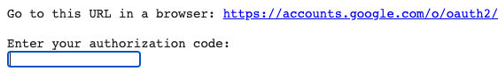

링크를 누르면 나타나는 창에서 아래 순서대로 진행합니다.

1. 구글계정을 선택합니다.
2. 보안 경고 창에서 ‘허용’을 누릅니다.
3. 인증코드를 복사합니다.


위에서 복사된 인증코드를 붙여넣기를 이용해 입력합니다.

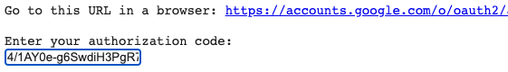

구글드라이브 마운트가 완료되면 colab 우측의 폴더 아이콘은 눌러서 나타난 탐색기에서 'kowiki.txt.zip'을 선태한 후 팝업메뉴에서 경로복사를 선택합니다.

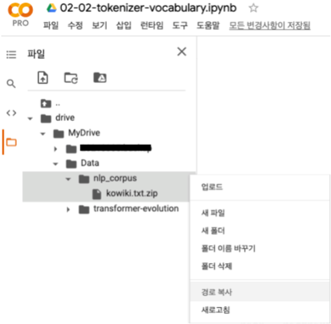

저장된 경로를 아래 코드에 붙여넣기를 합니다.

```python
# kowiki file 경로저장
kowiki_file = "/content/drive/MyDrive/Data/nlp_corpus/kowiki.txt.zip"
```

다음은 필요한 환경을 설정합니다.

```python
# 환경 설정
args = {
    # random seed value
    "seed": 1234,
    # CPU 또는 GPU 사용여부 결정
    "device": torch.device("cuda" if torch.cuda.is_available() else "cpu"),
    # 말뭉치 파일
    "corpus": kowiki_file,
}
args = argparse.Namespace(**args)

print(args)
```

위 코드의 실행 결과는 아래와 같습니다.

```text
Namespace(corpus='/content/drive/MyDrive/Data/nlp_corpus/kowiki.txt.zip', device=device(type='cpu'), seed=1234)
```

다음은 random seed를 설정해줍니다.

```python
# random seed 설정
random.seed(args.seed)
np.random.seed(args.seed)
torch.manual_seed(args.seed)
torch.cuda.manual_seed_all(args.seed)
```


#### 2. 파일내용 확인

한국어위키 파일 내용을 확인해보겠습니다. 우선 라인수를 확인해 보겠습니다.

```python
# wiki 라인수 확인
count = 0
with zipfile.ZipFile(args.corpus) as z:
    with z.open('kowiki.txt') as f:
        for i, line in enumerate(f):
            count += 1
print(count)
```

위 코드의 실행 결과는 아래와 같습니다. 라인수가 3,724,301개인 상당히 큰 파일입니다.

```text
3724301
```

한국어위키는 압축을 풀면 600M 정도의 크기이고 라인수가 많기 때문에 50라인만 출력해봅니다.

```python
# wiki 내용 확인
with zipfile.ZipFile(args.corpus) as z:
    with z.open('kowiki.txt') as f:
        for i, line in enumerate(f):
            if i >= 50:
                break
            line = line.decode('utf-8').strip()
            print(line)
```

위 코드의 실행 결과는 아래와 같습니다. 한국어위키가 주제별로 잘 정리되어 있는 것을 확인할 수 있습니다.

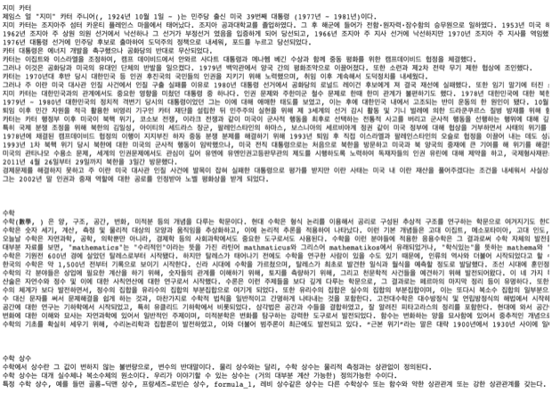

위와 같은 자연어 문자를 어떻게 Neural Network에 입력해야 할까요? 글자 그대로? 컴퓨터는 기본적으로 0과 1만을 인식할 수 있습니다. 즉 문자를 규칙성이 있는 단위로 분할한 후 숫자로 변환해서 Neural Network에 입력해야 합니다.


#### 3. Char Tokenizer

문자를 분할하는 규칙 중 하나는 글자 단위로 분할하는 것입니다. 아래 그림과 같이 글자 하나하나를 분할하는 방식입니다.

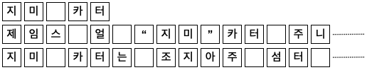

그러면 한국어위키를 글자 단위로 분할해 보겠습니다. 우선 아래 코드와 같이 한국어위키의 각 글자의 발생 빈도수를 세어봅니다.

```python
char_counter = collections.defaultdict(int)
# char 개수 확인
with zipfile.ZipFile(args.corpus) as z:
    with z.open('kowiki.txt') as f:
        for i, line in enumerate(f):
            line = line.decode('utf-8').strip()
            for c in line:
                char_counter[c] += 1
```

다음은 char_counter의 글자의 개수를 확인해 보겠습니다.

```python
# char 개수
print(len(char_counter))
```

위 코드의 실행 결과는 아래와 같습니다. 15,581개의 글자로 한국어위키의 모든내용을 표현할 수 있습니다.

```text
15581
```

이번에는 글자 중 발생 빈도수가 많은 글자 10개만 확인해 보겠습니다.

```python
# 빈도수가 많은 글자 10개 출력
most_freq = sorted(char_counter.items(), key=lambda item: item[1], reverse=True)

print(most_freq[:10])
```

위 코드의 실행 결과는 아래와 같습니다. 공백, ‘이’, ‘다’ 등의 순으로 글자가 많은 것을 확인할 수 있습니다. 공백의 개수는 55,863,103개이고 ‘이’의 개수는 5,799,143개입니다.

```text
[(' ', 55863103), ('이', 5799143), ('다', 5291578), ('.', 4395303), ('에', 4313327), ('의', 4228709), ('는', 3848984), ('로', 3112533), (',', 3110187), ('하', 2989928)]
```

다음은 글자 중 발생 빈도수가 적은 글자 10개만 확인해 보겠습니다.

```python
# 빈도수가 적은 글자 10개 출력
least_freq = sorted(char_counter.items(), key=lambda item: item[1])

print(least_freq[:10])
```

위 코드의 실행 결과는 아래와 같습니다. 한문 또는 특수문자들이 1번만 나타난 것을 확인할 수 있습니다.

```text
[('蔟', 1), ('蓓', 1), ('踢', 1), ('ǣ', 1), ('钊', 1), ('臄', 1), ('饀', 1), ('蝌', 1), ('廏', 1), ('Ꝩ', 1)]
```

다음은 글자의 개수를 확인해 보겠습니다.

```python
# token 개수
count = 0
for c, cnt in char_counter.items():
    count += cnt
print(count)
```

위 코드의 실행 결과는 아래와 같습니다. 한국어위키가 267,502,382개의 글자로 구성되어 있음을 확인할 수 있습니다.

```text
267502382
```

다음은 단어에 일련번호를 부여해서 vocabulary를 생성해 보겠습니다. 이때 문장의 길이를 맞추기 위한 '[PAD]'와 없는 글자를 처리하기 위한 '[UNK]'를 추가로 지정해 줍니다.

```python
# char에 일련번호 부여
char_to_id = {'[PAD]': 0, '[UNK]': 1}
for c, cnt in char_counter.items():
    char_to_id[c] = len(char_to_id)
print(len(char_to_id))
```

위 코드의 실행 결과는 아래와 같습니다. 15,581개의 글자에 특수 토큰 '[PAD]', '[UNK]' 2개가 추가되었습니다.

```text
15583
```

다음은 한국어위키를 글자단위 숫자로 변경해 보겠습니다. 5줄만 확인해 보겠습니다.

```python
# wiki char tokenize
with zipfile.ZipFile(args.corpus) as z:
    with z.open('kowiki.txt') as f:
        for i, line in enumerate(f):
            if i >= 5:
                break
            line = line.decode('utf-8').strip()
            print(line)
            _id = [char_to_id[c] for c in line]
            print(_id)
```

위 코드의 실행 결과는 아래와 같습니다. 각 글자들이 숫자로 변환된 것을 확인할 수 있습니다.

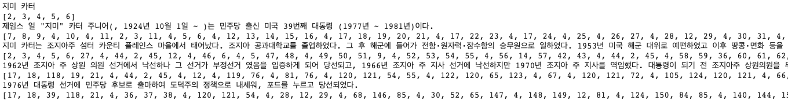

Char Tokenizer의 장점은 다음과 같습니다.
- 모든 문장을 적은 수의 vocabulary로 표현할 수 있습니다.
- Vocabulary에 글자가 없어서 ‘[UNK]’로 표현해야 하는 OOV(Out of Vocabulary) 문제가 발생할 가능성이 낮습니다.

Char Tokenizer의 단점은 다음과 같습니다.
- 글자 단위로 분할하기 때문에 token 수가 많아집니다. token 수가 많으면 연산이 많아지고 학습 속도가 늦어집니다.
- 각 글자 하나하나를 벡터로 표현할 경우 단어의 의미를 표현한다고 할 수 없습니다. 예를 들어서 4개의 글자 'b', 'o', 'o', 'k'의 벡터로 'book'을 표현할 수 없을 수 있습니다. 이런 문제를 해결하기 위해서 char 기반의 Neural Network은 통상 layer를 많이 쌓는 것이 일반적입니다.


#### 4. Word Tokenizer

문자를 분할하는 규칙 중 다른 하나는 띄어쓰기 단위로 분할하는 것입니다. 아래 그림과 같이 띄어쓰기 단위로 분할하는 방식입니다.

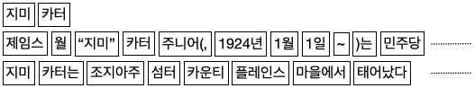

그러면 한국어위키를 띄어쓰기 단위로 분할해 보겠습니다. 우선 아래 코드와 같이 한국어위키의 띄어쓰기 단위의 단어 발생 빈도수를 세어봅니다. 단순하게 확인을 위한 목적이므로 '.', '!', '?' 등의 구두점 처리는 생략하겠습니다.

```python
word_counter = collections.defaultdict(int)
# word 개수 확인
with zipfile.ZipFile(args.corpus) as z:
    with z.open('kowiki.txt') as f:
        for i, line in enumerate(f):
            line = line.decode('utf-8').strip()
            for w in line.split():
                word_counter[w] += 1
```

다음은 word_counter 단어의 개수를 확인해 보겠습니다.

```python
# word 개수
print(len(word_counter))
```

위 코드의 실행 결과는 아래와 같습니다. 6,714,211개의 단어로 한국어위키가 구성되어 있음을 확인할 수 있습니다. Char tokenizer의 15,581개와 비교해서 약 430배 정도 개수가 많습니다.

```text
6714211
```

이번에는 단어 중 발생 빈도수가 많은 단어 10개만 확인해 보겠습니다.

```python
# 빈도수가 많은 단어 10개 출력
most_freq = sorted(word_counter.items(), key=lambda item: item[1], reverse=True)

print(most_freq[:10])
```

위 코드의 실행 결과는 아래와 같습니다. 공백, ‘있다.’, ‘이’ 등의 순으로 단어가 많은 것을 확인할 수 있습니다.

```text
[('있다.', 465195), ('이', 272738), ('수', 238266), ('있는', 195963), ('그', 193328), ('그는', 111749), ('한다.', 109327), ('~', 107753), ('되었다.', 103153), ('다른', 101086)]
```

다음은 단어 중 발생 빈도수가 적은 단어 10개만 확인해 보겠습니다.

```python
# 빈도수가 적은 단어 10개 출력
least_freq = sorted(word_counter.items(), key=lambda item: item[1])

print(least_freq[:10])
```

위 코드의 실행 결과는 아래와 같습니다.

```text
[('1981년)이다.', 1), ('전함·원자력·잠수함의', 1), ('땅콩·면화', 1), ('농부"', 1), ('(Peanut', 1), ('Farmer)로', 1), ('낙선하나', 1), ('연임했으며,', 1), ('반공국가들의', 1), ('정보기관·의회의', 1)]
```

다음은 단어의 개수를 확인해 보겠습니다.

```python
# token 개수
count = 0
for c, cnt in word_counter.items():
    count += cnt
print(count)
```

위 코드의 실행 결과는 아래와 같습니다. 한국어위키가 58,205,952개의 단어로 구성되어 있음을 확인할 수 있습니다. Char tokenizer의 267,502,382개와 비교해서 1/4 이상 적습니다.

```text
58205952
```

다음은 단어에 일련번호를 부여해서 vocabulary를 생성해 보겠습니다. 이때 문장의 길이를 맞추기 위한 '[PAD]'와 없는 단어를 처리하기 위한 '[UNK]'를 추가로 지정해 줍니다.

```python
# word에 일련번호 부여
word_to_id = {'[PAD]': 0, '[UNK]': 1}
for w, cnt in word_counter.items():
    word_to_id[w] = len(word_to_id)
print(len(word_to_id))
```

위 코드의 실행 결과는 아래와 같습니다. 6,714,211개의 단어에 특수 토큰 '[PAD]', '[UNK]' 2개가 추가되었습니다.

```text
6714213
```

다음은 한국어위키를 단어단위 숫자로 변경해 보겠습니다. 5줄만 확인해 보겠습니다.

```python
# wiki word tokenize
with zipfile.ZipFile(args.corpus) as z:
    with z.open('kowiki.txt') as f:
        for i, line in enumerate(f):
            if i >= 5:
                break
            line = line.decode('utf-8').strip()
            print(line)
            _id = [word_to_id[w] for w in line.split()]
            print(_id)
```

위 코드의 실행 결과는 아래와 같습니다. 각 단어들이 숫자로 변환된 것을 확인할 수 있습니다.

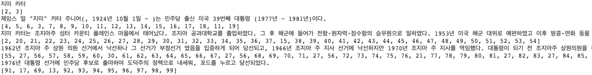

Word Tokenizer의 장점은 다음과 같습니다.
- 띄어쓰기 단위로 분할하기 때문에 token 수가 적어집니다.

Word Tokenizer의 단점은 다음과 같습니다.
- 어미변화로 인해 유사 단어들이 많아집니다. 아래 예와 같이 다양한 형태가 있을 수 있습니다. 그리고 이 단어를 표현하는 벡터들이 다른 의미를 가질 수 있습니다.
  - '책', '책을', '책에다', '책에서', '책이' 등
  - 'play', 'plays', 'playing', 'played' 등
- Vocabulary 개수가 매우 많아집니다. Vocabulary 개수가 많아지면 메모리 사용량이 늘어나고 연산량도 늘어납니다.


#### 5. Morph Tokenizer

다음은 형태소 단위로 분할하는 것입니다. 아래 그림과 같이 형태소 단위로 분할하는 방식입니다.

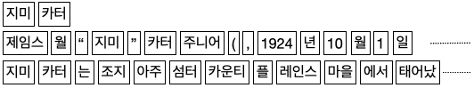

우선 형태소 분석기를 설치하겠습니다. 설치와 사용이 편리한 konlpy와 속도가 빠른 mecap을 설치하겠습니다.

```python
# 형태소분석기 설치
!set -x \
&& pip install konlpy \
&& curl -s https://raw.githubusercontent.com/konlpy/konlpy/master/scripts/mecab.sh | bash -x
```

다음을 형태소 분석기를 import 하고 선언합니다. 속도가 빠른 편인 mecab을 사용하겠습니다.

```python
import konlpy
# mecab 선언
mecab = konlpy.tag.Mecab()
```

그러면 한국어위키를 형태소 단위로 분할해 보겠습니다. 아래 코드 실행 시간은 형태소분석기로 인해 많은 시간이 걸립니다.

```python
morph_counter = collections.defaultdict(int)
# morph 개수 확인
with zipfile.ZipFile(args.corpus) as z:
    with z.open('kowiki.txt') as f:
        for i, line in enumerate(f):
            line = line.decode('utf-8').strip()
            for m in mecab.morphs(line):
                morph_counter[m] += 1
```

다음은 morph_counter 형태소 개수를 확인해 보겠습니다.

```python
# morph 개수
print(len(morph_counter))
```

위 코드의 실행 결과는 아래와 같습니다. 660,409개의 형태소로 한국어위키가 구성되어 있음을 확인할 수 있습니다. Char tokenizer의 15,581개와 비교해서 약 42배이고 word tokenizer의 6,714,211개의 1/10배입니다.

```text
660409
```

이번에는 형태소 중 발생 빈도수가 많은 형태소 10개만 확인해 보겠습니다.

```python
# 빈도수가 많은 morph 10개 출력
most_freq = sorted(morph_counter.items(), key=lambda item: item[1], reverse=True)

print(most_freq[:10])
```

위 코드의 실행 결과는 아래와 같습니다. 공백, .’, ‘의’ 등의 순으로 형태소가 많은 것을 확인할 수 있습니다.

```text
[('.', 4380736), ('의', 3641831), ('다', 3459076), ('이', 3332539), ('는', 3307338), (',', 3053205), ('에', 2755034), ('을', 2577961), ('하', 2348573), ('은', 1916337)]
```

다음은 형태소 중 발생 빈도수가 적은 형태소 10개만 확인해 보겠습니다.

```python
# 빈도수가 적은 morph 10개 출력
least_freq = sorted(morph_counter.items(), key=lambda item: item[1])

print(least_freq[:10])
```

위 코드의 실행 결과는 아래와 같습니다.

```text
[('mathmaticus', 1), ('mathematikos', 1), ('mathema', 1), ('manthanein', 1), ('춤춘다는', 1), ('isobar', 1), ('太蔟', 1), ('變徵', 1), ('三遷齋', 1), ('一小學校', 1)]
```

다음은 형태소의 개수를 확인해 보겠습니다.

```python
# token 개수
count = 0
for c, cnt in morph_counter.items():
    count += cnt
print(count)
```

위 코드의 실행 결과는 아래와 같습니다. 한국어위키가 129,449,561개의 형태소로 구성되어 있음을 확인할 수 있습니다. Char tokenizer의 267,502,382개와 비교해서 1/2 word tokenizer의 58,205,952개의 2배 이상입니다.

```text
129449561
```

다음은 형태소에 일련번호를 부여해서 vocabulary를 생성해 보겠습니다. 이때 문장의 길이를 맞추기 위한 '[PAD]'와 없는 단어를 처리하기 위한 '[UNK]'를 추가로 지정해 줍니다.

```python
# morph에 일련번호 부여
morph_to_id = {'[PAD]': 0, '[UNK]': 1}
for w, cnt in morph_counter.items():
    morph_to_id[w] = len(morph_to_id)
print(len(morph_to_id))
```

위 코드의 실행 결과는 아래와 같습니다. 660,409개의 형태소에 특수 토큰 '[PAD]', '[UNK]' 2개가 추가되었습니다.

```text
660411
```

다음은 한국어위키를 형태소단위 숫자로 변경해 보겠습니다. 5줄만 확인해 보겠습니다.

```python
# wiki word tokenize
with zipfile.ZipFile(args.corpus) as z:
    with z.open('kowiki.txt') as f:
        for i, line in enumerate(f):
            if i >= 5:
                break
            line = line.decode('utf-8').strip()
            print(line)
            _id = [word_to_id[w] for w in line.split()]
            print(_id)
```

위 코드의 실행 결과는 아래와 같습니다. 각 형태소들이 숫자로 변환된 것을 확인할 수 있습니다.

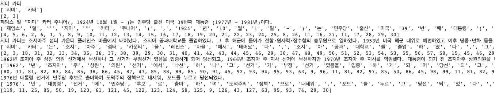

Morph Tokenizer의 장점은 다음과 같습니다.
- 형태소 단위로 분할하기 때문에 token 들이 적당한 의미를 가집니다.
- Word tokenizer와 char tokenizer의 중간쯤의 token 개수를 가집니다.

Morph Tokenizer의 단점은 다음과 같습니다.
- 형태소의 발전 속도가 언어의 발전 속도에 비해서 느립니다. 그리고 형태소 분석기들이 어느 정도의 오류를 가지고 있습니다.
- Word에 비해서는 vocabulary 개수가 많이 줄어들지만 여전히 많습니다.


#### 6. BPE (Byte Pair Encoding)

BPE(Byte Pair Encoding)은 압축 알고리즘을 이용하여 띄어쓰기 단위의 단어를 subword 단위로 분할하는 알고리즘입니다. 관련 논문은 [Neural Machine Translation of Rare Words with Subword Units](https://arxiv.org/abs/1508.07909){:target="_blank"}을 참고하면 됩니다.


기본적은 동작원리는 subword pair 중 가장 빈도수가 많은 subword pair를 하나의 subword로 합치는 방식입니다.


[Neural Machine Translation of Rare Words with Subword Units](https://arxiv.org/abs/1508.07909){:target="_blank"}논문의 예제를 가지고 동작을 확인해 보겠습니다. 우선 아래와 같은 말뭉치를 정의 합니다.

```python
# BPE corpus
corpus = """
low lower newest widest
low lower newest widest
low       newest widest
low       newest
low       newest
          newest
"""
```

다음은 BPE를 이용하여 subword 분할을 하고자 하는 말뭉치를 띄어쓰기 단위로 발생 빈도수를 계산합니다. 위 ‘4. Word Tokenizer’에서 ‘word_counter’를 계산하는 방식과 동일합니다.

```python
word_counter = collections.defaultdict(int)
# word 개수 확인
with zipfile.ZipFile(args.corpus) as z:
    for w in corpus.strip().split():
        word_counter[w] += 1

print(word_counter)
```

위 코드의 실행 결과는 아래와 같습니다. 각 단어의 발생 빈도수를 확인할 수 있습니다.

```text
{'low': 5, 'lower': 2, 'newest': 6, 'widest': 3})
```

각 단어를 글자 단위로 분할합니다. 이때 띄어쓰기 표시를 위해 글자의 처음 또는 마지막에 특수문자를 추가해 줍니다. 논문에는 마지막에 ‘</w>’ 특수문자를 추가했지만 지금은 처음에 특수문자 unicode “\u2581” (▁)을 추가하겠습니다.

```python
bpe_counter = collections.defaultdict(int)

# subword 개수 확인
for w, n in word_counter.items():
    w = f"\u2581{w}"
    bpe_counter[" ".join(w)] = n

print(bpe_counter)
```

위 코드의 실행 결과는 아래와 같습니다. 단어가 글자 단위로 분할된 것을 확인할 수 있습니다.

```text
defaultdict(<class 'int'>, {'▁ l o w': 5, '▁ l o w e r': 2, '▁ n e w e s t': 6, '▁ w i d e s t': 3})
```

counter를 이용해 vocabulary를 만드는 함수를 정의합니다.

```python
def update_vocab(vocab, counter):
    """
    vocab 변경
    :param vocab: vocabulary
    :param counter: BPE counter
    """
    for w in counter:
        for s in w.split():
            if s not in vocab:
                vocab[s] = len(vocab)
    return vocab
```

글자 기반의 Vocabulary를 만듭니다.

```python
# bpe 일련번호 부여
bpe_to_id = {'[PAD]': 0, '[UNK]': 1}
bpe_to_id = update_vocab(bpe_to_id, bpe_counter)

print(bpe_to_id)
```

위 코드의 실행 결과는 아래와 같습니다. 글자단위의 vocabulary가 만들어진것을 확인할 수 있습니다.

```text
{'[PAD]': 0, '[UNK]': 1, '▁': 2, 'l': 3, 'o': 4, 'w': 5, 'e': 6, 'r': 7, 'n': 8, 's': 9, 't': 10, 'i': 11, 'd': 12}
```

다음은 bi-gram의 빈도수를 계산하는 함수를 정의합니다. 아래 함수는 'pairs' 변수에 'symbols[i]'와 'symbols[i+1]' pair의 빈도수를 계산해서 저장하고 'pairs' 변수를 반환합니다.

```python
def get_stats(counter):
    """
    bi-gram 빈도수 계산
    :param counter: BPE counter
    """
    pairs = collections.defaultdict(int)
    for word, freq in counter.items():
        symbols = word.split()
        for i in range(len(symbols)-1):
            pairs[symbols[i],symbols[i+1]] += freq
    return pairs
```

다음은 빈도수가 가장 많은 pair를 합치는 함수를 정의합니다. 아래 함수는 'v_in'의 word를 정규식(re)를 이용해 pair를 합친 결과를 'v_out' 변수에 저장하고 'v_out' 변수를 반환합니다.

```python
def merge_vocab(pair, v_in):
    """
    bi-gram merge
    :param counter: BPE counter
    """
    v_out = {}
    bigram = re.escape(' '.join(pair))
    p = re.compile(r'(?<!\S)' + bigram + r'(?!\S)')
    for word in v_in:
        w_out = p.sub(''.join(pair), word)
        v_out[w_out] = v_in[word]
    return v_out
```

다음은 'get_stats' 함수를 이용해 bi-gram의 빈도수를 계산합니다.

```python
# bigram pair
pairs = get_stats(bpe_counter)

print(pairs)
```

위 코드의 실행 결과는 아래와 같습니다. bi-gram pair의 빈도수를 계산한 것을 알 수 있습니다.

```text
defaultdict(<class 'int'>, {('▁', 'l'): 7, ('l', 'o'): 7, ('o', 'w'): 7, ('w', 'e'): 8, ('e', 'r'): 2, ('▁', 'n'): 6, ('n', 'e'): 6, ('e', 'w'): 6, ('e', 's'): 9, ('s', 't'): 9, ('▁', 'w'): 3, ('w', 'i'): 3, ('i', 'd'): 3, ('d', 'e'): 3})
```

위에서 구한 bi-gram pair의 빈도수 중 가장 횟수가 많은 pair를 선택합니다.

```python
# find most freq bigram pair
best = max(pairs, key=pairs.get)

print(best)
```

위 코드의 실행 결과는 아래와 같습니다. ('e', 's')가 9번으로 빈도수가 가장 많아서 선택되었습니다. ('s', 't') 역시 9번으로 같지만 순서가 빠른 ('e', 's')가 선택되었습니다.

```text
('e', 's')
```

이제 'merge_vocab' 함수를 이용해 빈도수가 가장 많은 ('e', 's')를 합칩니다. 그리고 합친 결과를 'bpe_counter' 변수에 저장합니다.

```python
# merge most freq bigram pair
bpe_counter = merge_vocab(best, bpe_counter)

print(bpe_counter)
```

위 코드의 실행 결과는 아래와 같습니다. '▁ n e w e s t'와 '▁ w i d e s t'가 ('e', 's')가 합쳐져서 '▁ n e w **es** t', '▁ w i d **es** t'로 변경된 것을 확인할 수 있습니다.

```text
{'▁ l o w': 5, '▁ l o w e r': 2, '▁ n e w es t': 6, '▁ w i d es t': 3}
```

새로 만들어진 'bpe_counter'를 이용해 vocabulary를 갱신합니다.

```python
# update vocab
bpe_to_id = update_vocab(bpe_to_id, bpe_counter)

print(bpe_to_id)
```

위 코드의 실행 결과는 아래와 같습니다. Vocabulary에 'es'가 13번으로 추가된 것을 확인할 수 있습니다.

```text
{'[PAD]': 0, '[UNK]': 1, '▁': 2, 'l': 3, 'o': 4, 'w': 5, 'e': 6, 'r': 7, 'n': 8, 's': 9, 't': 10, 'i': 11, 'd': 12, 'es': 13}
```

이 과정을 다시한번 반복합니다.

```python
# bigram pair
pairs = get_stats(bpe_counter)
print(pairs)
# find most freq bigram pair
best = max(pairs, key=pairs.get)
print(best)
# merge most freq bigram pair
bpe_counter = merge_vocab(best, bpe_counter)
print(bpe_counter)
# update vocab
bpe_to_id = update_vocab(bpe_to_id, bpe_counter)
print(bpe_to_id)
```

위 코드의 실행 결과는 아래와 같습니다. ('es', 't')가 빈도수가 가장 많았고 vocabulary에 'est'가 14번으로 추가된 것을 확인할 수 있습니다.

```text
defaultdict(<class 'int'>, {('▁', 'l'): 7, ('l', 'o'): 7, ('o', 'w'): 7, ('w', 'e'): 2, ('e', 'r'): 2, ('▁', 'n'): 6, ('n', 'e'): 6, ('e', 'w'): 6, ('w', 'es'): 6, ('es', 't'): 9, ('▁', 'w'): 3, ('w', 'i'): 3, ('i', 'd'): 3, ('d', 'es'): 3})
('es', 't')
{'▁ l o w': 5, '▁ l o w e r': 2, '▁ n e w est': 6, '▁ w i d est': 3}
{'[PAD]': 0, '[UNK]': 1, '▁': 2, 'l': 3, 'o': 4, 'w': 5, 'e': 6, 'r': 7, 'n': 8, 's': 9, 't': 10, 'i': 11, 'd': 12, 'es': 13, 'est': 14}
```

위 코드를 다시 한번 실행하면 결과는 아래와 같습니다. ('▁', 'l')가 빈도수가 가장 많았고 vocabulary에 '▁l'가 15번으로 추가된 것을 확인할 수 있습니다.

```text
defaultdict(<class 'int'>, {('▁', 'l'): 7, ('l', 'o'): 7, ('o', 'w'): 7, ('w', 'e'): 2, ('e', 'r'): 2, ('▁', 'n'): 6, ('n', 'e'): 6, ('e', 'w'): 6, ('w', 'est'): 6, ('▁', 'w'): 3, ('w', 'i'): 3, ('i', 'd'): 3, ('d', 'est'): 3})
('▁', 'l')
{'▁l o w': 5, '▁l o w e r': 2, '▁ n e w est': 6, '▁ w i d est': 3}
{'[PAD]': 0, '[UNK]': 1, '▁': 2, 'l': 3, 'o': 4, 'w': 5, 'e': 6, 'r': 7, 'n': 8, 's': 9, 't': 10, 'i': 11, 'd': 12, 'es': 13, 'est': 14, '▁l': 15}
```

위 코드를 다시 한번 실행하면 결과는 아래와 같습니다. ('▁l', 'o')가 빈도수가 가장 많았고 vocabulary에 '▁lo'가 16번으로 추가된 것을 확인할 수 있습니다.

```text
defaultdict(<class 'int'>, {('▁l', 'o'): 7, ('o', 'w'): 7, ('w', 'e'): 2, ('e', 'r'): 2, ('▁', 'n'): 6, ('n', 'e'): 6, ('e', 'w'): 6, ('w', 'est'): 6, ('▁', 'w'): 3, ('w', 'i'): 3, ('i', 'd'): 3, ('d', 'est'): 3})
('▁l', 'o')
{'▁lo w': 5, '▁lo w e r': 2, '▁ n e w est': 6, '▁ w i d est': 3}
{'[PAD]': 0, '[UNK]': 1, '▁': 2, 'l': 3, 'o': 4, 'w': 5, 'e': 6, 'r': 7, 'n': 8, 's': 9, 't': 10, 'i': 11, 'd': 12, 'es': 13, 'est': 14, '▁l': 15, '▁lo': 16}
```

위 코드를 다시 한번 실행하면 결과는 아래와 같습니다. ('▁lo', 'w')가 빈도수가 가장 많았고 vocabulary에 '▁low'가 17번으로 추가된 것을 확인할 수 있습니다.

```text
defaultdict(<class 'int'>, {('▁lo', 'w'): 7, ('w', 'e'): 2, ('e', 'r'): 2, ('▁', 'n'): 6, ('n', 'e'): 6, ('e', 'w'): 6, ('w', 'est'): 6, ('▁', 'w'): 3, ('w', 'i'): 3, ('i', 'd'): 3, ('d', 'est'): 3})
('▁lo', 'w')
{'▁low': 5, '▁low e r': 2, '▁ n e w est': 6, '▁ w i d est': 3}
{'[PAD]': 0, '[UNK]': 1, '▁': 2, 'l': 3, 'o': 4, 'w': 5, 'e': 6, 'r': 7, 'n': 8, 's': 9, 't': 10, 'i': 11, 'd': 12, 'es': 13, 'est': 14, '▁l': 15, '▁lo': 16, '▁low': 17}
```

위 코드를 다시 한번 실행하면 결과는 아래와 같습니다. ('▁', 'n')가 빈도수가 가장 많았고 vocabulary에 '▁n'가 18번으로 추가된 것을 확인할 수 있습니다.

```text
defaultdict(<class 'int'>, {('▁low', 'e'): 2, ('e', 'r'): 2, ('▁', 'n'): 6, ('n', 'e'): 6, ('e', 'w'): 6, ('w', 'est'): 6, ('▁', 'w'): 3, ('w', 'i'): 3, ('i', 'd'): 3, ('d', 'est'): 3})
('▁', 'n')
{'▁low': 5, '▁low e r': 2, '▁n e w est': 6, '▁ w i d est': 3}
{'[PAD]': 0, '[UNK]': 1, '▁': 2, 'l': 3, 'o': 4, 'w': 5, 'e': 6, 'r': 7, 'n': 8, 's': 9, 't': 10, 'i': 11, 'd': 12, 'es': 13, 'est': 14, '▁l': 15, '▁lo': 16, '▁low': 17, '▁n': 18}
```

위 과정을 vocabulary 수가 원하는 개수가 될 때까지 반복하면 됩니다.


BPE Tokenizer의 장점은 다음과 같습니다.
- 말뭉치가 있다면 비교적 간단하게 만들 수 있습니다.
- Subword를 이용하면 적은 수의 vocabulary를 가지고 OOV(Out of Vocabulary)를 최소화할 수 있습니다.

BPE Tokenizer의 단점은 다음과 같습니다.
- Subword의 분할이 의미 기준이 아닐 수 있습니다. 다음과 같은 예를 들 수 있습니다.
  - ‘수원에’라는 문장을 분할할 때 [‘▁수원’, ‘에’]가 아닌 [‘▁수’, ‘원에’]로 분할되기도 합니다.
  - ‘대한민국을’, ‘대한민국은’, ‘대한민국으로’ 등의 빈도수가 단어들은 [‘대한민국’, ‘을’, ‘은’, ‘으로’] 형태로 분류되길 원하지만 [‘대한민국을’, ‘대한민국은’, ‘대한민국으로’] 그대로 분류되기도 합니다.


BEP와 같은 subword 방식이 최근에는 가장 많이 사용되는 방식입니다.


#### 7. Sentencepiece

Sentencepiece는 google에서 제공하는 Tokenizer tool입니다. 자세한 내용을 다음을 참고하시면 됩니다.
- [github-sentencepiece](https://github.com/google/sentencepiece){:target="_blank"}
- [SentencePiece: A simple and language independent subword tokenizer and detokenizer for Neural Text Processing](https://arxiv.org/abs/1808.06226){:target="_blank"}


Tokeinze 방식으로는 char, word, BPE, unigram 등 다양한 방식을 제공합니다. BPE는 발생 빈도수를 이용해서 분할 하였다면 unigram([Subword Regularization: Improving Neural Network Translation Models with Multiple Subword Candidates](https://arxiv.org/abs/1804.10959){:target="_blank"})은 확률기반으로 subword의 발생확률을 최대화하는 방식으로 분할합니다.


Sentencepiece의 기본 tokenize 방식은 unigram 입니다.


Sentencepiece의 자세한 활용법은 [sentencepiece_python_module_example.ipynb](https://github.com/google/sentencepiece/blob/master/python/sentencepiece_python_module_example.ipynb){:target="_blank"}을 참고하면 됩니다.


이제 sentencepiece를 이용해 한국어위키 말뭉치로 vocabulary를 만들어 보겠습니다. 우선 sentencepiece를 설치합니다.

```python
# Sentencepiece 설치
!pip install sentencepiece
```

다음은 sentencepiece를 import 합니다.

```python
# import sentencepiece
import sentencepiece as spm
```

다음은 sentencepiece vocabulary를 학습할 함수를 정의합니다.

```python
def train_sentencepiece(corpus, prefix, vocab_size=32000):
    """
    sentencepiece를 이용해 vocab 학습
    :param corpus: 학습할 말뭉치
    :param prefix: 저장할 vocab 이름
    :param vocab_size: vocab 개수
    """
    spm.SentencePieceTrainer.train(
        f"--input={corpus} --model_prefix={prefix} --vocab_size={vocab_size + 7}" +  # 7은 특수문자 개수
        " --model_type=unigram" +
        " --max_sentence_length=999999" +  # 문장 최대 길이
        " --pad_id=0 --pad_piece=[PAD]" +  # pad token 및 id 지정
        " --unk_id=1 --unk_piece=[UNK]" +  # unknown token 및 id 지정
        " --bos_id=2 --bos_piece=[BOS]" +  # begin of sequence token 및 id 지정
        " --eos_id=3 --eos_piece=[EOS]" +  # end of sequence token 및 id 지정
        " --user_defined_symbols=[SEP],[CLS],[MASK]" +  # 기타 추가 토큰 SEP: 4, CLS: 5, MASK: 6
        " --input_sentence_size=100000" +  # 말뭉치에서 셈플링해서 학습
        " --shuffle_input_sentence=true")  # 셈플링한 말뭉치 shuffle
```

위 함수의 설명은 다음과 같습니다.
- 함수의 입력으로는 corpus(말뭉치), prefix(생성할 파일 이름), vocab_size(vocabulary 개수) 등을 받습니다.
- -–input: 망뭉치 파일 경로를 입력합니다.
- -–model_prefix: 생성할 파일 이름을 입력합니다. model_prefix.model, model_prefix.vocab 두 개의 파일이 생성됩니다.
- --vocab_size: 생성할 vocabulary의 개수를 입력합니다. 특수문자 개수 7을 추가해서 지정했습니다.
- --model_type: Vocabulary를 학습할 방법을 입력합니다. 기본값인 'unigram'을 입력합니다.
- --max_sentence_length: 한 문장의 최대길이를 의미합니다.
- --pad_id: 짧은 문장의 길이를 맞춰줄 pad token의 일련번호 의미합니다.
- --pad_piece: pad token의 문자열을 의미합니다.
- --unk_id: Vocabulary에 없는 token을 처리할 unk token의 일련번호 의미합니다.
- --unk_piece: unk token의 문자열을 의미합니다.
- --bos_id: 문장의 시작을 의미하는 bos token의 일련번호 의미합니다.
- --bos_piece: bos token의 문자열을 의미합니다.
- --eos_id: 짧은 문장의 길이를 맞춰줄 pad token의 일련번호 의미합니다.
- --eos_piece: pad token의 문자열을 의미합니다.
- --user_defined_symbols: 추가적으로 필요한 token을 정의합니다. 일련번호는 특수 토큰 이후부터 순서대로 부여됩니다.
- --input_sentence_size: 한국어위키의 말뭉치의 경우는 데이터가 커서 vocabulary를 학습하는데 시간이 많이 걸립니다. 시간 단축을 위해 sampling을 해서 학습하도록 sampling 개수를 정의합니다. 전체 말뭉치를 학습하기를 원하면 'input_sentence_size', 'shuffle_input_sentence'를 제거하면 됩니다.
- --shuffle_input_sentence: 말뭉치의 순서를 섞을지 여부를 결정합니다.

이제 한국어위키 말뭉치의 압축을 풉니다. 이유는 sentencepiece가 압축파일은 학습할 수 없기 때문입니다. 아래 코드의 'unizp' 뒤 부분의 파일 경로는 적당하게 수정하면 됩니다.

```python
# 현재 작업폴더에 압축풀기
!unzip /content/drive/MyDrive/Data/nlp_corpus/kowiki.txt.zip

print(os.listdir("./"))
```

위 코드를 다시 한번 실행하면 결과는 아래와 같습니다. 압축이 풀리고 현재 폴더 아래 'kowiki.txt'파일이 생성된 것을 확인할 수 있습니다.

```text
Archive:  /content/drive/MyDrive/Data/nlp_corpus/kowiki.txt.zip
  inflating: kowiki.txt              
  inflating: __MACOSX/._kowiki.txt   
['.config', '.ipynb_checkpoints', 'drive', 'kowiki.txt', '__MACOSX', 'sample_data']
```

이제 'train_sentencepiece' 함수를 이용해 vocabulary를 학습합니다.

```python
# vocab 학습
train_sentencepiece("kowiki.txt", "kowiki_32000")
```

2~3분 정도 기다리면 학습이 완료됩니다. 학습된 파일을 확인해 봅니다.

```python
# 생성결과 확인
print(os.listdir("./"))
```

위 코드를 다시 한번 실행하면 결과는 아래와 같습니다. 'kowiki_32000.model', 'kowiki_32000.vocab' 파일이 생성된 것을 확인할 수 있습니다.

```text
['.config', '.ipynb_checkpoints', 'drive', 'kowiki.txt', 'kowiki_32000.model', 'kowiki_32000.vocab', '__MACOSX', 'sample_data']
```

이제 생성된 파일을 다음에 사용할 수 있도록 적당한 위치에 백업해 놓습니다.

```python
# 생성파일 백업
corpus_dir = os.path.dirname(args.corpus)
shutil.copy("kowiki_32000.model", corpus_dir)
shutil.copy("kowiki_32000.vocab", corpus_dir)

print(os.listdir(corpus_dir))
```

위 코드를 다시 한번 실행하면 결과는 아래와 같습니다. 'kowiki_32000.model', 'kowiki_32000.vocab' 파일이 백업된 것을 확인할 수 있습니다.

```text
['kowiki.txt.zip', 'kowiki_32000.model', 'kowiki_32000.vocab']
```

다음은 생성된 vocabulary를 확인해보기 위해서 vocabulary를 load 합니다.

```python
# load vocab
spm_vocab = spm.SentencePieceProcessor()
spm_vocab.load(os.path.join(corpus_dir, "kowiki_32000.model"))
```

다음은 한국어위키를 sentencepiece를 이용해 token과 숫자로 변경해 보겠습니다. 5줄만 확인해 보겠습니다.

```python
# wiki spm tokenize
with zipfile.ZipFile(args.corpus) as z:
    with z.open('kowiki.txt') as f:
        for i, line in enumerate(f):
            if i >= 5:
                break
            line = line.decode('utf-8').strip()
            print(line)
            tokens = spm_vocab.encode_as_pieces(line)
            print(tokens)
            _ids = spm_vocab.encode_as_ids(line)
            print(_ids)
```

위 코드의 실행 결과는 아래와 같습니다. 'encode_as_pieces' 함수를 이용해 subword token으로 'encode_as_ids' 함수를 이용해 subword 숫자로 변환된 것을 확인할 수 있습니다.

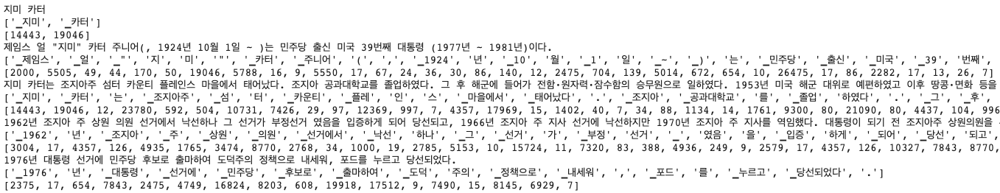


다음은 자주사용되는 sentencepiece 함수에 대해서 알아보겠습니다.

###### 문자열을 token으로 분할하는 함수 (encode_as_pieces)

```python
# 문자열을 token으로 변경
tokens = spm_vocab.encode_as_pieces("아름다운 대한민국 우리나라 금수강산")

print(tokens)
```

위 코드를 다시 한번 실행하면 결과는 아래와 같습니다. 문자열이 적당하게 token으로 분할된 것을 확인할 수 있습니다.

```text
['▁아름다운', '▁대한민국', '▁우리나라', '▁금', '수', '강', '산']
```

###### token을 문자열로 복원하는 함수 (decode_pieces)

```python
# token을 문자열로 복원
print(spm_vocab.decode_pieces(tokens))
```

위 코드를 다시 한번 실행하면 결과는 아래와 같습니다. 처음 문자열이 복원된 것을 확인할 수 있습니다.

```text
아름다운 대한민국 우리나라 금수강산
```

###### 문자열을 숫자로 분할하는 함수 (encode_as_ids)

```python
# 문자열을 숫자로 분할
ids = spm_vocab.encode_as_ids("아름다운 대한민국 우리나라 금수강산")

print(ids)
```

위 코드를 다시 한번 실행하면 결과는 아래와 같습니다. 문자열이 적당하게 숫자로 분할된 것을 확인할 수 있습니다.

```text
[4869, 243, 6308, 653, 104, 301, 162]
```

###### 숫자를 문자열로 복원하는 함수 (decode_ids)

```python
# 숫자를 문자열로 복원
print(spm_vocab.decode_ids(ids))
```

위 코드를 다시 한번 실행하면 결과는 아래와 같습니다. 처음 문자열이 복원된 것을 확인할 수 있습니다.

```text
아름다운 대한민국 우리나라 금수강산
```

###### token을 숫자로 변환하는 함수 (piece_to_id)

```python
# token을 숫자로 변경
print(spm_vocab.piece_to_id(tokens))
```

위 코드를 다시 한번 실행하면 결과는 아래와 같습니다. token들이 숫자로 변경된 것을 확인할 수 있습니다.

```text
[4869, 243, 6308, 653, 104, 301, 162]
```

###### 숫자를 token으로 변환하는 함수 (decode_ids)

```python
# 숫자를 token으로 변경
print(spm_vocab.id_to_piece(ids))
```

위 코드를 다시 한번 실행하면 결과는 아래와 같습니다. 숫자들이 token으로 변경된 것울 확인할 수 있습니다.

```text
['▁아름다운', '▁대한민국', '▁우리나라', '▁금', '수', '강', '산']
```

#### 8. SentencePeice with Morph

sentencepiece와 형태소 분석기를 함께 사용하는 방법에 대해서 알아보겠습니다. 함께 사용하는 과정은 아래와 같습니다.

1. 형태소 분석기를 이용해 문장을 형태소 단위로 분할한 문장으로 변환합니다.
2. 형태소 단위로 분할된 문장을 sentencepiece를 이용해 분할합니다.


우선 형태소 단위로 분할된 말뭉치를 생성합니다. 형태소분석기는 위에서 사용한 mecab을 사용하겠습니다. 아래 코드는 실행 시간이 오래 걸립니다.

```python
# morph 단위로 분할된 말뭉치 생성
with open("kowiki-mecab.txt", "w") as o_f:
    with zipfile.ZipFile(args.corpus) as z:
        with z.open('kowiki.txt') as f:
            for i, line in enumerate(f):
                line = line.decode('utf-8').strip()
                tokens = mecab.morphs(line)
                string = " ".join(tokens)
                o_f.write(string)
                o_f.write("\n")
```

파일이 잘 생성되었는지 확인해 보겠습니다.

```python
# 파일 확인
print(os.listdir("./"))
```

위 코드를 다시 한번 실행하면 결과는 아래와 같습니다. 'kowiki-mecab.txt' 파일이 생성된 것을 확인할 수 있습니다.

```text
['.config', 'kowiki-mecab.txt', '.ipynb_checkpoints', 'drive', 'kowiki.txt', 'kowiki_32000.model', 'kowiki_32000.vocab', '__MACOSX', 'sample_data']
```

이제 'train_sentencepiece' 함수를 이용해 morph vocabulary를 학습합니다.

```python
# morph vocab 학습
train_sentencepiece("kowiki-mecab.txt", "kowiki_mecab_32000")
```

2~3분 정도 기다리면 학습이 완료됩니다. 학습된 파일을 확인해 봅니다.

```python
# 생성결과 확인
print(os.listdir("./"))
```

위 코드를 다시 한번 실행하면 결과는 아래와 같습니다. 'kowiki_mecab_32000.vocab', 'kowiki_mecab_32000.model' 파일이 생성된 것을 확인할 수 있습니다.

```text
['.config', 'kowiki_mecab_32000.vocab', 'kowiki_mecab_32000.model', 'kowiki-mecab.txt', '.ipynb_checkpoints', 'drive', 'kowiki.txt', 'kowiki_32000.model', 'kowiki_32000.vocab', '__MACOSX', 'sample_data']
```

이제 생성된 파일을 다음에 사용할 수 있도록 적당한 위치에 백업해 놓습니다.

```python
# 생성파일 백업
corpus_dir = os.path.dirname(args.corpus)
shutil.copy("kowiki_mecab_32000.model", corpus_dir)
shutil.copy("kowiki_mecab_32000.vocab", corpus_dir)

print(os.listdir(corpus_dir))
```

위 코드를 다시 한번 실행하면 결과는 아래와 같습니다. kowiki_mecab_32000.model', 'kowiki_mecab_32000.vocab' 파일이 백업된 것을 확인할 수 있습니다.

```text
['kowiki.txt.zip', 'kowiki_32000.model', 'kowiki_32000.vocab', 'kowiki_mecab_32000.model', 'kowiki_mecab_32000.vocab']
```

다음은 생성된 vocabulary를 확인해보기 위해서 vocabulary를 load 합니다.

```python
# load morph vocab
spm_morph_vocab = spm.SentencePieceProcessor()
spm_morph_vocab.load(os.path.join(corpus_dir, "kowiki_mecab_32000.model"))
```

다음은 한국어위키를 sentencepiece를 이용해 token과 숫자로 변경해 보겠습니다. 5줄만 확인해 보겠습니다. 이때 형태소 분석을 먼저 한 후 sentencepiece를 이용해 tokenize 합니다.

```python
# wiki spm morph tokenize
with zipfile.ZipFile(args.corpus) as z:
    with z.open('kowiki.txt') as f:
        for i, line in enumerate(f):
            if i >= 5:
                break
            line = line.decode('utf-8').strip()
            print(line)
            string = " ".join(mecab.morphs(line))
            print(string)
            tokens = spm_morph_vocab.encode_as_pieces(string)
            print(tokens)
            _ids = spm_morph_vocab.encode_as_ids(string)
            print(_ids)
```

위 코드의 실행 결과는 아래와 같습니다. 형태소 단위로 분할 후 sentencepiece로 분할 된 것을 확인할 수 있습니다.

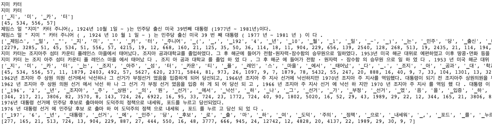


자연어처리에서 가장 기본이 되는 tokenizer와 vocabulary에 대해서 알아봤습니다. 이후 과정에서는 형태소분석기를 사용하지 않고 sentencepiece만 사용해서 학습한 'kowiki_32000.model'을 기본으로 사용하겠습니다.
