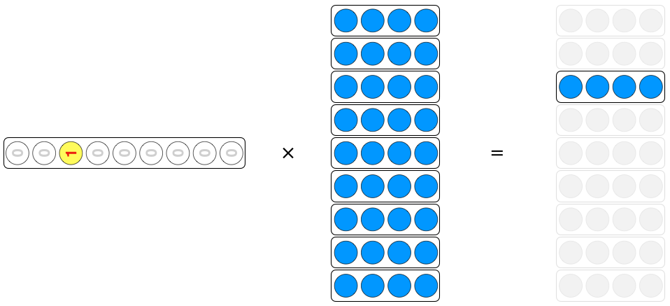

이 포스트는 Discrete한 Value를 벡터형태로 표현하는 방법인 one-hot encoding과 분류문제에서 loss로 사용되는 crossentropy에 대해서 이해하는데 목적이 있습니다.

###### 미리 확인해야할 포스트

- [간단한 단어분류 프로젝트를 통한 자연어처리 이해](../nlp-tutorial-01-01-sequence-prediction/)
- [간단한 문장분류 프로젝트를 통한 자연어처리 이해](../nlp-tutorial-01-02-sentence-prediction/)
- [자연어처리를 위한 행렬연산](../nlp-tutorial-02-01-matrix-equations/)
- [자연어처리를 위한 Tokenizer & Vocabulary](../nlp-tutorial-02-02-tokenizer/)


개발 환경은 [google colab](https://colab.research.google.com/){:target="_blank"}을 사용하며 개발 언어는 [pytorch](https://pytorch.org/){:target="_blank"}를 사용합니다. 이 포스트를 작성할 시점의 pytorch 버전은 1.7.1 입니다.


**소스코드**

- Colab에서 동작하는 소스코드는 [02-03-one-hot-encoding.ipynb](https://github.com/paul-hyun/torch-nlp-tutorial/blob/main/02-inputs-outputs/02-03-one-hot-encoding.ipynb){:target="_blank"}을 참고하시면 됩니다.


#### 1. One-Hot Encoding 이란

One-Hot Encoding은 Discrete Value를 벡터로 표현하는 방식입니다. 유한한 개수의 Discrete Value에 0부터 임의의 순서대로 일련번호를 부여한 후 벡터에 일련번호에 해당하는 부분만 1이고 나머지는 모두 0인 벡터입니다. Discrete Value의 예는 다음과 같습니다.

- Vocabulary의 일련번호
- 정답 class [긍정, 부정], [명사, 동사, 목적어, ...]
- 기타

우선 아래와 같은 말뭉치를 가정해 보겠습니다.

```text
나는 학생 입니다
나는 좋은 선생님 입니다
당신은 매우 좋은 선생님 입니다
```

이 말뭉치에서 띄어쓰기 단위로 분할한 vocabulary를 생성하면 아래와 갔습니다.

```text
{0: '[PAD]', 1: '[UNK]', 2: '나는', 3: '학생', 4: '입니다', 5: '좋은', 6: '선생님', 7: '당신은', 8: '매우'}
```

말뭉치를 vocabulary의 일련번호로 변경하면 아래와 같습니다.

```text
[[2, 3, 4],
 [2, 5, 6, 4],
 [7, 8, 5, 6, 4]]
```

이것을 one-hot encoding으로 변경하기 위해서 우선 벡터의 크기를 결정해야 합니다. Vocabulary가 0 ~ 8까지 9개이므로 가능한 모든 경우를 표현하기 위한 벡터의 크기는 9입니다. 다음과 같이 표현할 수 있습니다.

```text
0: [1, 0, 0, 0, 0, 0, 0, 0, 0]
1: [0, 1, 0, 0, 0, 0, 0, 0, 0]
2: [0, 0, 1, 0, 0, 0, 0, 0, 0]
3: [0, 0, 0, 1, 0, 0, 0, 0, 0]
4: [0, 0, 0, 0, 1, 0, 0, 0, 0]
5: [0, 0, 0, 0, 0, 1, 0, 0, 0]
6: [0, 0, 0, 0, 0, 0, 1, 0, 0]
7: [0, 0, 0, 0, 0, 0, 0, 1, 0]
8: [0, 0, 0, 0, 0, 0, 0, 0, 1]
```

말뭉치를 one-hot으로 표현하면 아래와 같습니다.

```text
[[[0, 0, 1, 0, 0, 0, 0, 0, 0],  # 2
  [0, 0, 0, 1, 0, 0, 0, 0, 0],  # 3
  [0, 0, 0, 0, 1, 0, 0, 0, 0]],  # 4
 [[0, 0, 1, 0, 0, 0, 0, 0, 0],  # 2
  [0, 0, 0, 0, 0, 1, 0, 0, 0],  # 5
  [0, 0, 0, 0, 0, 0, 1, 0, 0],  # 6
  [0, 0, 0, 0, 1, 0, 0, 0, 0]],  # 4
 [...]]
```

그런데 만일 vocabulary의 개수가 아주 크면 어떻게 될까요? 만일 32,007개의 단어를 표현하기 위해서는 one-hot encoding이 아래와 같을 것입니다.

```text
0: [1, 0, 0, 0, 0, 0, 0, 0, 0, 0, 0, 0, 0, 0, 0, 0, 0, 0, 0, 0, ..., 0]
1: [0, 1, 0, 0, 0, 0, 0, 0, 0, 0, 0, 0, 0, 0, 0, 0, 0, 0, 0, 0, ..., 0]
2: [0, 0, 1, 0, 0, 0, 0, 0, 0, 0, 0, 0, 0, 0, 0, 0, 0, 0, 0, 0, ..., 0]
3: [0, 0, 0, 1, 0, 0, 0, 0, 0, 0, 0, 0, 0, 0, 0, 0, 0, 0, 0, 0, ..., 0]
4: [0, 0, 0, 0, 1, 0, 0, 0, 0, 0, 0, 0, 0, 0, 0, 0, 0, 0, 0, 0, ..., 0]
5: [0, 0, 0, 0, 0, 1, 0, 0, 0, 0, 0, 0, 0, 0, 0, 0, 0, 0, 0, 0, ..., 0]
6: [0, 0, 0, 0, 0, 0, 1, 0, 0, 0, 0, 0, 0, 0, 0, 0, 0, 0, 0, 0, ..., 0]
...
32,006: [0, 0, 0, 0, 0, 0, 0, 0, 0, 0, 0, 0, 0, 0, 0, 0, 0, 0, 0, 0, ..., 1]
```

위와 같이 하나의 벡터의 길이는 32,007이고 그중 한 개만 1이고 나머지는 모두 0 인 매우 **sparse** 한 벡터로 **비효율** 적입니다.


이제 [간단한 문장분류 프로젝트를 통한 자연어처리 이해](../nlp-tutorial-01-02-sentence-prediction/) 프로젝트를 기반으로 실습을 통해 one-hot encoding을 확인해 보겠습니다.

#### 2. 환경

우선 필요한 library를 import 합니다.

```python
import argparse
import random

import numpy as np
import torch
```

다음은 필요한 환경을 설정합니다.

```python
# 환경 설정
args = {
    # random seed value
    "seed": 1234,
    # CPU 또는 GPU 사용여부 결정
    "device": torch.device("cuda" if torch.cuda.is_available() else "cpu")
}
args = argparse.Namespace(**args)

print(args)
```

위 코드의 실행 결과는 아래와 같습니다.

```text
Namespace(device=device(type='cpu'), seed=1234)
```

다음은 random seed를 설정해줍니다.

```python
# random seed 설정
random.seed(args.seed)
np.random.seed(args.seed)
torch.manual_seed(args.seed)
torch.cuda.manual_seed_all(args.seed)
```


#### 3. Data & Vocabulary

다음은 데이터를 정의합니다.

```python
# 입력 문장
raw_inputs = [
    "나는 학생 입니다",
    "나는 좋은 선생님 입니다",
    "당신은 매우 좋은 선생님 입니다"
]

# 정답: 학생(1), 기타(0)
raw_labels = [1, 0, 0]
```

위 입력 데이터를 이용해 띄어쓰기 단위로 Vocabulary를 정의합니다.

```python
# 문장을 띄어쓰기단위로 분할
words = []
for s in raw_inputs:
    words.extend(s.split())

# 중복단어 제거
words = list(dict.fromkeys(words))

# 각 단어별 일련번호
word_to_id = {"[PAD]": 0, "[UNK]": 1}
for w in words:
    word_to_id[w] = len(word_to_id)

# 각 번호별 단어
id_to_word = {i: w for w, i in word_to_id.items()}

print(id_to_word)
```

위 코드의 실행 결과는 아래와 같습니다. Vocabulary가 생성된 것을 확인할 수 있습니다.

```text
{0: '[PAD]', 1: '[UNK]', 2: '나는', 3: '학생', 4: '입니다', 5: '좋은', 6: '선생님', 7: '당신은', 8: '매우'}
```


#### 4. One-Hot Encoding

이제 만들어진 Vocabulary를 이용해서 입력 데이터를 일련번호 형태로 변경합니다.

```python
# 일련번호 데이터
train_inputs = []
for s in raw_inputs:
    row = [word_to_id[w] for w in s.split()]
    row += [0] * (5 - len(row))
    train_inputs.append(row)
train_inputs = np.array(train_inputs)

print(train_inputs)
```

위 코드의 실행 결과는 아래와 같습니다.

```text
[[2 3 4 0 0]
 [2 5 6 4 0]
 [7 8 5 6 4]]
```

다음은 one-hot을 표현하는 metrix를 numpy eye라는 함수를 이용해 생성합니다.

```python
# one-hot metrix 생성
onehot_metrix = np.eye(len(word_to_id))

print(onehot_metrix)
```

위 코드의 실행 결과는 아래와 같습니다. 0부터 8까지 9개의 one-hot을 표현하는 metrix가 생성되었습니다.

```text
[[1. 0. 0. 0. 0. 0. 0. 0. 0.]
 [0. 1. 0. 0. 0. 0. 0. 0. 0.]
 [0. 0. 1. 0. 0. 0. 0. 0. 0.]
 [0. 0. 0. 1. 0. 0. 0. 0. 0.]
 [0. 0. 0. 0. 1. 0. 0. 0. 0.]
 [0. 0. 0. 0. 0. 1. 0. 0. 0.]
 [0. 0. 0. 0. 0. 0. 1. 0. 0.]
 [0. 0. 0. 0. 0. 0. 0. 1. 0.]
 [0. 0. 0. 0. 0. 0. 0. 0. 1.]]
```

이제 입력 데이터 일련번호를 one-hot으로 변경합니다.

```python
# 일련번호를 one-hot으로 변경
train_onehots = onehot_metrix[train_inputs]

print(train_onehots)
```

위 코드의 실행 결과는 아래와 같습니다. [[2 3 4 0 0] [2 5 6 4 0] [7 8 5 6 4]] 행렬이 one-hot으로 변경되었습니다.

```text
[[[0. 0. 1. 0. 0. 0. 0. 0. 0.]
  [0. 0. 0. 1. 0. 0. 0. 0. 0.]
  [0. 0. 0. 0. 1. 0. 0. 0. 0.]
  [1. 0. 0. 0. 0. 0. 0. 0. 0.]
  [1. 0. 0. 0. 0. 0. 0. 0. 0.]]

 [[0. 0. 1. 0. 0. 0. 0. 0. 0.]
  [0. 0. 0. 0. 0. 1. 0. 0. 0.]
  [0. 0. 0. 0. 0. 0. 1. 0. 0.]
  [0. 0. 0. 0. 1. 0. 0. 0. 0.]
  [1. 0. 0. 0. 0. 0. 0. 0. 0.]]

 [[0. 0. 0. 0. 0. 0. 0. 1. 0.]
  [0. 0. 0. 0. 0. 0. 0. 0. 1.]
  [0. 0. 0. 0. 0. 1. 0. 0. 0.]
  [0. 0. 0. 0. 0. 0. 1. 0. 0.]
  [0. 0. 0. 0. 1. 0. 0. 0. 0.]]]
```

다음은 one-hot을 numpy의 argmax 함수를 이용해 일련번호로 변경해 보겠습니다.

```python
# one-hot을 일련번호로 변경
print(np.argmax(train_onehots, axis=-1))
```

위 코드의 실행 결과는 아래와 같습니다. One-hot이 일련번호로 잘 변경된 것을 확인할 수 있습니다.

```text
[[2 3 4 0 0]
 [2 5 6 4 0]
 [7 8 5 6 4]]
 ```

Vocabulary 단어 개수가 9이므로 one-hot 벡터의 크기도 9입니다. 만일 vocabulary 단어 개수가 32,000과 같이 매우 큰 수이면 one-hot 벡터의 크기도 매우 큰 수가 되어야 하는데 이 벡터는 1개만 1이고 나머지 0인 sparse 한 벡터이고 비효율적입니다.

#### 5. Embedding

다음은 일련번호를 이용한 단어벡터 변환과 one-hot을 이용한 단어벡터 변환을 비교해 보겠습니다. 우선 두 개의 입력 모드를 tensor로 변경합니다.

```python
# torch tensor로 변경
t_train_inputs = torch.tensor(train_inputs)
t_train_onehots = torch.tensor(train_onehots).to(torch.float32)
```

일련번호를 단어벡터로 변경하기 위한 embedding을 선언합니다.

```python
# Embedding 선언
embed = torch.nn.Embedding(len(word_to_id), 4)
```

이제 일련번호를 단어벡터로 변경합니다.

```python
# 일련번호를 단어 벡터로 변경
hidden1 = embed(t_train_inputs)

print(hidden1)
```

위 코드의 실행 결과는 아래와 같습니다.

```text
tensor([[[-0.2153,  0.8840, -0.7584, -0.3689],
         [-0.3424, -1.4020,  0.3206, -1.0219],
         [ 0.7988, -0.0923, -0.7049, -1.6024],
         [-0.1117, -0.4966,  0.1631, -0.8817],
         [-0.1117, -0.4966,  0.1631, -0.8817]],

        [[-0.2153,  0.8840, -0.7584, -0.3689],
         [-0.5675, -0.2772, -2.1834,  0.3668],
         [ 0.7667,  0.0190,  0.0220,  1.1532],
         [ 0.7988, -0.0923, -0.7049, -1.6024],
         [-0.1117, -0.4966,  0.1631, -0.8817]],

        [[ 1.8409, -1.0174,  1.2192,  0.1601],
         [-0.6857, -0.0496, -1.2485, -0.8509],
         [-0.5675, -0.2772, -2.1834,  0.3668],
         [ 0.7667,  0.0190,  0.0220,  1.1532],
         [ 0.7988, -0.0923, -0.7049, -1.6024]]], grad_fn=<EmbeddingBackward>)
```

이제 embedding의 weight를 확인합니다.

```python
# embedding wieght
print(embed.weight)
```

위 코드의 실행 결과는 아래와 같습니다. Embedding weight의 [[2 3 4 0 0] [2 5 6 4 0] [7 8 5 6 4]] 위치의 값이 위 단어벡터의 값과 같은 것을 확인할 수 있습니다.

```text
Parameter containing:
tensor([[-0.1117, -0.4966,  0.1631, -0.8817],
        [ 0.0539,  0.6684, -0.0597, -0.4675],
        [-0.2153,  0.8840, -0.7584, -0.3689],
        [-0.3424, -1.4020,  0.3206, -1.0219],
        [ 0.7988, -0.0923, -0.7049, -1.6024],
        [-0.5675, -0.2772, -2.1834,  0.3668],
        [ 0.7667,  0.0190,  0.0220,  1.1532],
        [ 1.8409, -1.0174,  1.2192,  0.1601],
        [-0.6857, -0.0496, -1.2485, -0.8509]], requires_grad=True)
```

다음은 embedding weight와 one-hot의 행렬곱을 이용해 단어벡터를 구하겠습니다. One-hot을 열벡터로 봤을 때의 행렬곱 수식은 아래와 같습니다.

$Wx=v$

그림으로 표현하면 다음과 같습니다. $W$의 열중 $x$가 1에 해당되는 열을 제외한 나머지는 0이 곱해져서 없어지므로 $W$의 하나의 열만을 꺼내오게 됩니다.


위 수식을 Transpose 하면 one-hot을 행벡터로 보는 것과 동일합니다. 수식은 다음과 같습니다.

$x^TW^T=v^T$

그림으로 표현하면 다음과 같습니다. $W^T$의 행중 $x^T$가 1에 해당되는 행을 제외한 나머지는 0이 곱해져서 없어지므로 $W^T$의 하나의 행만을 꺼내오게 됩니다.



One-hot을 행벡터보고 embedding weight와 행렬곱을 이용하 단어벡터를 구해봅니다.

```python
# one_hots와 wegith와 matmul
hidden2 = torch.matmul(t_train_onehots, embed.weight)

print(hidden2)
```

위 코드의 실행 결과는 아래와 같습니다. 위에서 일련변호에서 단어벡터를 구한 결과와 동일한 것을 확인할 수 있습니다.

```text
tensor([[[-0.2153,  0.8840, -0.7584, -0.3689],
         [-0.3424, -1.4020,  0.3206, -1.0219],
         [ 0.7988, -0.0923, -0.7049, -1.6024],
         [-0.1117, -0.4966,  0.1631, -0.8817],
         [-0.1117, -0.4966,  0.1631, -0.8817]],

        [[-0.2153,  0.8840, -0.7584, -0.3689],
         [-0.5675, -0.2772, -2.1834,  0.3668],
         [ 0.7667,  0.0190,  0.0220,  1.1532],
         [ 0.7988, -0.0923, -0.7049, -1.6024],
         [-0.1117, -0.4966,  0.1631, -0.8817]],

        [[ 1.8409, -1.0174,  1.2192,  0.1601],
         [-0.6857, -0.0496, -1.2485, -0.8509],
         [-0.5675, -0.2772, -2.1834,  0.3668],
         [ 0.7667,  0.0190,  0.0220,  1.1532],
         [ 0.7988, -0.0923, -0.7049, -1.6024]]], grad_fn=<UnsafeViewBackward>)
```

One-hot 벡터와 행렬곱을 이용해서 단어벡터를 구하는 방식은 잘 사용되지 않습니다. 일련번호와 torch.nn.Embedding을 사용하는 방식이 주로 사용됩니다.


지금까지 One-Hot Encoding에 대해서 알아봤습니다.
