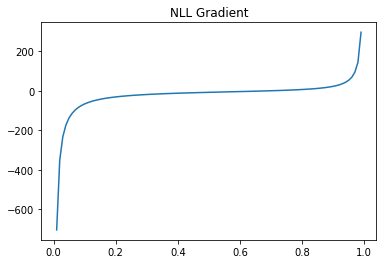

이 포스트는 Negative Log Likelihood, Corss Entropy, Kullback–Leibler divergence에 대해서 이해하는데 목적이 있습니다.

###### 미리 확인해야할 포스트

- [간단한 단어분류 프로젝트를 통한 자연어처리 이해](../nlp-tutorial-01-01-sequence-prediction/)
- [간단한 문장분류 프로젝트를 통한 자연어처리 이해](../nlp-tutorial-01-02-sentence-prediction/)
- [자연어처리를 위한 행렬연산](../nlp-tutorial-02-01-matrix-equations/)
- [자연어처리를 위한 Tokenizer & Vocabulary](../nlp-tutorial-02-02-tokenizer/)
- [자연어처리를 위한 One-Hot Encoding](../nlp-tutorial-02-03-one-hot/)


개발 환경은 [google colab](https://colab.research.google.com/){:target="_blank"}을 사용하며 개발 언어는 [pytorch](https://pytorch.org/){:target="_blank"}를 사용합니다. 이 포스트를 작성할 시점의 pytorch 버전은 1.7.1 입니다.


**소스코드**

- Colab에서 동작하는 소스코드는 [02-04-negative-log-likelihood.ipynb](https://github.com/paul-hyun/torch-nlp-tutorial/blob/main/02-inputs-outputs/02-04-negative-log-likelihood.ipynb){:target="_blank"}을 참고하시면 됩니다.


#### 1. Log Likelihood

###### Likelihood

Likelihood는 한문으로 가능도(可能度) 또는 우도(尤度)라고 표현하며 '특정 사건들이 일어날 가능성'을 의미합니다. 또는 '샘플들과 확률분포의 일관된 정도'를 의미합니다.


정규분포에서 확률은 왼쪽 그림과 같이 $x_1$ 과 $x_2$ 사이의 넓이를 의미합니다. Likelihood는 $x_1$ 과 $x_2$의 확률분포의 값 $f_\theta(x_1)$, $f_\theta(x_2)$의 곱을 의미합니다. 여기서 $\theta$는 확률분포의 파라미터로 정규분포의 경우는 평균 $\mu$과 표준편차 $\sigma$를 의미합니다. Likelihood를 수식으로 표현하면 다음과 같습니다.

$\mathcal{L} (\theta \vert x) = f _\theta (x_1, x_2, ..., x_n) = \prod_i^n f _\theta (x_i)$

간단한 예를 들면 아래 그림과 같이 샘플 $a=(a_1, ..., a_n)$ 와 $b=(b_1, ..., b_n)$의 likelihood를 비교해 보면 샘플 $a$가 확률분포를 더 잘 반영하고 있어서 $\mathcal{L} (\theta \vert a) > \mathcal{L} (\theta \vert b)$입니다.


###### Maximum Likelihood Estimation

Maximum Likelihood Estimation은 샘플로부터 likelihood를 최대화하는 확률분포를 추정하는 방법입니다. 예를 들어 랜덤하게 선택된 중학교 3학년 10명의 키가 아래와 같다고 가정해 보겠습니다.


학생들의 키는 정규분포를 따른다고 가정을 하고 아래와 같이 3가지 경우로 확률분포를 추정했다면 가운데의 경우가 가장 likelihood가 가장 높고 중학교 3학년 10명의 샘플에 대한 확률분포를 잘 추정했다고 볼 수 있습니다.


Maximum Likelihood Estimation을 수식으로 표현하면 아래와 같습니다. 수식의 의미는 likelihood를 최대화하는 $\theta$를 찾는 것입니다.

$\hat{\theta} = \underset{\theta}{\mathrm{argmax}} \mathcal{L}(\theta \vert x)$

정규분포에서 표준편차를 5로 고정하고 평균만 160에서 180까지 1단의로 변화시키면서 likelihood를 확인해보면 아래와 같습니다. 168에서 최댓값을 보이고 있습니다.


###### Log Likelihood

Log Likelihood를 likelihood에 log를 취한 값입니다. Log Likelihood의 수식은 아래와 같습니다. 곱셈의 더하기로 변경되어서 컴퓨터 계산이 좀 더 단조로워졌습니다.

$\log \mathcal{L} (\theta \vert x) = \sum_i^n \log f _\theta (x_i)$

이제 log likelihood를 최대화하는 확률분포를 추정하는 수식은 아래와 같습니다. Log는 단조증가함수이므로 log를 취해도 크기의 순서는 변하지 않습니다.

$\hat{\theta} = \underset{\theta}{\mathrm{argmax}} \log \mathcal{L}(\theta \vert x)$

정규분포에서 표준편차를 5로 고정하고 평균만 160에서 180까지 1단의로 변화시키면서 log likelihood를 확인해보면 아래와 같습니다. Likelihood와 동일하게 168에서 최댓값을 보이고 있습니다.


###### Negative Log Likelihood

Negative Log Likelihood를 log likelihood에 음수를 취한 값입니다. Negative Log Likelihood의 수식은 아래와 같습니다.

$- \log \mathcal{L} (\theta \vert x) = - \sum_i^n \log f _\theta (x_i)$

Log Likelihood를 최대화하는 문제에서 negative log likelihood를 최소화하는 문제로 변경되었습니다. Negative Log Likelihood 초소화 화는 확률분포를 추정하는 수식은 아래와 같습니다. 이제 negative log likelihood를 loss로 사용하면 딥러닝의 gradient descent를 이용하여 최솟값을 찾을 수 있습니다.

$\hat{\theta} = \underset{\theta}{\mathrm{argmin}} - \log \mathcal{L}(\theta \vert x)$

정규분포에서 표준편차를 5로 고정하고 평균만 160에서 180까지 1단의로 변화시키면서 negative log likelihood를 확인해보면 아래와 같습니다. 168에서 최솟값을 보이고 있습니다.


직접 코드로 확인해 보겠습니다.


#### 2. 환경

우선 필요한 library를 import 합니다.

```python
import argparse
import random

import numpy as np
import torch
import matplotlib.pyplot as plt
```

다음은 필요한 환경을 설정합니다.

```python
# 환경 설정
args = {
    # random seed value
    "seed": 1234,
    # CPU 또는 GPU 사용여부 결정
    "device": torch.device("cuda" if torch.cuda.is_available() else "cpu")
}
args = argparse.Namespace(**args)

print(args)
```

위 코드의 실행 결과는 아래와 같습니다.

```text
Namespace(device=device(type='cpu'), seed=1234)
```

다음은 random seed를 설정해줍니다.

```python
# random seed 설정
random.seed(args.seed)
np.random.seed(args.seed)
torch.manual_seed(args.seed)
torch.cuda.manual_seed_all(args.seed)
```

#### 3. Negative Log Likelihood 코드

키를 의미하는 변수 $x$를 150에서 190사이를 균등하게 분할한 값을 구합니다.

```python
# Generate linearly spaced vector
x = np.linspace(150, 190, 100)
print(x)
```

위 코드의 실행 결과는 아래와 같습니다. 150부터 190사이의 값들이 구해졌습니다.

```text
[150.         150.4040404  150.80808081 151.21212121 151.61616162
 152.02020202 152.42424242 152.82828283 153.23232323 153.63636364
 ...
 186.36363636 186.76767677 187.17171717 187.57575758 187.97979798
 188.38383838 188.78787879 189.19191919 189.5959596  190.        ]
```

다음은 Gaussian PDF(Probability Density Function) 함수를 정의합니다. Gaussian PDF의 수식은 아래와 같습니다.

$P(x)={1 \over \sqrt{2 \pi \sigma^2}}e^{-{(x-\mu)^2 \over 2 \sigma^2}}$

```python
def gaussian_pdf(x, mean=0, std=1):
    """
    Gaussian PDF(Probability Density Function)
    :param x: 입력 값
    :return: gelu activation result
    """
    var = std * std
    p = 1 / np.sqrt(np.pi * var) * np.exp(-np.square(x - mean) / (2 * var))
    return p
```

이제 Gaussian PDF를 그려봅니다.

```python
# gaussian PDF
y = gaussian_pdf(x, mean=170, std=5)

# draw plot
plt.plot(x, y)
plt.title('Gaussian PDF')
plt.show()
```

위 코드의 실행 결과는 아래와 같습니다.


이제 위에서 예를 들었던 중학교 3학년 10명의 샘플을 선언합니다.

```python
# sampled height
heights = [164.95, 165.35, 165.76, 166.16, 167.78, 168.99, 169.8, 170.2, 171.82, 172.63]
heights = np.array(heights)
```

학생 키의 평균을 170으로 하고 표준편차를 5로 한 경우의 likelihood를 구해봅니다. numpy의 prod 함수를 이용하면 모든 값들의 곱을 구할 수 있습니다.

```python
# Likelihood
lh = gaussian_pdf(heights, mean=170, std=5)

print(lh)
print(np.prod(lh))
```

위 코드의 실행 결과는 아래와 같습니다. 각각의 확률분포함수의 값과 이것을 모두 곱한 likelihood를 확인할 수 있습니다.

```text
[0.06775528 0.07322248 0.07875962 0.08401879 0.10224628 0.11055912
 0.11274768 0.11274768 0.10560486 0.09825974]
4.895358294629109e-11
```

이제 160부터 180까지의 학생 키 평균값을 선언합니다.

```python
# mean value
means = np.arange(160, 181)
print(means)
```

위 코드의 실행 결과는 아래와 같습니다.

```text
[160 161 162 163 164 165 166 167 168 169 170 171 172 173 174 175 176 177
 178 179 180]
```

이제 각 평균값별로 likelihood를 구하고 최댓값을 확인해 봅니다.

```python
# 평균값별로 likelihood 계산
lhs = []
for mean in means:
    lh = gaussian_pdf(heights, mean=mean, std=5)
    lh = np.prod(lh)
    lhs.append(lh)
lhs = np.array(lhs)
max_idx = np.argmax(lhs)

print(max_idx, means[max_idx], lhs[max_idx])
print(lhs)
```

위 코드의 실행 결과는 아래와 같습니다. 평균 168에서 8.273746830289748e-11이 최댓값입니다.

```text
8 168 8.273746830289748e-11
[7.59733879e-17 1.75107142e-15 2.70538099e-14 2.80178764e-13
 1.94502059e-12 9.05097568e-12 2.82324652e-11 5.90315804e-11
 8.27374683e-11 7.77324314e-11 4.89535829e-11 2.06656430e-11
 5.84784117e-12 1.10923719e-12 1.41037786e-13 1.20206721e-14
 6.86758787e-16 2.63003730e-17 6.75152370e-19 1.16177999e-20
 1.34007220e-22]
```

결과를 그래프로 확인해봅니다.

```python
# draw plot
plt.plot(means, lhs, '-o')
plt.title('Likelihood')
plt.show()
```

위 코드의 실행 결과는 아래와 같습니다.


다음은 평균 168에서 표준편차 5의 확률분포에서 샘플값의 분포를 확인해 보겠습니다.

```python
# gaussian PDF
y = gaussian_pdf(x, mean=168, std=5)
lh = gaussian_pdf(heights, mean=168, std=5)

# draw plot
plt.plot(x, y)
plt.plot(heights, lh, "ro")
plt.title('Gaussian PDF')
plt.show()
```

위 코드의 실행 결과는 아래와 같습니다. 확률분포의 중간에 비교적 고르게 분포되어 있음을 확인할 수 있습니다.


이제 각 평균값별로 log likelihood를 구하고 최댓값을 확인해 봅니다.

```python
# 평균값별로 log likelihood 계산
lls = []
for mean in means:
    lh = gaussian_pdf(heights, mean=mean, std=5)
    ll = np.log(lh)
    ll = np.sum(ll)
    lls.append(ll)
lls = np.array(lls)
max_idx = np.argmax(lls)

print(max_idx, means[max_idx], lls[max_idx])
print(lls)
```

위 코드의 실행 결과는 아래와 같습니다. 평균 168에서 -23.215348553588004이 최댓값입니다.

```text
8 168 -23.215348553588004
[-37.11614855 -33.97854855 -31.24094855 -28.90334855 -26.96574855
 -25.42814855 -24.29054855 -23.55294855 -23.21534855 -23.27774855
 -23.74014855 -24.60254855 -25.86494855 -27.52734855 -29.58974855
 -32.05214855 -34.91454855 -38.17694855 -41.83934855 -45.90174855
 -50.36414855]
```

결과를 그래프로 확인해봅니다.

```python
# draw plot
plt.plot(means, lls, '-o')
plt.title('Log Likelihood')
plt.show()
```

위 코드의 실행 결과는 아래와 같습니다.


이제 각 평균값별로 negative log likelihood를 구하고 최댓값을 확인해 봅니다. Negative log likelihood는 log likelihood에 음수를 취하면 됩니다.

```python
# 평균값별로 negative log likelihood 계산
nlls = -(lls)
min_idx = np.argmin(nlls)

print(min_idx, means[min_idx], nlls[min_idx])
print(nlls)
```

위 코드의 실행 결과는 아래와 같습니다. 평균 168에서 23.215348553588004이 최솟값입니다.

```text
8 168 23.215348553588004
[37.11614855 33.97854855 31.24094855 28.90334855 26.96574855 25.42814855
 24.29054855 23.55294855 23.21534855 23.27774855 23.74014855 24.60254855
 25.86494855 27.52734855 29.58974855 32.05214855 34.91454855 38.17694855
 41.83934855 45.90174855 50.36414855]
```

결과를 그래프로 확인해봅니다.

```python
# draw plot
plt.plot(means, nlls, '-o')
plt.title('Negative Log Likelihood')
plt.show()
```

위 코드의 실행 결과는 아래와 같습니다.


#### 4. Negative Log Likelihood Example

아주 간단한 예를 이용해서 다시 한번 확인해 보겠습니다.

길가는 사람 10명의 핸드폰 운영체제를 조사한 결과가 아래와 갔습니다. 아래 샘플을 이용해서 핸드폰 운영체제 점유율을 추정해 보겠습니다.
- Android 7명
- iOS 3명

Android 운영체제의 점유율을 $p$라고 할 경우 아래와 같습니다.
- Android 점유율: $p$
- iOS 점유율: $1-p$

7개의 Android와 3개의 iOS의 발생 가능한 경우의 수는 $_{10} C _7$입니다. 그러므로 확률은 아래와 같습니다.

$_{10} C _7 p^7 (1-p)^3$

이제 위 확률을 최대화하는 p를 구하면 됩니다. 이때 $_{10} C _7$은 p와 관계없는 상수이므로 무시할 수 있습니다.

우선 Android 점유율을 $(0, 1)$ 사이의 값 100개를 구합니다. 점유율 중 0, 1을 배제하는 이유는 0일 경우는 Android가 선택될 수 없으며 1인 경우는 iOS가 선택될 수 없기 때문에 불능입니다.

```python
# Generate linearly spaced vector
p = np.linspace(0, 1, 102)[1:-1]
print(p)
```

위 코드의 실행 결과는 아래와 같습니다.

```text
[0.00990099 0.01980198 0.02970297 0.03960396 0.04950495 0.05940594
 0.06930693 0.07920792 0.08910891 0.0990099  0.10891089 0.11881188
 ...
 0.9009901  0.91089109 0.92079208 0.93069307 0.94059406 0.95049505
 0.96039604 0.97029703 0.98019802 0.99009901]
```

이제 각 p에 대해서 likelihood를 구해봅니다.

$\mathcal{L}(p) = p^7(1-p)^3$

```python
# likelihood
lh = np.power(p, 7) * np.power(1 - p, 3)
```

결과를 그래프로 확인해봅니다.

```python
# draw plot
plt.plot(p, lh)
plt.title('Likelihood')
plt.show()
```

위 코드의 실행 결과는 아래와 같습니다.


다음은 각 p에 대해서 log likelihood를 구해봅니다.

$\log \mathcal{L}(p) = 7 \log p + 3 \log (1-p)$

```python
# log likelihood
lh = np.power(p, 7) * np.power(1 - p, 3)
```

결과를 그래프로 확인해봅니다.

```python
# draw plot
plt.plot(p, ll)
plt.title('Log Likelihood')
plt.show()
```

위 코드의 실행 결과는 아래와 같습니다.


다음은 각 p에 대해서 negative log likelihood를 구해봅니다.

$-\log \mathcal{L}(p) = - 7 \log p - 3 \log (1-p)$

```python
# negative log likelihood
nll = - 7 * np.log(p) - 3 * np.log(1 - p)
```

결과를 그래프로 확인해봅니다.

```python
# draw plot
plt.plot(p, nll)
plt.title('Negative Log Likelihood')
plt.show()
```

위 코드의 실행 결과는 아래와 같습니다.


다음은 negative log likelihood를 미분해서 기울기를 구해봅니다.

$- {\log \mathcal{L}(p) \over dp} = - 7 {1 \over p} + 3 {1 \over 1 -p}$

```python
# negative log likelihood gradient
gradient = - 7 / p + 3 / (1 - p)
```

결과를 그래프로 확인해봅니다.

```python
# draw plot
plt.plot(p, gradient)
plt.title('NLL Gradient')
plt.show()
```

위 코드의 실행 결과는 아래와 같습니다.




위식을 전개하면 $p=0.7$인 경우 gradient가 $0$이 되고 negative log likelihood가 최솟값이고 likelihood가 최대가 됩니다.


지금까지 Negative Log Likelihood에 대해서 알아봤습니다.
